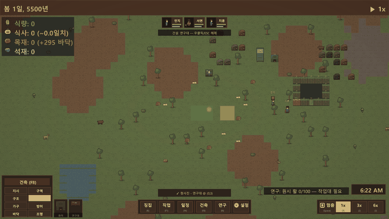
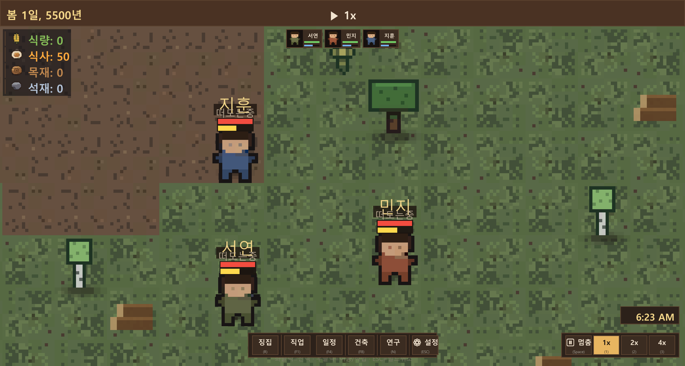
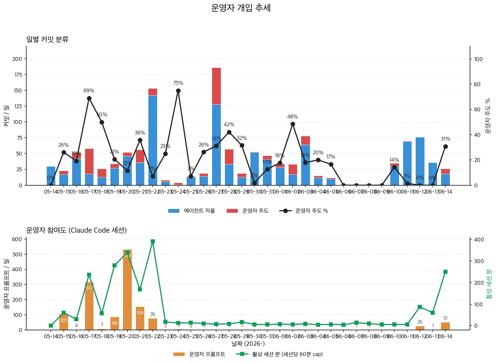

<div align="center">

# MelonS-Agents

**한국어** | [English](./README.md) · [**라이브 사이트 →**](https://melons.github.io/MelonS-Agents/)

**자기 게임을 직접 만들고, 플레이하고, *검증*하는 에이전트** — 입력 레벨 재현 게이트와 격리 채점(grader) 루브릭 평결로 검증되는 콜로니심 수직 슬라이스 — 그리고 production 미디어 스킬 2종(music-video 쇼츠, 한국 잡보드 digest).  전부 [agentskills.io](https://agentskills.io) spec 준수, Claude Code, Cursor, Goose, Gemini CLI, OpenAI Codex, GitHub Copilot 호환.

**기계적인 단계는 로컬, 창작 단계는 Claude.**  phrase-aware ffmpeg 쉐이더가 빈티지 비주얼을 음악 구조와 동기화.  job-hunt 는 짧은 키워드를 role-synonym map 통해 자동 확장.  세 가지 감사 트리거 — 커밋·이상·스케줄 — 으로 시스템이 자신의 드리프트를 스스로 잡습니다.  영어 + 한국어 듀얼 트랙.

`미션 출력 100+ · 미션 타입 5종 · 포터블 스킬 2개 + 메타 스킬 1개 · ffmpeg 쉐이더 23개 · 컬러 그레이드 6종 · 런타임 API 토큰 0개 · 감사 레이어 3개 · MIT`


[](https://github.com/MelonS/MelonS-Agents/actions/workflows/main-protection.yml)



*무인 16일 콜로니 소크 — 에이전트가 만들고, 에이전트가 검증.*

</div>

## 60초 안에 시작 (계정 0개, `.env` 편집 0번)

```bash
git clone --depth 1 https://github.com/MelonS/MelonS-Agents.git
cd MelonS-Agents
./scripts/first-touch.sh        # 단일 명령 가이드 데모 마법사
```

마법사가 사전 도구 체크, 데모 캐시 fetch (~30초), 번들된 CC-BY
Blender 클립 + Kevin MacLeod 트랙으로 60초 9:16 쇼츠 렌더 (~100초)
후 결과물을 엽니다. Pexels 가입, Suno 라운드트립, `.env` 편집 모두
필요 없음. 수동 + 고급 경로는 [Quick start](#quick-start) 참조.

## 이 프로젝트는 누구를 위한 것인가

- **파이프라인 코드를 짜지 않고도 숏폼 세로 영상을 만들고 싶은 분.**
  마법사에 음악 파일 하나 넘기면 비트 정렬 컷 + 빈티지 쉐이더 적용된
  9:16 쇼츠가 돌아옴.  프리미어, 애프터이펙트, GUI 다 불필요.
- **마법처럼 포장하지 않고 정직하게 보여주는 멀티에이전트 시스템을
  관찰하고 싶은 분.**  레포의 모든 커밋이 시스템 진화의 1단계 관찰
  포인트; `docs/audit/` 는 감사가 잡은 모든 drift 기록; `docs/metrics/quality-trend.png`
  + `intervention.png` 는 자율성 + 품질 주장이 시간 흐름에 따라
  정직한지 차트화.
- **실제 검색 방식에 맞춰진 한국 잡보드 다이제스트가 필요한 분.**
  `--seed "Problem Solver"` 한 줄이면, 회사마다 다르게 부르는 24개
  동의어 타이틀 (FDE / Applied AI Engineer / Generalist / Founding
  Engineer / …) 로 자동 확장 후 11개 소스에서 fetch.
- **다른 런타임에 drop-in 가능한 agentskills.io 호환 Skill 이 필요한 분.**
  두 스킬 모두 Claude Code, Cursor, Goose, Gemini CLI, OpenAI Codex
  외 ~38 개 호환 런타임에서 작동.

파이프라인을 가려놓은 SaaS 가 필요하다면 이 레포는 아닙니다.  파이프라인의
모든 단계를 검사 가능한 bash + 오픈소스 로컬 도구 (ffmpeg / whisper.cpp
/ ollama / aubio) 로 보고 싶다면, 맞습니다.

## 개요

> [Claude Code](https://docs.anthropic.com/claude-code) 로 돌리는
> macOS 멀티에이전트 시스템.  최신 태그는 [**v0.4.0**](https://github.com/MelonS/MelonS-Agents/releases/tag/v0.4.0).
> 지금까지 두 개의 production 스킬이 올라가 있고, 둘 다
> [agentskills.io](https://agentskills.io) 스펙을 따라서 Claude Code,
> Cursor, Goose, Gemini CLI 등 호환 런타임에 그대로 떨어집니다.
>
> **스킬 1 — `music-video`.**  음악 파일을 넣으면 60초짜리 9:16
> 세로 쇼츠가 나옵니다.  장르별 컬러 그레이드 6종이 평범한 Pexels
> 스톡 footage 를 장르 톤으로 먼저 깔고, 그 위에 ffmpeg 쉐이더
> 23개와 phrase-aware 구조(`aubiotrack` 비트로 컷, `aubioonset`
> 드럼 hit 으로 글리치 마이크로 에디트, preset 별 게이팅 적용)가
> 얹힙니다.  맨 위 데모는 noir-detective 렌더, 아래쪽 그리드에서
> 6개 장르를 옆으로 비교할 수 있습니다.  구현은
> [`agents/missions/music-video/run.sh`](agents/missions/music-video/run.sh) —
> 스킬이 5-에이전트 미션 파이프라인(orchestrator + planner /
> resourcer / editor / qa)을 그대로 타기 때문에 미션 튜닝이 곧
> 스킬 튜닝이 됩니다.
>
> **스킬 2 — `job-hunt`.**  키워드 하나로 한국·글로벌 잡보드를
> 훑고 중복 제거된 마크다운 다이제스트를 만듭니다.
> `--seed "Problem Solver"` 한 줄이 실제로 회사들이 쓰는 24개
> 동의어 (FDE / Applied AI Engineer / Generalist / Founding Engineer
> / Forward Deployed / …) 로 펼쳐진 다음 11개 소스 플러그인을
> 돕니다.  그 중 5개(`global-ats` — Anthropic / OpenAI / Cursor /
> Stripe / Notion / Datadog 등 27개 AI/SaaS 회사의 Greenhouse +
> Ashby + Lever 보드 / `global-remoteok` / `global-remotive` /
> `global-hn-whoshiring` Algolia 경유 HN 월간 / `kr-worknet`
> 정부 공공고용서비스)는 API 키 없이 즉시 작동합니다.  나머지
> 2개(`kr-wanted`, `kr-saramin`)는 소스별 API 키가 필요합니다.
> end-to-end 라이브 테스트: 5,000+ raw → ~200 매칭.  스킬은
> standalone 형태 — 오케스트레이터를 안 거치고
> `skills/job-hunt/scripts/run.sh` 가 직접 구현입니다.  fetch /
> filter / dedupe 파이프라인에선 planner / qa 단계가 거의 비기
> 때문에 5-에이전트 핸드오프를 굳이 둘 이유가 없습니다.
>
> **스킬 3 — `game-dev-agent` (개발 중, 위 "프로덕션 스킬 두 개"
> 카운트에 포함되지 않음).**  Unity 기반 게임 개발용 AI 에이전트
> — 스프라이트 생성, C# 스캐폴딩, 밸런스 튜닝, 오디오 생성,
> 인게임 AI 디렉터를 오케스트레이션하는 메타 스킬입니다.  이
> 프레임워크로 만들어지는 두 개의 프로토타입 스킬이 함께 붙어
> 있어 경험적 검증 표면 역할을 합니다 — 탑다운 콜로니-심 vertical
> slice ([`skills/game-prototype/`](skills/game-prototype/)) 와 2D
> physics-merge 퍼즐
> ([`skills/game-prototype-suika/`](skills/game-prototype-suika/),
> Day 2 까지 출하 · 프레임워크 미사용 베이스라인 대비 wall-clock
> 약 15× 가속).  두 프로토타입이 각자 end-of-day 산출물 일정을
> 모두 만족하는 시점에 프로덕션 카운트로 졸업합니다.  스킬 정의:
> [`skills/game-dev-agent/`](skills/game-dev-agent/).
>
> **이 레포를 돌리는 두 가지 방법.**
> - *에이전트 주도* (메인) — Claude Code 깔고, 클론된 레포를
>   가리키고, 미션을 타이핑하면 Claude Code 가 파일 편집·커밋·푸시까지
>   합니다.  비용: Max 구독이 오케스트레이션을 흡수하고, 그 외
>   유료 항목은 money firewall 이 잡습니다.
> - *스크립트만* (대체) — `./scripts/bootstrap.sh` 후 bash 스크립트
>   단독 실행.  Claude Code 불필요, 자동 커밋·푸시도 없지만 렌더
>   결과물 자체는 동일합니다.  비용: 무료 Pexels API 키 외 $0.
>
> **스캐폴드 자체는 범용입니다.**  쇼트폼 영상이 v1 도메인인 건
> 결과물이 눈에 보이고 실패 모드가 빨리 잡혀서 그렇지, 아키텍처가
> 쇼트폼 전용으로 설계된 건 아닙니다.  새 스킬은 작업 성격에 맞는
> shape 를 고르면 됩니다 — 아래 아키텍처 섹션에서 3-shape 모델과
> 미래 스킬(영화 / 게임 / 롱폼 분석) 이 어떤 shape 로 갈 만한지
> 정리해 두었습니다.
>
> 깔린 원칙은 하나입니다 — **제작 파이프라인을 자동화하고,
> 시스템이 자기 로직을 스스로 진화시키게 한다.**  모든 커밋이
> 그 진화의 한 걸음입니다.  히스토리는 산출물 기록이 아니라
> 에이전트 시스템 자체가 자라온 흔적입니다 (산출물은 gitignored
> `records/` 로컬에 남습니다).

### PawnSim — 에이전트가 지금 가장 활발히 반복 개발 중인 프로토타입 (2026-06 focus)

현재 가장 활발한 검증 표면은 **PawnSim** (Skill #3-A) 입니다 — 에이전트가
만들면서 *동시에* 플레이테스트하는 타이트한 루프로 돌아가고, 운영자가 올린
인게임 피드백이 곧바로 다음 수정 배치로 이어집니다.



콜로니스트는 utility AI 로 벌목/채광/채집/농사/요리/운반/건축/연구/전투를
자율 수행하고, AI 디렉터가 위협을 스폰하며, 플레이어는 림을 징집하고 건축·지정
명령을 칠합니다. 모든 스프라이트·씬·C# 시스템은
[`game-dev-agent`](skills/game-dev-agent/) 가 CLI 로 스캐폴딩하며 (수동 Unity
에디터 작업 0), 모든 커밋이 6단계 `refactor_check` 게이트를 통과합니다. 위
스크린샷은 실제 빌드 — 장르 표준 좌상단 자원 readout, 다양해진 흙/돌 지형,
조밀한 광맥 군집, 이름표+개별 모션 콜로니스트. 전체 기능 + **정직한** 검증
상태(알려진 결함 포함)는
[`skills/game-prototype/README.md`](skills/game-prototype/README.md) 에 있습니다.

> **엔지니어링 결정, 한 페이지로.**
> [`docs/engineering-case-studies.ko.md`](docs/engineering-case-studies.ko.md)
> — 프로덕션에서 드러난 9건의 문제와 각각이 만들어낸 최소 메커니즘
> (Tier-1 라우팅, 세마포어 배치, 콘텐츠 품질 피드백 루프, 3-레이어
> 리액티브 감사, ffmpeg 쉐이더의 한계, 온보딩 마찰 → 제로-계정 데모
> 경로, 장르 인식 declarative preset 라우팅, 자율성 신호 +
> 개입-감소 레버, 2026-05-22 music-video QA 패스 후 "quality bar 는
> 버그가 아니라 시스템이 enforce 못한 6개 계약"). 각 항목은
> *문제 → 제약 → 결정 → 산출물* 포맷.

## 설계 노트

일반적인 에이전트 데모와 차별화되는 설계 선택들:

- **목표 계층과 작업 큐의 분리.** [`docs/goal.md`](docs/goal.md)는
  활성 목표를 구체적 산출물로 정의; [`docs/roadmap.md`](docs/roadmap.md)는
  일별 작업 큐. 큐가 비었다고 목표가 달성된 것은 **아님** — 목표의
  "Done when" 조건만이 달성을 정의함. 분리 이유: 이전 24시간 구간이
  인프라 커밋 11개를 쌓는 동안 큐는 0건이었고 실제 산출물도 0건이었던
  사고를 다시 막기 위함.
- **운영 계약은 커밋된 단일 출처.** 2026-05-22에 portability 이유로
  두 파일로 분리:
  [`docs/operator-contract.md`](docs/operator-contract.md)는 이 프로젝트의
  12개 하드 룰 + 프로젝트 한정 컨벤션(이 레포의 README 구조, README
  유지보수 cadence).
  [`config/claude-global.template.md`](config/claude-global.template.md)은
  프로젝트 간 이동하는 운영자 스타일 선호(이중 스택 리포팅, 터미널
  포맷, 배치 실행, 글쓰기 톤, idle 시그널, 스크럼-마스터 footer); install
  스크립트가 BEGIN/END 마커 사이에 idempotent하게 `~/.claude/CLAUDE.md`로
  렌더링. 에이전트의 로컬 메모리는 각 룰의 canonical 파일을 가리키는
  빠른 캐시; 두 곳이 어긋나면 canonical이 이기고 메모리가 수정됨.
- **오케스트레이션과 실행 사이의 비용 방화벽.** Anthropic API 토큰은
  Tier 1 오케스트레이션에서만 소비. 미션 실행(전사 → 선택 → 렌더
  → QA)은 `whisper.cpp` + `ollama` + `ffmpeg` 로컬 실행이며
  토큰 비용 0. [`docs/cost-model.md`](docs/cost-model.md) 참조.
- **별도 트랙 auditor + 능동 알림 surface.**
  [`auditor`](.claude/agents/auditor.md) 서브에이전트는 launchd로
  매일 03:00 발화, 저장소 전체를 읽기 전용 순회, 안정 채널에 기록:
  [`docs/audit/CURRENT-ALERT.md`](docs/audit/)는 최근 verdict이
  비-CLEAN일 때만 존재 — 다음 인터랙티브 세션은 목표를 잡기 전
  이 파일을 의무적으로 읽음.
- **파일 기반 서브에이전트 핸드오프.** 서브에이전트들은 대화
  히스토리를 공유하지 않음. 커밋되는 파일(`plan.md` / `MANIFEST.md`
  / `qa-report.md`)을 통해 통신. 각 서브에이전트의 컨텍스트는 자신의
  프롬프트 + 자신이 읽는 매니페스트로 한정됨 — 예측 가능한 토큰
  비용, 예측 가능한 실패 모드.
- **운영자 도구.** 시스템 상태를 표면에 띄우고 일상적인 상태-확인
  프롬프트를 흡수해서 운영자가 타이핑할 필요가 없게 만드는 스크립트들.
  [`scripts/doctor.sh`](scripts/doctor.sh)는 Claude 호출 없는 ~2초
  헬스 체크 — CLI 도구, env 키, 스케줄러, 감사 알림, git 상태, 디스크,
  스킬별 활성화, 스킬 매니페스트 drift; `--json` 출력은
  `actionable_warn` 필드를 포함해서 opt-in env 키 + git-tree 같은
  노이즈를 카운트에서 제외함.
  [`scripts/audit-skill-drift.sh`](scripts/audit-skill-drift.sh)는
  13번째 감사 룰 — 각 스킬의 LIVE 플래그 매니페스트가 실제 스크립트의
  게이팅과 일치하는지 검증.
  [`scripts/statusline.sh`](scripts/statusline.sh)는 Claude Code
  statusline — doctor 의 JSON 캐시 (60초 백그라운드 regen) 와
  goal-lock 스킬을 읽어서 `doctor:⚠N · goal:N/M · audit⚠` 를
  상시 표시; "지금 상태가 뭐임?" 이 타이핑 없이 답됨.
  [`scripts/log-decision.sh`](scripts/log-decision.sh) 는
  [`docs/autonomous-decisions.md`](docs/autonomous-decisions.md) 에
  한 줄 entry 를 append — 에이전트가 오버나잇 작업 중 unilateral
  결정을 내릴 때 기록, 운영자는 아침에 한 페이지를 스캔해서 무엇이
  결정됐는지 확인.
  [`outputs/review-queue/`](outputs/review-queue/) + 3 개 스크립트
  (`review-queue-add.sh` / `-digest.sh` / `-decide.sh`) 는 batched
  taste-decision 큐 — music-video 렌더가 per-mp4 ping 대신 여기로
  auto-enqueue.
  [`scripts/morning-brief.sh`](scripts/morning-brief.sh) — 위 모든
  것을 한 페이지 overnight digest 로 결합하는 단일 명령: doctor
  verdict, audit 상태, intervention trend (7-day Δ), 12h 전부터의
  커밋 + attribution, 오늘 자율 결정, review-queue pending 카운트,
  blockers.  Read-only.  "밤사이 뭐 됐어?" 의 canonical 답.
  도구별 what/when/output 표 전체 카탈로그:
  [`docs/operator-tooling.md`](docs/operator-tooling.md).

## 자율성 신호 — 운영자 개입 추세

사람이 계속 조타해야 하는 멀티 에이전트 시스템은 사실 자기가
대체하려던 그 노력을 그대로 다시 들이고 있을 뿐입니다.  이 차트는
그것을 정직하게 측정합니다 — `main` 의 모든 커밋을 **user-initiated**
(운영자가 필요를 surface, 옵션을 선택, deliverable 을 승인) 와
**agent-autonomous** (감사가 drift 포착, 로드맵 pull, 인프라
유지보수) 로 분류하고, 운영자의 로컬 Claude Code 세션 로그에서
프롬프트 횟수와 활성 세션 분을 함께 추출합니다.



목표: 에이전트 시스템이 더 많은 결정을 흡수할수록 두 패널 모두
하향 추세.  `com.melons.agents.intervention-chart` launchd 잡
([`scripts/intervention-chart-collect.sh`](scripts/intervention-chart-collect.sh))
이 매일 02:00 KST 에 갱신.  이 잡은
[`scripts/generate-intervention-chart.py`](scripts/generate-intervention-chart.py)
를 호출하여 `git log` + `~/.claude/projects/-Users-melons-ai/*.jsonl`
에서 두 패널을 재구성합니다.  분류 휴리스틱 + 감소 분석은
[`docs/research/2026-05-22-intervention-reduction.md`](docs/research/2026-05-22-intervention-reduction.md)
에 정리; 일별 raw 데이터는
[`docs/metrics/intervention.json`](docs/metrics/intervention.json).

## 품질 신호 — 미션 결과 추세

자율성 신호의 짝.  *자율성* 은 "운영자 개입이 줄고 있나?" 를 묻고,
*품질* 은 "파이프라인이 시간이 지날수록 더 안정적인 결과물을
내고 있나?" 를 묻습니다.  모든
`records/missions/<date>/<id>/qa-report.md` 의
`Verdict: PASS|FAIL` + `attempt N of M` 를 파싱하고, qa-report 가
없는 미션 (music-video 계열 — 미션별 retry 하네스 없음) 은
"metrics.json only" 로 카운트합니다.


Panel B 가 시스템의 진화를 한눈에 보여줍니다 — 2026-05-17 의 spike
는 faceless 파일럿 배치 (8 → 33 missions/day); 그 이후 평탄 구간은
현재 music-video 포맷이 일일 3-8 렌더의 sustainable cadence 에
정착한 모습.  재생성:
`.venv/bin/python scripts/generate-quality-trend-chart.py`; 일별
raw 데이터는 [`docs/metrics/quality-trend.json`](docs/metrics/quality-trend.json).

## 샘플 출력

지금까지 **5가지** 미션 타입에 걸쳐 100+건의 출력이 나왔습니다.
현재 production 포맷은 `music-video` 미션 — 음악이 메인 오디오인
쇼츠 (내레이션·캡션 없음, 비트에 맞춘 컷, 드럼 onset 에 맞춘 글리치
마이크로 에디트).  2026-05-17 에 이전의 내레이션 기반 포맷을 밀어내고
운영자 파일럿 픽으로 채택됐습니다
([결정 로그](docs/pilots/decision-log.md#operator-pick--2026-05-17)).

### 최근 ship (롤링)

- **2026-06-03 PawnSim 플레이테스트-수정 배치** (Skill #3-A) — 운영자
  플레이테스트 루프가 [`skills/game-prototype/`](skills/game-prototype/) 에
  12커밋 배치를 끌어냄: 림 이동 속도 회귀 + 벌목 접근 지터 수정(P0), needs→부정
  thought 연동으로 배고프면/못 자면/다치면 기분이 실제로 나빠지게, idle 림 전원이
  한 나무로 몰리던 dispatch 예약-키 버그 수정, 자원 readout 을 장르 표준 좌상단
  세로 목록으로 이전, 광맥 조밀 군집 + 맵 전역 흙/돌 지형 재구성, 설정 패널 수정.
  각 수정은 build + 스크린샷/좌표 검증;
  [`docs/PLAYTEST-TODO.md`](skills/game-prototype/docs/PLAYTEST-TODO.md) 에
  항목별 상태 (운영자 인게임 확인 전까지 미삭제).
- **2026-05-23 production batch** — 6개 mp4 (`monday-v1/v2`,
  `convenience-v1/v2`, `smallhand-folk-v1/v2`) 가
  [`outputs/publish/shorts-2026-05-23-batch/`](outputs/publish/) 에
  생성됨.  [`scripts/music-video-batch.sh`](scripts/music-video-batch.sh)
  로 처음 돌린 멀티 트랙 배치.
- **키네틱 가사 오버레이** — `scripts/music-video-lyrics.sh` +
  whisper 기반 LRC 추출 (`scripts/music-video-lyric-align.sh`).
  아래 장르 그리드의 `smallhand-folk` 프레임에서 실제로 보입니다
  ("가난이 너를 만든 게 / 아니라").  alignment confidence 가 낮은
  라인은 자동으로 보정 표시, 위치는 크로스 플랫폼 safe-band 안.
- **publish 전 게이트 + 썸네일 자동 추출** —
  `scripts/music-video-validate.sh` (길이 / 해상도 / 라우드니스 /
  쉐이더-앵커 커버리지 / 가사 sync drift 통합 검증, exit 0/1/2)
  + `scripts/music-video-thumbnail.sh` (중반 클라이맥스 JPG).
  `MUSIC_VIDEO_VALIDATE=1` 로 두면 렌더 직후 자동 chain.

### v5 프로토타입 이후 누적된 것들

- **ffmpeg 쉐이더 23개** —
  [`scripts/music-video-shaders.sh`](scripts/music-video-shaders.sh) 에
  3-스테이지로 정리: 1차 (pond / halation / breathing / combo) +
  장르-인식 확장 (light_leak / duotone / vignette_pulse / scanline /
  chromatic_split / neon_edge / vhs / saturation_pulse / kaleidoscope
  / beat_burst / strobe / shake / color_burst / light_rays) +
  Stage-2/Stage-3 (paper_grain / dust_speck / posterize / trail_echo /
  soft_bloom). 카툰 / cel-shading 은 의도적으로 deferred —
  [case study 5](docs/engineering-case-studies.ko.md#5-ffmpeg-안의-쉐이더-효과--벽이-어디인지-아는-것).
- **장르-인식 preset 라우팅** —
  [`skills/music-video/data/genre-presets.yaml`](skills/music-video/data/genre-presets.yaml)
  의 14-장르 테이블이 장르 → preset → env override → post-shader 체인을
  해소 (case study 7).  앰비언트 / 클래시컬 / 드림코어는 ANY 컷이 계약
  위반인 장르라서 별도 `scripts/music-video-stillzoom.sh` (이미지 + 음악 →
  60초 Ken-Burns) 로 라우팅.
- **장르별 베이스 컬러 그레이드** — 모든 preset 의 `grade_profile` 필드
  (kr_warm_pastel / hollywood_teal_orange / lofi_warm_grain /
  rnb_low_key / city_pop_neon / neutral) 가
  [`scripts/music-video-grade.sh`](scripts/music-video-grade.sh) 의
  ffmpeg `curves` + `eq` + `colorbalance` 스테이지를 쉐이더 전에 적용.
  일반 Pexels 스톡 footage 를 장르-코드된 룩으로 *쉐이더 적용 전*에
  변환.  연구 원문:
  [`docs/research/2026-05-22-music-video-pro-practices.md`](docs/research/2026-05-22-music-video-pro-practices.md)
  §2; 시각적 A/B 결과:
  [`docs/research/2026-05-22-grade-profile-comparison.md`](docs/research/2026-05-22-grade-profile-comparison.md).
- **디렉터-규율 shot plan** (opt-in scaffold) —
  [`scripts/shot-plan.sh`](scripts/shot-plan.sh) 가 가사 LRC + phrase
  경계에서 per-segment intent layer 를 B-roll fetch 전에 생성, 실제
  music-video 디렉터가 촬영 전에 shot list 를 쓰는 관행을 흉내.
  `MUSIC_VIDEO_USE_SHOT_PLAN=1` 로 활성화.  방법론 연구:
  [`docs/research/2026-05-22-music-video-director-methodology.md`](docs/research/2026-05-22-music-video-director-methodology.md).
- **Music-video quality bar — 시스템이 enforce 하는 5개 계약**
  ([case study 9](docs/engineering-case-studies.ko.md#9-quality-bar-는-버그가-아니라-시스템이-enforce-못한-6개-계약이었다)
  · 전체 changelog 는
  [`skills/music-video/CHANGELOG.md`](skills/music-video/CHANGELOG.md)):
  A.1 B-roll dedup 레지스트리 (`records/youtube/broll-used.txt`,
  271개 id seeded), A.2 whisper 기반 lyric vocal-onset alignment
  (`scripts/music-video-lyric-align.sh`, KR 워드-레벨 / EN 세그먼트-레벨,
  LRC + JSON 사이드카 + drift verdict), A.3 lang_anchor + 매 3 segment
  마다 person-anchored 키워드 주입 + QA 게이트
  (`scripts/music-video-qa-anchor.sh`, exit 0 PASS / 1 WARN / 2 FAIL),
  B.1 쉐이더 vocabulary 를 23개 3-스테이지로 확장, C.1
  `MUSIC_VIDEO_SHADER_GATE` 의 4가지 쉐이더 게이트 모드 (uniform /
  phrase_climax / onsets / beats) + ffmpeg expr-length 한도 회피용
  이벤트 카운트 30 캡.
- **운영자 대상 유틸리티** — `scripts/first-touch.sh` 마법사
  (단일 명령 가이드 제로-계정 데모), `scripts/music-video-batch.sh`
  (멀티 트랙 렌더 래퍼), `scripts/music-video-validate.sh`
  (통합 publish-전 게이트), `scripts/music-video-thumbnail.sh`
  (업로드용 still 자동 추출), `scripts/lyric-extract.sh`
  (whisper 기반 가사 추출), `scripts/morning-brief.sh` (1 페이지
  overnight 다이제스트).  전체 테이블은
  [`docs/music-video-pipeline-reference.md`](docs/music-video-pipeline-reference.md).
- **Skill #2 — `job-hunt`** v0.4.0 (위 music-video 트랙과 별도) —
  짧은 키워드 UX + 소스 플러그인 11개 (live-ready 키 없음 5개,
  키 게이팅 2개, mock-fallback / 영구-mock 4개) + enrichment scaffold
  5개. 워크스루는 [`docs/skills/job-hunt.ko.md`](docs/skills/job-hunt.ko.md).

`faceless-short` 미션 (내레이션 기반 쇼츠) 은 여전히 아래 쇼케이스로
유지되며, v1 파이프라인 출력 (단일-클립 highlight + shorts-batch) 은
기준점 참고용으로 그 아래에 유지됩니다.

### Music-video 파일럿 (니치 피벗 후, 2026-05-17)

`music-video` 미션은 60초 9:16 쇼츠를 만드는데, **음악이 메시지**입니다 —
운영자가 공급한 음악 파일이 유일한 오디오 트랙, 컷은 `aubiotrack` 으로
추출한 phrase 경계에 정렬, 클립별 재생 속도가 분위기에 따라 가변
(정적 톤 0.55×, 앰비언트 0.70×, 액티브 0.80×, 자연 톤 1.00×),
마이크로 "스크래치" 글리치 (0.2초 역재생 + 0.2초 forward jump-cut) 는
`aubioonset` 으로 검출한 드럼 hit에 정렬되되 **정적-카메라로 분류된
클립에만** 적용됨 (글리치 중 프레임 흔들림 방지). 미세 필름 그레인 +
소프트 비네팅 + 글리치 onset마다의 가우시안 줌-펄스로 빈티지 lo-fi
처리.

다섯 개의 프로토타입 (v1→v5) 으로 운영자 피드백을 반영하며 점진 개발:

- v1: 균등 7.5초 컷 (비트 동기 없음)
- v2: `aubiotrack` phrase 경계로 컷 이동
- v3: 클립별 가변 재생 속도 추가 (정적 톤 슬로우)
- v4: 슬로우 클립 중간 지점에 글리치 마이크로 에디트
- v5: 글리치 위치를 `aubioonset` 드럼 hit + 정적-카메라 클립으로 제한

v5 = 운영자 검증 완료 → 정식
[`agents/missions/music-video/run.sh`](agents/missions/music-video/run.sh)
으로 승격. v6 빈티지 lofi 처리 (그레인 + 비네팅 + 줌-펄스) 는 v5 위에
같은 미션에 통합 — 렌더별로 `MUSIC_VIDEO_FILM_GRAIN_INTENSITY`,
`MUSIC_VIDEO_VIGNETTE_ANGLE`, `MUSIC_VIDEO_ZOOM_PULSE_AMP` env var로
조절. 출력 mp4는 여전히 gitignored (records/). 음악 파일 자체는
정책상 로컬-only ([`assets/music/README.md`](assets/music/README.md))
— "비디오에서 사용 가능 라이선스" 와 "파일 재배포 가능 라이선스" 가
다른 문제라 레포는 절대 오디오 자산을 들고 다니지 않음.

#### 장르 카탈로그 한눈에 보기 (2026-05-20 → 2026-05-23 production batch 의 중반 정지 프레임)

최근 렌더에서 뽑은 6개 중반 정지 프레임.  각 row 는 동일한 generic
Pexels 스톡 footage 가 장르별 `grade_profile` (2026-05-22 출시) 을
거치면서 쉐이더 레이어 *전*에 장르-코딩 된 룩으로 변환되는지를
보여줍니다.  캡션은 적용된 장르 preset + grade profile.

| | | |
|---|---|---|
|  |  |  |
| **`noir-detective`** · rnb_low_key | **`rain-lofi`** · lofi_warm_grain | **`arcade-synthwave`** · city_pop_neon |
|  |  |  |
| **`coastline-summer`** · hollywood_teal_orange | **`linen-minimal`** · kr_warm_pastel | **`smallhand-folk`** · 키네틱 가사 오버레이 |

14개 장르 preset 은 렌더마다
[`skills/music-video/data/genre-presets.yaml`](skills/music-video/data/genre-presets.yaml)
로 resolve; 6개 grade profile 은
[`scripts/music-video-grade.sh`](scripts/music-video-grade.sh) 에서
ffmpeg 필터 그래프로 컴파일됨.  이 프레임들 중 어떤 것도 cherry-pick
B-roll 을 받지 않음 — 모든 클립이 파이프라인 unattended 가 돌리는
같은 generic Pexels mood-keyword fetch 에서 나옴.  비주얼 정체성은
grade + shader 스택 자체임.

재현 (어떤 트랙이든 → 9:16 쇼츠):

```bash
./agents/missions/music-video/run.sh <id> <path/to/music.mp3>
# 또는 디렉토리 일괄:
./scripts/music-video-batch.sh assets/music/*.mp3
```

#### 포스트프로세싱 쉐이더 — 1차 패스 (2026-05-17 저녁)

아래는 2026-05-17 에 ship 된 첫 4개 쉐이더의 narrative 입니다.  이후
19개가 추가 ship 됨 — 2026-05-21 (장르-인식 확장: scanline /
chromatic_split / neon_edge / vhs / saturation_pulse / kaleidoscope /
beat_burst / strobe / shake / color_burst / light_rays) 와 2026-05-22
(Stage-2 + Stage-3: light_leak / duotone / vignette_pulse /
paper_grain / dust_speck / posterize / trail_echo / soft_bloom) —
총 23개 카탈로그는
[`scripts/music-video-shaders.sh`](scripts/music-video-shaders.sh) 에
정리되어 있고
[`skills/music-video/data/genre-presets.yaml`](skills/music-video/data/genre-presets.yaml)
로 장르별 라우팅됩니다.

운영자가 v6 빈티지 lo-fi 처리 위에 쉐이더 스타일 효과 요청.  세 가지
효과는 순수 ffmpeg 필터 그래프로 작동하고 (GLSL · 외부 도구 없음),
한 가지는 의도적으로 보류:

- **`pond`** — 화면 전체에 적용되는 움직이는 물 표면 변위.  `geq` 가
  3중 sin 파동 필드로 X/Y 변위 맵 두 장을 540×960 에서 생성 (1080×1920
  직접 생성보다 4× 빠름) → bicubic scale 후 `displace` 에 투입.  최대
  ±13 px (~1.2 % 폭) — 전체 화면에 명확히 보이지만 거슬리지 않음.
  "화면 자체가 연못 표면이고 잔잔히 sway 함" 으로 읽힘.
- **`breathing`** — 연속적인 부드러운 스케일 파동, 5 초 주기, +0~5 %.
  항상 upscale → `crop` 후 프레임이 1080 밑으로 안 떨어짐 (첫 시도
  `sin(t)` 범위 −1~+1 로 했더니 1080 미만 폭에서 libx264 가 중간에
  크래시.  `(0.5 + 0.5*sin)` 으로 재구성, 곱셈 인자 ≥ 1.0 보장).
- **`halation`** — 밝은 영역 주변의 따뜻한 빛 번짐.  소스 split → 사본을
  brightness 임계값 + 22 px gblur → 원본 위에 screen blend 0.30
  opacity.  앰버 / 네온 영역이 80s 필름의 light leak 처럼 보임 — 운영자가
  첫 시도에서 "확실히 티남" 확인.
- **`combo`** — `pond` + `halation` 의 **phrase-aware 강도 envelope**.
  두 효과 강도가 모두 `T` (시간) 함수: 인트로 (0~15 s) 에 off / 약,
  빌드 (15~22.5 s) 에 ramp-up, 클라이맥스 (22.5~45 s) 에 풀, 윈드다운
  (45~52.5 s) 에 taper, 아웃트로 (52.5~60 s) 에 settle.  phrase 경계는
  원본 reference 트랙의 phrase 경계는 95.8 BPM × 12 비트 = 7.5 s
  cadence 와 일치 — 다른 트랙은 스크립트에서 envelope 파라미터 수정.

시도했으나 **포기**: **카툰 (cel-shading)** 렌더링.  ffmpeg 가 luma 와
chroma 를 독립 양자화 (`lutyuv` 의 `round(val/N)*N`) 하면 hue 가
망가짐 — 운영자가 "완전 그냥 초록색만 나옴" 으로 reject.  진짜 cel-
shading 은 GLSL 쉐이더 (mpv + libplacebo, 200~500 줄), EbSynth (1
키프레임 페인팅 후 모션 따라 전파), 또는 AI 스타일라이즈 (Stable
Diffusion + AnimateDiff, ComfyUI, RunwayML / Kaiber) 중 하나가
필요.  ffmpeg 파이프라인 안에선 자연스러운 구현 불가 → 별도 R&D
분기로 보류, 어설프게 production 에 박지 않음.

재현:

```bash
# 단일 효과
./scripts/music-video-shaders.sh pond     <input.mp4> <output.mp4>
./scripts/music-video-shaders.sh halation <input.mp4> <output.mp4>

# phrase-aware combo (검증된 최종 결과)
./scripts/music-video-shaders.sh combo    <input.mp4> <output.mp4>
```

<details>
<summary><b>이전 미션 (historical)</b> — <code>faceless-short</code> 내레이션 시대 + v1 <code>highlight</code> / <code>shorts-batch</code> + faceless 점수표</summary>

music-video 피벗 이전에 만들어진 미션들이라 현재 production 포맷은 아니지만, 시스템이 어떻게 진화했는지 보여주는 증거로 트리에 남겨둡니다.  지금 라이브로 굴러가는 작업과 시각적으로 경쟁하지 않도록 접어둡니다.

#### `faceless-short` 미션 (내레이션 기반)

토픽 프롬프트 → ollama 가 스크립트 초안 → Kokoro-ONNX (`am_michael`, 한국어는 macOS `Yuna`) 가 음성 합성 → whisper.cpp 가 타이밍 전사 → 스크립트 기반 캡션 교정으로 고유명사를 원본대로 복원 → SRT 큐를 구두점에서 단일 라인 분할 → ollama 가 내레이션 윈도우(8개) 마다 Pexels 검색어 추출 → 윈도우당 B-roll 1개 fetch → ffmpeg 가 9:16 크롭, libass 자막 번인, 출처 오버레이까지 마무리.

파일럿 deliverable (히타이트 + 수소, 각 EN/KO), 파일럿당 비용 **$0**:

| | 히타이트 (역사 × 성경) | 수소 (과학) |
|---|---|---|
| EN |  |  |
| KO |  |  |

언어별로 자기 캡션에서 검색어를 따로 뽑아 B-roll 도 따로 가져옵니다.  같은 영상에 음성만 갈아끼우고 싶으면 `FACELESS_REUSE_BROLL=<en_mission_dir>` 로 EN 의 이어붙인 B-roll 을 KO 가 강제로 재사용하게 됩니다.  A/B 노트 + 업로드 메타데이터 + 토픽 큐는 [`docs/pilots/`](docs/pilots/) 아래.

#### v1 파이프라인 — `highlight` / `summarize` / `shorts-batch`

실제 소스 URL (예: Creative Commons 영상) 을 받아서 9:16 출력을 만들고 출처 워터마크 + 자막을 번인합니다.  토픽 *기반* 생성이 아니라 영상 *에서* 부분 발췌가 필요할 때 여전히 씁니다.


| 단일 하이라이트 | 숏츠 배치 |
|----------------|----------|
|  |  |
| `highlight-015213` · 39 초 · 첫 시도 PASS | `shorts-batch-024840 / short-01` · 44 초 · 첫 시도 PASS |

둘 다 *Sintel* 트레일러 (CC-BY-3.0, © Blender Foundation).

#### Faceless 파일럿 점수표

music-video 피벗 전에 v4 → v5 → v6 반복에서 매겼던 구조화된 진행 신호.  현재 music-video 미션은 자체 점수표 대신 플랫폼 시청 시간 데이터로 평가합니다 — per-video metrics 는 [`docs/pilots/`](docs/pilots/) 아래.


v5 → v6 상승폭 (Hittites EN +12점, Hydrogen EN +15점) 은 스크립트 생성 단계를 로컬 `llama3.2:3b` 에서 Claude Sonnet 으로 교체한 결과 — 후크와 사실 일관성 두 차원에 집중됐고, 운영자가 v5 에서 지적한 부분과 정확히 일치합니다.  점수는 시청자 패널이 아니라 Claude 의 self-assessment 입니다.  버전별 상세는 [`docs/pilots/scorecard.md`](docs/pilots/scorecard.md).

</details>

## 분석가/리뷰어를 위한 안내

이 저장소에 대한 읽기 전용 분석을 시작한다면
[`docs/for-analysts.md`](docs/for-analysts.md)부터 보세요 — 1차
진단 정확도를 위한 단일 진입점입니다. [`docs/cost-model.md`](docs/cost-model.md)
(Anthropic 대 로컬 비용 구분)과 [`docs/architecture.md`](docs/architecture.md)
(전체 데이터 흐름)과 함께 보면 됩니다.

## 아키텍처

시스템은 모든 skill 을 **단일 shape** 으로 강요하지 않습니다.
오늘 ship 된 shape 2가지 모두 agentskills.io 호환; 새 skill 은
작업 성격에 맞는 shape 를 고름:

```
   Skill 호출 (agentskills.io spec)
                │
                ▼
   ┌─ Shape A — Missions-routed (5-agent 파이프라인) ──────────────────┐
   │                                                                    │
   │     ┌─────────────┐                                                │
   │     │Orchestrator │  opus       Tier 1 — Anthropic API             │
   │     └──────┬──────┘             (Claude Code CLI 런타임)           │
   │       ┌───┴───┬────────┬────────┐                                  │
   │       ▼       ▼        ▼        ▼                                  │
   │   Planner Resourcer  Editor    QA                                  │
   │    opus     opus    sonnet  sonnet                                 │
   │       │       │        │        │                                  │
   │       └───── 파일 (plan.md / MANIFEST.md / qa-report.md) ──────   │
   │                              │                                     │
   │   언제 고름: 각 단계가 실질 작업을 캐리할 때 (planner 추론,         │
   │   resourcer fetch, editor 멀티-스테이지 렌더, qa 코덱/길이 검증).  │
   │   예: skills/music-video/ — scripts/run.sh 가                      │
   │   agents/missions/music-video/run.sh 로 symlink 되어 미션의        │
   │   튜닝 + retry loop 를 상속.                                       │
   └────────────────────────────────────────────────────────────────────┘

   ┌─ Shape B — Standalone (skill 자체가 구현) ────────────────────────┐
   │                                                                    │
   │     skills/<name>/scripts/run.sh    (오케스트레이터 / plan.md /    │
   │              │                       qa-report.md 없음, skill 자체 │
   │              ▼                       파이프라인만)                  │
   │     mechanical 파이프라인 (HTTP + parse + format + render)         │
   │                                                                    │
   │   언제 고름: planner / qa 단계가 거의 비어있을 mechanical 작업.    │
   │   생략하면 호출당 4번의 file 기반 핸드오프 제거.  예:               │
   │   skills/job-hunt/ — filter→fetch→dedupe→render 전부 curl+jq,      │
   │   planner / qa 는 no-op 가 됨.                                     │
   └────────────────────────────────────────────────────────────────────┘

   ┌─ Shape ? — 미래 skill (예: 영화 / 게임 / 롱폼 분석) ──────────────┐
   │                                                                    │
   │   미해결 질문.  작업 성격별 가능 매핑:                              │
   │     - 멀티-에셋 분석 + per-asset Claude 비평 →                      │
   │       missions-routed (planner=장면 분할, editor=비평 컴포지션,    │
   │       qa=사실관계 / 스포일러 체크).                                 │
   │     - URL → 메타데이터 → LLM 요약 → 마크다운 digest →               │
   │       standalone (job-hunt 와 같은 shape).                         │
   │     - 롱-러닝 stateful (예: 영구 플레이스루) →                      │
   │       checkpoint/resume 가 필요한 새 Shape C.                      │
   │   결정은 skill 별 SKILL.md `metadata.pipeline-source` 에 기록.      │
   │   선택 표는 docs/architecture.md "Skills layer — two shapes" 참조. │
   └────────────────────────────────────────────────────────────────────┘

   ── 로컬 실행 레이어 (두 shape 공유) ───────────────────────────────
       Tier 2: ffmpeg / whisper.cpp / ollama / aubio / curl + jq
       records/missions/<date>/<id>/ 또는 records/<skill>/<date>/ 에 기록

   ── Operator 표면 (Claude-free, ~2초) ──────────────────────────────
       review-queue   doctor.sh   statusline   morning-brief.sh
       상태-확인 프롬프트 흡수, 운영자가 타이핑 없이 상태 스캔.

   ── Auditor (별도 트랙, read-only, 3-layer 트리거) ─────────────────
       L1 post-commit 훅 (drift-risk 경로) → audit-run.sh contract
       L2 15-분 미션 이상 폴                → 포커스된 audit
       L3 매일 03:00 baseline launchd       → audit-run.sh all
       결과: docs/audit/<date>-<focus>.md + CURRENT-ALERT.md
```

Shape A 의 서브에이전트 (planner / resourcer / editor / qa) 는
Shape A 의 서브에이전트는 현재: **planner=opus**, **resourcer=opus**,
**editor=sonnet**, **qa=sonnet**.  Planner + resourcer 는 2026-05-22
~17:40 KST 에 `opus` 로 업그레이드 — Hittites faceless-short brief
로 1회 A/B 돌린 결과 ([`docs/research/2026-05-22-abtest-planner-opus.md`](docs/research/2026-05-22-abtest-planner-opus.md))
토큰 + wall-clock 델타는 미미 (+5.9% 토큰, 동일 wall-clock) 였지만
opus 가 cross-stage 추론 우위 1개를 보여줘서 1회 revert 보다는
multi-week production trial 이 합리적이라고 판단.  운영 미션 ~10-20개
누적 후 재평가; opus 신호가 실제 워크로드에서 compound 안 하면
sonnet 으로 revert.  Editor + qa 는 sonnet 유지 — 이 두 stage 는
실무에서 가장 bash-scripted 되어 있어서 opus 의 추론 깊이가 bite 할
여지가 작음.

| 에이전트 | 책임 | 산출물 |
|----------|------|--------|
| 🤖 **Orchestrator** (opus) | 미션 분해, 위임, 최종 통합 | 태스크 리스트 · `summary.md` |
| 🧠 **Planner** (opus, 2026-05-22~) | 전략 수립, 작업 분해, 수락 기준 정의 | `plan.md` |
| 📦 **Resourcer** (opus, 2026-05-22~) | 자산 수집, 외부 도구 실행 (ffmpeg / yt-dlp / whisper) | `resources/MANIFEST.md` |
| 🎞️ **Editor** (sonnet) | 출력 렌더링, 산출물 조립 | `outputs/CHANGELOG.md` |
| ✅ **QA** (sonnet) | 계획 기준 대비 검증, 회귀 감지 | `qa-report.md` |
| 🔍 **Auditor** (sonnet) | 저장소 전체 drift / contract / cost / security 감사 (별도 트랙, 매일 03:00) | `docs/audit/<date>-<focus>.md` + 비-CLEAN 시 `docs/audit/CURRENT-ALERT.md` |

서브 에이전트 정의: [`.claude/agents/`](.claude/agents/) · 미션 템플릿과 공용 셸 라이브러리: [`agents/`](agents/)

### 게임 프로토타입 아키텍처 (Skill #3-A — PawnSim)

게임 프로토타입은 **`game-dev-agent`** 메타-스킬이 CLI 로 처음부터 끝까지
스캐폴딩하는 별도 Unity 코드베이스입니다. 아키텍처는 두 층 — *생성기*
(에이전트 측 빌드 체인) 와 *생성물* (Unity 프로젝트 자체):

```
   ── 생성기: game-dev-agent CLI (수동 Unity 에디터 작업 없음) ─────────
       agent.py gen-sprite / gen-sprite-proc   스프라이트 (SDXL / 절차적 / PIL palette.py)
       agent.py gen-sfx                         절차적 WAV SFX
       agent.py integrate --method scenes       Unity batchmode → SceneSetup.GenerateAll
       agent.py integrate --method build        Unity batchmode → BuildScript.BuildWindows
       refactor_check.py (6단계 게이트)         scenes→build→QA샷→로그스캔→비주얼diff→PlayMode

   ── 생성물: skills/game-prototype/unity-project/Assets/ ─────────────
       Editor/    SceneSetup.cs (+14 partial) — 프로그래매틱 씬/프리팹 생성
                  BuildScript.cs               — headless 빌드 엔트리
       Scripts/
         Core/    Services.cs (ServiceLocator — 5 싱글톤 → 테스트 가능 lookup)
         Data/    PawnStats / HealthPartsConfig (SO 외부화 튜닝)
         AI/      IPawnAction + PawnActions (utility-AI Strategy 패턴)
         Tests/   V-series PlayMode 시나리오
         (~50+ 런타임 컴포넌트: PawnEntity, PathGrid, AStar,
          ReservationManager, BuildManager, AIDirector, AudioBank, …)
       Sprites/   palette.py + PIL 생성기 + SDXL/절차적 아트
       Audio/     절차적 WAV (+ _gen_sfx.py)
       Prefabs/   Pawn / Wall / Floor / Door / Stove / Bed / …
       Scenes/    MainMenu.unity · Game.unity (둘 다 재생성, 수동 편집 아님)
```

게임 내부 아키텍처를 떠받치는 세 가지 설계: **utility-AI Strategy 패턴** (각
콜로니스트 작업이 매 틱 점수화되는 `IPawnAction` 이라 거대 상태머신 없이 행동이
조합됨), **ServiceLocator** (5개 런타임 싱글톤을 static 참조 대신 테스트 가능한
lookup 으로 해소), **SO 외부화 튜닝** (pawn/health 수치를 하드코딩 대신
ScriptableObject 로). `SceneSetup.cs` 는 1057L → ~310L 로 14개 partial 분할해
씬 생성이 리뷰 가능하게 유지. 여기서 짚을 함정 하나: `[SerializeField]` 값은
`.prefab`/`.unity` 에 **baked** 되므로, 소스 기본값 변경은 재생성된 prefab/scene
을 함께 커밋해야 비로소 적용됨 — "픽스가 안 먹는다" 사례 다수가 여기서 옴.

전체 구조·조작·기능·정직한 검증 상태:
[`skills/game-prototype/README.md`](skills/game-prototype/README.md). 구동
메타-스킬: [`skills/game-dev-agent/`](skills/game-dev-agent/).

## 코드 / 데이터 분리

| 계층 | 경로 | 추적 여부 |
|------|------|-----------|
| 코드 (로직) | `.claude/agents/`, `agents/`, `config/`, `scripts/` | ✓ |
| Skills (agentskills.io-spec 패키지) | `skills/<name>/` | ✓ |
| 데이터 (산출물) | `records/missions/<date>/<id>/` | ✗ (gitignore) |
| 시크릿 | `.env` | ✗ (gitignore) |

저장소는 에이전트 시스템 자체만 보관합니다. 미션 산출물 — 영상,
전사, 생성된 자산 — 은 모두 로컬 `records/`에만 남습니다. GitHub에
드러나는 것은 산출물이 아니라 시스템의 진화 과정입니다.

## 플랫폼 지원

| 영역 | macOS 14+ | Linux | Windows 11 |
|------|-----------|-------|------------|
| 미션 실행 (전사 → 선택 → 렌더 → QA) | ✓ 1차 검증 | ✓ best-effort | ✓ best-effort (git-bash 로 bash 스크립트 실행) |
| 하드웨어 가속 렌더 | ✓ `h264_videotoolbox` (Apple Silicon) | `h264_nvenc` (NVIDIA) 또는 `libx264` 폴백 | ✓ `h264_nvenc` (NVIDIA — primary), 또는 `h264_qsv` (Intel) / `libx264` 폴백 |
| 로컬 AI 비디오 생성 (LTX-Video / SVD / AnimateDiff) | 가능하나 NVENC 없음 → 느림 | NVIDIA Linux 가능 | ✓ **주 검증** (Mix #2 longform = Windows + 4070 Ti SUPER) |
| `bootstrap.sh` 합성 fixture (macOS `say`-기반 TTS) | ✓ | 스킵 — `scripts/fetch-fixtures.sh` 로 실제 CC fixture 사용 | 스킵 — `scripts/windows/setup-env.ps1` 로 env 셋업 후 실제 CC fixture 사용 |
| 스케줄러 (야간 자동 실행, 일일 감사) | ✓ `launchd` | systemd timers / cron 으로 대체 | Task Scheduler 로 대체 (수동 셋업, TODO `scripts/windows/install-scheduler.ps1`) |
| Windows 셋업 가이드 | n/a | n/a | [`docs/platform-windows.md`](docs/platform-windows.md) |

macOS가 **주 검증 플랫폼** (엔드투엔드 테스트 완료). Linux는 미션
실행에는 동작하지만 스케줄러와 합성 fixture 생성은 OS별 적응이
필요합니다. 크로스 플랫폼 CI는 아직 없고, clone-and-go 흐름은
Darwin에서만 검증되어 있음.

모든 도구 경로와 엔드포인트는 환경 변수로 관리됩니다 —
`agents/lib/env.sh`가 빈 `*_BIN` 변수를 `command -v`로 자동 해석하므로
PATH에 도구가 설치되어 있으면 충분. 필요할 때만 `.env`에서 override.

## 자율 모드

[`config/policies.yaml`](config/policies.yaml)에 정의됩니다.

| 모드 | 플래그 | 동작 |
|------|--------|------|
| ⚙️ **Interactive** (기본값) | `AUTONOMY_MODE=false` | 로직 변경·파괴적 작업·외부 게시 전에 사용자 확인을 받습니다. |
| 🌙 **Autonomous** | `AUTONOMY_MODE=true` | `AUTONOMY_BUDGET_USD` 범위 안에서 무인 실행. 로직 파일(`agents/`, `.claude/agents/`)은 불변입니다. |

## 미션 흐름

1. 사용자가 미션을 지시합니다.
2. `orchestrator`가 `records/missions/<date>/<id>/`와 태스크 리스트를 생성합니다.
3. `planner` → 수락 기준이 포함된 `plan.md`.
4. `resourcer` → 자산과 `resources/MANIFEST.md`.
5. `editor` → 산출물과 `outputs/CHANGELOG.md`.
6. `qa` → 항목별 PASS / FAIL이 적힌 `qa-report.md`.
7. PASS 시 `orchestrator`가 `summary.md`를 작성합니다.

## 툴체인

**Agent layer**: [Claude Code](https://docs.anthropic.com/claude-code)
(Anthropic CLI — 멀티 에이전트 orchestration 구동; 서브에이전트 정의는
[`.claude/agents/`](.claude/agents/), per-project 설정은
[`CLAUDE.md`](CLAUDE.md) + [`.claude/settings.json`](.claude/settings.json)).

**Mission tools**: `ffmpeg` (libass 포함 빌드 — macOS: `brew install
ffmpeg-full`, Linux: `apt install ffmpeg`) · `aubio` (비트 / 온셋 감지
— `brew install aubio`) · `jq` · `yt-dlp` · `whisper.cpp` (`small`,
다국어) · `ollama` (`llama3.2:3b`) · `Kokoro-ONNX` (TTS, Apache 2.0 —
faceless-short 내레이션) · macOS `say` (한국어 + fallback 음성) ·
Pexels Videos API (무료 티어 — music-video + faceless-short B-roll).

## 사전 요구사항

- **macOS 14+** (주 검증) 또는 **Linux** (best-effort) 또는 **Windows 11** (best-effort, NVIDIA + git-bash 경로 — 로컬 AI 비디오 작업에는 주 플랫폼) —
  위 [플랫폼 지원](#플랫폼-지원) 참조.  윈도우 셋업은 [`docs/platform-windows.md`](docs/platform-windows.md) 참조.
- **[Claude Code](https://docs.anthropic.com/claude-code)** — **agent-driven 경로** (orchestrator + 서브에이전트가 파이프라인 인계받음) 에만 필요.  script-only 경로는 없이도 작동.  플랜 선택은 아래 [Claude Code 요금제 + 사용량 안내](#claude-code-요금제--사용량-안내) 섹션 참조.
- macOS는 **Homebrew**, Linux는 `apt` / `pacman` / 동등 패키지 매니저
- **Apple Silicon 권장** — 렌더 가속에 `h264_videotoolbox` 사용,
  `-allow_sw 1`로 Intel / Linux에서 libx264 자동 폴백
- **여유 디스크 ~3 GB** — whisper.cpp `small` 모델 (~150 MB),
  Pexels B-roll 다운로드 (미션당 ~50 MB, 자동 정리), 출력 mp4
- **도구**: `ffmpeg` (libass 포함 빌드), `ffprobe`, `whisper.cpp`,
  `ollama`, `yt-dlp`, `aubio` (music-video 미션의 비트 / 온셋 감지에
  필요), `jq`. `scripts/bootstrap.sh`가 모두 점검하고 누락된
  도구별로 OS에 맞는 `brew install …` / `apt install …` 명령을 정확히
  출력 — 도구 누락이 침묵 실패로 끝나지 않음.
- **API 키**: 무료 [Pexels API 키](https://www.pexels.com/api/)
  (시간당 200 req — 개인 사용에 충분) — B-roll fetch 에 필요.
  `bootstrap.sh` 가 `.env` 에 `PEXELS_API_KEY` 안 잡혀 있으면 경고.

## Claude Code 요금제 + 사용량 안내

Claude Code 가 멀티 에이전트 레이어 (orchestrator → planner → resourcer
→ editor → QA + 일일 auditor) 를 구동합니다.  미션 스크립트 자체는
standalone 으로 돌아가고 Anthropic 토큰을 **0** 사용합니다 — 토큰은
agent-driven 경로에서만 소비됩니다.

**현재 Anthropic 플랜** (변경되니 항상
[공식 가격 페이지](https://www.anthropic.com/pricing) 에서 확인):

| 플랜 | 월 가격 | 이 레포에서의 적합도 |
|------|---------|--------------------|
| **Free** | $0 | 읽기 / 가벼운 실험.  실제 미션 돌리면 빠르게 한도 도달. |
| **Pro** | $20 | 하루 1-2 music-video 미션.  단일 운영자 캐주얼 cadence. |
| **Max — 입문 티어** | $100 | 하루 몇 미션 + 야간 배치.  일일 업로드 cadence 현실적. |
| **Max — 상위 티어** | $200 | 프로덕션 cadence (하루 10+ 미션, 멀티-트랙 야간 배치, 병렬 R&D).  이 레포의 운영자가 사용 중. |

**미션 당 대략 토큰 사용량** (orchestration 만 — 로컬 ffmpeg / ollama
/ whisper.cpp 단계는 무료):

| 미션 | Anthropic 토큰 (추정) | 비고 |
|------|---------------------|------|
| `music-video` (1편 렌더 + 쉐이더) | ~50–150 k | Orchestrator + planner + resourcer = opus, editor + qa = sonnet (2026-05-22~).  토큰 지출 대부분이 planner + editor (필터 그래프 추론).  music-video 는 fully bash-scripted 라서 서브에이전트 거의 안 fire — 추정치 대부분은 운영자 채팅. |
| `faceless-short` (1편 렌더) | ~100–250 k | planner 가 내레이션 스크립트도 작성하기 때문에 더 높음.  스크립트 생성에 Sonnet 쓰는 v6 는 범위 상단에 가까움. |
| `audit-run.sh contract` (out-of-band) | ~20–50 k | 레포 1회 audit 패스. |
| 일일 `mission-queue.sh` drain | ~50–150 k × N 항목 | 큐 항목당 single music-video 미션과 동일. |

위는 **rough estimate**.  실 수치는 자막 복잡도, 재시도 횟수 (QA
피드백 루프가 실패 stage 재실행), orchestrator 턴 안의 운영자 대화량에
따라 변동.  Tier-1 / Tier-2 firewall — 로컬 vs Anthropic 분기 — 은
[`docs/cost-model.md`](docs/cost-model.md) 에 문서화됨.

**비용 안정성 팁**:
- 운영자-Claude Code 대화 자체가 미션보다 토큰을 더 많이 쓸 수도
  있음; 기획 대화는 집중해서.
- `autonomous` 모드 (`AUTONOMY_MODE=true`) 는 `AUTONOMY_BUDGET_USD`
  강제 — 야간 배치에 유용.
- 토큰 영수증은 Anthropic 콘솔 → 첫 몇 번 미션 후 본인 사용량 확인 후
  플랜 조정 권장.

## 빠른 시작

> **최신 안정 태그**: `v0.4.0` — `v0.2.0` 의 Skills 프레임워크 +
> 제로-계정 데모, `v0.3.0` 의 permission bootstrap + 플러그형
> B-roll 위에 `job-hunt` 스킬을 얹은 단계.  처음 클론한다면 태그
> 클론이 권장; `main` 은 태그 이후 새 작업이 진행 중일 수 있음.

### Skill #1 — music-video 제로-계정 데모 (~2분, 클론에서 mp4 재생까지)

Pexels 가입 없음, Suno 왕복 없음, `.env` 편집 없음.  번들된
CC-BY Blender Foundation 클립 + Kevin MacLeod 트랙 사용
(둘 다 CC-BY 4.0 / 3.0, attribution 은 `outputs/SOURCES.txt`
에 자동 기록).  "계정 만들기 전에 일단 결과물 보고 결정" 시나리오용.

```bash
# 1) clone (Mac/Linux + ffmpeg + ollama + aubio 있으면 OK)
git clone --depth 1 https://github.com/MelonS/MelonS-Agents.git
cd MelonS-Agents

# 2) 원커맨드 가이드 마법사 — 사전 체크 → 데모 렌더 → 결과 열기.
#    단일 Y/n 결정; 나머지는 자동.
./scripts/first-touch.sh

# 또는 수동 경로:
# 2a) 부트스트랩 (도구 점검, brew/apt 힌트 출력;
#     no-key/no-music 상태 감지해서 데모 경로를 자동 추천)
./scripts/bootstrap.sh
# 2b) 제로-계정 데모 — 첫 실행에서 데모 캐시 다운로드 (~30초) → 렌더 (~100초)
#     결과:
#     records/missions/<YYYY-MM-DD>/music-video-demo-<HHMMSS>/outputs/short.mp4
MUSIC_VIDEO_DEMO_MODE=1 ./agents/missions/music-video/run.sh demo
```

music-video 환경변수 + 플래그 + 쉐이더 카탈로그 전체 레퍼런스:
[`docs/music-video-pipeline-reference.md`](docs/music-video-pipeline-reference.md).

재현성 게이트: `scripts/test-demo-mode.sh` 가 새로 클론된 트리에
대해 전체 경로 실행 (assertion: `short.mp4` ≥ 1 MB, ≥ 50 s,
`SOURCES.txt` 에 CC-BY 크레딧 ≥ 2 라인).  PASS 로그는
[`docs/onboarding/demo-mode-log.txt`](docs/onboarding/demo-mode-log.txt)
에 누적.

소스 커스터마이즈, attribution 의무, 풀 Pexels + 운영자 음악
플로우 (아래) 로의 graduation 경로는
[`docs/onboarding/demo-mode.md`](docs/onboarding/demo-mode.md)
참고.

### Skill #2 — job-hunt 짧은-키워드 데모 (~5초, 네트워크 없음)

키워드 한 개가 role family 전체로 자동 확장 + mock-fallback
소스에서 마크다운 digest 생성 (라이브 HTTP 없음, API 키 없음,
operator-profile.md 필요 없음).

```bash
# 위 clone + bootstrap 다음에:
skills/job-hunt/scripts/run.sh --seed "Problem Solver" --dry-run
# 출력: stdout 에 digest.md 경로 — 열어 보면 여러 소스에 걸친
# mock 채용공고가 problem-solver family 의 24개 동의어 키워드에 매칭됨.

# 같은 family 의 다른 seed — 동일 결과:
skills/job-hunt/scripts/run.sh --seed "FDE" --dry-run
skills/job-hunt/scripts/run.sh --seed "Forward Deployed" --dry-run
skills/job-hunt/scripts/run.sh --seed "Generalist" --dry-run
```

운영자 셋업 없이 진짜 채용공고를 받으려면 global-* plugin 을
라이브로 켜면 됨 — 키 불필요:

```bash
JH_GLOBAL_ATS_LIVE=1 JH_GLOBAL_REMOTEOK_LIVE=1 \
JH_GLOBAL_REMOTIVE_LIVE=1 JH_GLOBAL_HN_LIVE=1 \
JH_WORKNET_LIVE=1 \
skills/job-hunt/scripts/run.sh --seed "Problem Solver"
# Greenhouse + Ashby + Lever ATS board (27개 회사), RemoteOK /
# Remotive / HN 월간 thread / 워크넷 에서 ~5천건 raw → Problem
# Solver 24-동의어 필터로 200건 매칭.  각 소스의 합법성/기술
# 가능성 감사는 docs/research/job-sources-survey-2026-05-21.md
# 참고.
```

digest 가 어떻게 생겼는지는
[`docs/samples/job-hunt-digest-mock.md`](docs/samples/job-hunt-digest-mock.md)
참고. 양쪽 skill 의 레시피 모음은
[`EXAMPLES.md`](EXAMPLES.md).

소스별 라이브 HTTP 활성화 (Wanted API key, Saramin OpenAPI key
등) 또는 4개 enrichment utility (fit-score / cover-letter /
company-research / interview-prep) 의 라이브 Claude 호출 활성화는
워크스루 참고:
[`docs/skills/job-hunt.md`](docs/skills/job-hunt.md) (English) /
[`docs/skills/job-hunt.ko.md`](docs/skills/job-hunt.ko.md) (한국어).

### 풀 경로 — 운영자 음악 + 키워드별 Pexels B-roll

언락된 mood-keyword 카탈로그와 운영자 공급 트랙용:

```bash
# 1) .env 편집 — PEXELS_API_KEY 설정 (무료, https://www.pexels.com/api/)

# 2) Suno (무료 티어, suno.com) 에서 음악 트랙 생성.  예 프롬프트:
#    "late night jazz lofi, soft piano, 60 BPM, [Instrumental]"
#    → mp3 다운 후 assets/music/ 에 드롭
#    (gitignore 됨 — license 추적은 assets/music/SOURCES.md 에)

# 3) 트랙으로 music-video 미션 실행
./agents/missions/music-video/run.sh upload1 "assets/music/<your_track>.mp3"

# 4) (옵션이지만 핵심) phrase-aware 쉐이더 combo 적용
#    — pond surface ripple + warm halation, 95.8 BPM phrase cadence
#       (다른 템포는 스크립트 안에서 envelope 조정)
./scripts/music-video-shaders.sh combo \
    records/missions/$(date +%Y-%m-%d)/music-video-upload1-*/outputs/short.mp4 \
    outputs/publish/my-first-short.mp4
```

미션 베이스 출력은
`records/missions/<date>/music-video-<id>-<HHMMSS>/outputs/short.mp4`
에 저장 (gitignore — 산출물은 본인 머신에만 남고 GitHub 에는
에이전트 시스템 자체만 올라감).  쉐이더 단계가 최종 mp4 를
`outputs/publish/` 로 복사 → 업로드 시 거기서 픽업.

자동화된 일일 cadence: `records/queue/music-video-pending.txt` 에
트랙 큐잉 후 `scripts/daily-music-video.sh --all` 실행 (또는
launchd / cron 으로 스케줄).

### v1 플로우 — 단일 클립 highlight (기준점)

```bash
./agents/missions/highlight/run.sh https://download.blender.org/durian/trailer/sintel_trailer-1080p.mp4
```

다중 소스 배치 + 자율 큐 드레이너 (v1 용):

```bash
./scripts/batch-mission.sh -f sources.txt
echo 'https://example.com/long.mp4' >> records/queue/pending.txt
./scripts/mission-queue.sh
./scripts/install-scheduler.sh install      # 야간 launchd
```

### Skill #3 — 게임 프로토타입 (PawnSim) 빌드 + 실행

개발 중 (프로덕션 스킬 카운트 제외), 에이전트가 가장 활발히 플레이테스트하는
루프입니다. **Windows + Unity 6000.0.75f1 LTS** 필요 (빌드 체인이 에디터를
batchmode 로 구동); 나머지 레포는 Mac/Linux.

```bash
cd skills/game-prototype

# 1) 씬 + 프리팹 재생성 (프로그래매틱 — 수동 에디터 작업 없음)
python ../game-dev-agent/scripts/agent.py integrate --project unity-project --method scenes

# 2) Windows .exe 빌드 (headless)
python ../game-dev-agent/scripts/agent.py integrate --project unity-project --method build --day PLAY

# 3) 가장 최신 빌드 실행 — 일별 폴더가 날짜 스탬프라 항상 동적으로 해석
#    (날짜 하드코딩 시 stale 빌드를 조용히 실행하게 됨):
"$(ls -dt builds/day-*/ | head -1)PawnSim.exe"
```

사전 빌드된 `.exe` 는 커밋하지 않음 (`builds/` gitignore); 2단계가 생성합니다.
유용한 플래그: `-starthour 22` (야간 데모), `-delay 12 -screenshot <절대경로>`
(headless 캡처), `-opensettings` (캡처 전 설정 패널 열기). 전체 조작·기능·정직한
검증 상태는 [`skills/game-prototype/README.md`](skills/game-prototype/README.md).

## 운영 계약

이 저장소는 전적으로 에이전트가 운영합니다. 일상 규칙:

- **에이전트가 모든 작업을 수행** — 설치, 편집, 설정, 커밋, 푸시, 스케줄링. 사용자는 터미널에서 명령을 실행하지 않습니다.
- 사용자는 **에이전트가 하드 가드레일에 막힐 때만** 개입 (예: 본인 권한 자체 수정, `main`에 강제 푸시) — 그 경우에도 클릭 한 번의 승인만, 절대 다단계 레시피 따라하기 아님.
- **결과 vs 작업 큐, 분리.** [`docs/goal.md`](docs/goal.md) 에 구체 deliverable 로서의 active goal, [`docs/roadmap.md`](docs/roadmap.md) 에 일별 작업 큐 (그 *Now* 섹션이 "다음에 무엇을 할지"의 단일 출처).
- **결제 방화벽**: 유료 API, SaaS 구독, 클라우드 리소스 생성은 사용자의 명시적 확인이 필요. 로컬 자원(Ollama, FFmpeg, whisper.cpp, brew)은 완전 자율.

전체 계약: [`CLAUDE.md`](CLAUDE.md) 및 [`config/policies.yaml`](config/policies.yaml) 자율 모드 규칙 참조.

## 라이선스

MIT. [`LICENSE`](LICENSE) 파일을 참고하세요.
