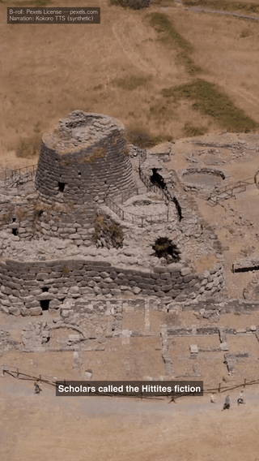
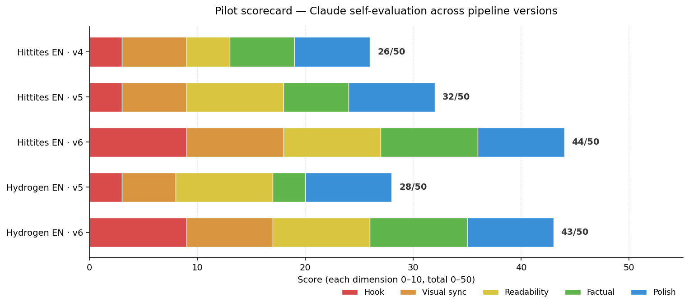

<div align="center">

# MelonS-Agents

**한국어** | [English](./README.md) · [**라이브 사이트 →**](https://melons.github.io/MelonS-Agents/)

**토픽 프롬프트 → 60초 9:16 세로 쇼츠.**

**기계적인 단계는 로컬, 창작 단계는 Claude.**  세 가지 감사 트리거 — 커밋·이상·스케줄 — 으로 시스템이 자신의 드리프트를 스스로 잡습니다.  영어 + 한국어 듀얼 트랙.

`미션 32회 · 런타임 API 토큰 0개 · 감사 레이어 3개 · v6 scorecard 44 / 50 · MIT`




</div>

## 개요

> macOS 기반 멀티 에이전트 시스템입니다.  **현재 초점** — 위 데모에
> 보이는 — 은 faceless 숏폼 영상 생성.  **하지만 시스템 자체는
> 숏폼 전용이 아닙니다.**  스캐폴드 — orchestrator + 4개 미션
> 서브에이전트 + 파일 기반 핸드오프 + 3-layer 반응형 감사 +
> Tier-1/Tier-2 비용 라우팅 — 은 범용으로 설계되었으며, 숏폼
> 영상은 *시각적으로 검증 가능한 구체적 산출물*에 대해 아키텍처를
> 시험해 본 v1 미션 타입일 뿐입니다.  추가 미션 타입 (리서치
> 워크플로우, 다단계 데이터 파이프라인, 운영자가 다음으로 집어 올
> 자동화 작업 등) 은 프로젝트가 성숙하면서 같은 스캐폴드 위에
> 얹힐 예정입니다.
>
> 단 하나의 원칙 위에 만들어졌습니다 — **제작 파이프라인을
> 자동화하고, 시스템이 자신의 로직을 스스로 진화시키게 한다.**
> 이 저장소의 모든 커밋은 그 진화의 한 단계입니다.  히스토리는
> 산출물의 기록이 아니라, 에이전트 시스템 자체가 성장해 온
> 궤적입니다.

> **엔지니어링 결정, 한 페이지로.**
> [`docs/engineering-case-studies.ko.md`](docs/engineering-case-studies.ko.md)
> — 프로덕션에서 드러난 4건의 문제와 각각이 만들어낸 최소 메커니즘
> (Tier-1 라우팅, 세마포어 배치, 콘텐츠 품질 피드백 루프, 3-레이어
> 리액티브 감사). 각 항목은 *문제 → 제약 → 결정 → 산출물* 포맷.

## 설계 노트

일반적인 에이전트 데모와 차별화되는 설계 선택들:

- **목표 계층과 작업 큐의 분리.** [`docs/goal.md`](docs/goal.md)는
  활성 목표를 구체적 산출물로 정의; [`docs/roadmap.md`](docs/roadmap.md)는
  일별 작업 큐. 큐가 비었다고 목표가 달성된 것은 **아님** — 목표의
  "Done when" 조건만이 달성을 정의함. 분리 이유: 이전 24시간 구간이
  인프라 커밋 11개를 쌓는 동안 큐는 0건이었고 실제 산출물도 0건이었던
  사고를 다시 막기 위함.
- **운영 계약은 커밋된 단일 출처.**
  [`docs/operator-contract.md`](docs/operator-contract.md) — 12개
  하드 룰 + 컨벤션. 에이전트의 로컬 메모리는 이 파일을 가리키는
  빠른 캐시; 두 곳이 어긋나면 이 파일이 이김.
- **오케스트레이션과 실행 사이의 비용 방화벽.** Anthropic API 토큰은
  Tier 1 오케스트레이션에서만 소비. 미션 실행(전사 → 선택 → 렌더
  → QA)은 `whisper.cpp` + `ollama` + `ffmpeg` 로컬 실행이며
  토큰 비용 0. [`docs/cost-model.md`](docs/cost-model.md) 참조.
- **별도 트랙 auditor + 능동 알림 surface.**
  [`auditor`](.claude/agents/auditor.md) 서브에이전트는 launchd로
  매일 03:00 발화, 저장소 전체를 읽기 전용 순회, 안정 채널에 기록:
  [`docs/audit/CURRENT-ALERT.md`](docs/audit/)는 최근 verdict이
  비-CLEAN일 때만 존재 — 다음 인터랙티브 세션은 목표를 잡기 전
  이 파일을 의무적으로 읽음.
- **파일 기반 서브에이전트 핸드오프.** 서브에이전트들은 대화
  히스토리를 공유하지 않음. 커밋되는 파일(`plan.md` / `MANIFEST.md`
  / `qa-report.md`)을 통해 통신. 각 서브에이전트의 컨텍스트는 자신의
  프롬프트 + 자신이 읽는 매니페스트로 한정됨 — 예측 가능한 토큰
  비용, 예측 가능한 실패 모드.

## 샘플 출력

지금까지 **5가지** 미션 타입에 걸쳐 60+건의 출력이 생성되었습니다.
가장 최근 (2026-05-17) 포커스는 신규 `music-video` 미션 — 음악-주
음성 오디오 쇼츠 (내레이션 없음, 캡션 없음, 비트 정렬 컷 + 드럼 onset
정렬 글리치 마이크로 에디트) — 운영자의 파일럿 픽으로 채택됨, 자세한
내용은 [`docs/pilots/decision-log.md`](docs/pilots/decision-log.md#operator-pick--2026-05-17)
참고.  같은 날 저녁에 4-효과 포스트프로세싱 쉐이더 레이어 landing
(pond surface, breathing zoom, halation, phrase-aware combo; 카툰은
deferred — [case study 5](docs/engineering-case-studies.ko.md#5-ffmpeg-안의-쉐이더-효과--벽이-어디인지-아는-것)
참조) + `scripts/daily-music-video.sh` 가 mission + shader 를 cron /
launchd 일일 업로드 cadence 에 맞춘 queue runner 로 래핑.  `faceless-
short` 미션 (내레이션 기반 쇼츠) 은 여전히 아래 쇼케이스로 유지되며,
v1 파이프라인 출력 (단일-클립 highlight + shorts-batch) 은 기준점
참고용으로 그 아래에 유지됩니다.

### Music-video 파일럿 (니치 피벗 후, 2026-05-17)

`music-video` 미션은 60초 9:16 쇼츠를 만드는데, **음악이 메시지**입니다 —
운영자가 공급한 음악 파일이 유일한 오디오 트랙, 컷은 `aubiotrack` 으로
추출한 phrase 경계에 정렬, 클립별 재생 속도가 분위기에 따라 가변
(정적 톤 0.55×, 앰비언트 0.70×, 액티브 0.80×, 자연 톤 1.00×),
마이크로 "스크래치" 글리치 (0.2초 역재생 + 0.2초 forward jump-cut) 는
`aubioonset` 으로 검출한 드럼 hit에 정렬되되 **정적-카메라로 분류된
클립에만** 적용됨 (글리치 중 프레임 흔들림 방지). 미세 필름 그레인 +
소프트 비네팅 + 글리치 onset마다의 가우시안 줌-펄스로 빈티지 lo-fi
처리.

다섯 개의 프로토타입 (v1→v5) 으로 운영자 피드백을 반영하며 점진 개발:

- v1: 균등 7.5초 컷 (비트 동기 없음)
- v2: `aubiotrack` phrase 경계로 컷 이동
- v3: 클립별 가변 재생 속도 추가 (정적 톤 슬로우)
- v4: 슬로우 클립 중간 지점에 글리치 마이크로 에디트
- v5: 글리치 위치를 `aubioonset` 드럼 hit + 정적-카메라 클립으로 제한

v5 = 운영자 검증 완료 → 정식
[`agents/missions/music-video/run.sh`](agents/missions/music-video/run.sh)
으로 승격. v6 빈티지 lofi 처리 (그레인 + 비네팅 + 줌-펄스) 는 v5 위에
같은 미션에 통합 — 렌더별로 `MUSIC_VIDEO_FILM_GRAIN_INTENSITY`,
`MUSIC_VIDEO_VIGNETTE_ANGLE`, `MUSIC_VIDEO_ZOOM_PULSE_AMP` env var로
조절. 출력 mp4는 여전히 gitignored (records/). 음악 파일 자체는
정책상 로컬-only ([`assets/music/README.md`](assets/music/README.md))
— "비디오에서 사용 가능 라이선스" 와 "파일 재배포 가능 라이선스" 가
다른 문제라 레포는 절대 오디오 자산을 들고 다니지 않음.

재현:

```bash
agents/missions/music-video/run.sh <id> <path/to/music.mp3>
```

#### 포스트프로세싱 쉐이더 (2026-05-17 저녁)

운영자가 v6 빈티지 lo-fi 처리 위에 쉐이더 스타일 효과 요청.  세 가지
효과는 순수 ffmpeg 필터 그래프로 작동하고 (GLSL · 외부 도구 없음),
한 가지는 의도적으로 보류:

- **`pond`** — 화면 전체에 적용되는 움직이는 물 표면 변위.  `geq` 가
  3중 sin 파동 필드로 X/Y 변위 맵 두 장을 540×960 에서 생성 (1080×1920
  직접 생성보다 4× 빠름) → bicubic scale 후 `displace` 에 투입.  최대
  ±13 px (~1.2 % 폭) — 전체 화면에 명확히 보이지만 거슬리지 않음.
  "화면 자체가 연못 표면이고 잔잔히 sway 함" 으로 읽힘.
- **`breathing`** — 연속적인 부드러운 스케일 파동, 5 초 주기, +0~5 %.
  항상 upscale → `crop` 후 프레임이 1080 밑으로 안 떨어짐 (첫 시도
  `sin(t)` 범위 −1~+1 로 했더니 1080 미만 폭에서 libx264 가 중간에
  크래시.  `(0.5 + 0.5*sin)` 으로 재구성, 곱셈 인자 ≥ 1.0 보장).
- **`halation`** — 밝은 영역 주변의 따뜻한 빛 번짐.  소스 split → 사본을
  brightness 임계값 + 22 px gblur → 원본 위에 screen blend 0.30
  opacity.  앰버 / 네온 영역이 80s 필름의 light leak 처럼 보임 — 운영자가
  첫 시도에서 "확실히 티남" 확인.
- **`combo`** — `pond` + `halation` 의 **phrase-aware 강도 envelope**.
  두 효과 강도가 모두 `T` (시간) 함수: 인트로 (0~15 s) 에 off / 약,
  빌드 (15~22.5 s) 에 ramp-up, 클라이맥스 (22.5~45 s) 에 풀, 윈드다운
  (45~52.5 s) 에 taper, 아웃트로 (52.5~60 s) 에 settle.  phrase 경계는
  Velvet Turntable 레퍼런스 트랙 95.8 BPM × 12 비트 phrase = 7.5 s
  cadence 와 일치 — 다른 트랙은 스크립트에서 envelope 파라미터 수정.

시도했으나 **포기**: **카툰 (cel-shading)** 렌더링.  ffmpeg 가 luma 와
chroma 를 독립 양자화 (`lutyuv` 의 `round(val/N)*N`) 하면 hue 가
망가짐 — 운영자가 "완전 그냥 초록색만 나옴" 으로 reject.  진짜 cel-
shading 은 GLSL 쉐이더 (mpv + libplacebo, 200~500 줄), EbSynth (1
키프레임 페인팅 후 모션 따라 전파), 또는 AI 스타일라이즈 (Stable
Diffusion + AnimateDiff, ComfyUI, RunwayML / Kaiber) 중 하나가
필요.  ffmpeg 파이프라인 안에선 자연스러운 구현 불가 → 별도 R&D
분기로 보류, 어설프게 production 에 박지 않음.

재현:

```bash
# 단일 효과
scripts/music-video-shaders.sh pond     <input.mp4> <output.mp4>
scripts/music-video-shaders.sh halation <input.mp4> <output.mp4>

# phrase-aware combo (검증된 최종 결과)
scripts/music-video-shaders.sh combo    <input.mp4> <output.mp4>
```

### Faceless 파일럿 (영어 + 한국어 A/B)

`faceless-short` 미션은 토픽 프롬프트만으로 60초 완성본을 산출합니다 — 입력 영상 없음.  파이프라인: ollama가 내레이션 스크립트 초안 → Kokoro-ONNX (`am_michael`, 한국어는 macOS `Yuna`) 음성 합성 → whisper.cpp 타이밍 전사 → 스크립트 정합 캡션 교정 (고유명사를 원본 스크립트 텍스트로 복원) → SRT 큐를 자연 구두점에서 단일 라인으로 분할 (모바일 2줄 박스 오버랩 차단) → ollama가 내레이션 시간 윈도우(8개) 마다 Pexels 검색어 1개씩 추출 → Pexels Videos API에서 윈도우당 B-roll 1개 수집 → ffmpeg가 각 클립을 윈도우 길이로 트림·9:16 풀화면 크롭·libass 자막 번인·출처 오버레이까지 완성.

같은 토픽을 두 가지 언어 버전으로 렌더해 음성+자막 차이를 나란히 비교:

| | 히타이트 (역사 × 성경) | 수소 (과학) |
|---|---|---|
| EN |  |  |
| KO |  |  |

각 언어 버전은 자기 캡션에서 윈도우당 Pexels 검색어를 *자체적으로* 추출 — 그래서 EN과 KO는 스크립트 구조는 공유하지만 동일한 클립을 항상 쓰지는 않습니다 (v3/v4 설계: 윈도우별 키워드로 내레이션 비트와 정렬 우선).  "동일 영상, 음성만 교체" 비교가 필요하면 `FACELESS_REUSE_BROLL=<en_mission_dir>`로 KO 렌더가 EN의 이어붙인 B-roll을 강제 재사용하게 할 수 있습니다.

A/B 제작 노트, 플랫폼별 업로드 메타데이터, 다음 10개 토픽 큐는 모두 [`docs/pilots/`](docs/pilots/) 아래에 있습니다.  파일럿당 한계 비용: **$0** (Pexels 무료 티어, 그 외 단계는 모두 로컬).

### v1 파이프라인 (단일 클립 highlight / shorts-batch)

원조 v1 미션 — `highlight`, `summarize`, `shorts-batch` — 은 실제 소스 URL (예: Creative Commons 영상)을 받아 9:16 출력을 만들면서 출처 워터마크 + 자막을 번인합니다.  `faceless-short` 이전의 설계이며, 토픽이 아니라 영상에서 *부분 발췌*가 필요할 때 여전히 활용됩니다.


`highlight-015213/outputs/short.mp4`의 6초 발췌 — Sintel 트레일러 (CC-BY-3.0, © Blender Foundation), 39초 9:16 워터마크 + 자막.  전체 mp4는 `records/` 아래에 (gitignored); 위 GIF는 크기 최적화 발췌 (가로 360 px, 12 fps, ≈ 2.8 MB) — ffmpeg + palette dither로 생성하여 `docs/demo/`에 v1 파이프라인의 영구 증거로 유지.

| 단일 하이라이트 | 숏츠 배치 |
|----------------|----------|
|  |  |
| `highlight-015213` · 39 초 · 첫 시도 PASS | `shorts-batch-024840 / short-01` · 44 초 · 첫 시도 PASS |

둘 다 *Sintel* 트레일러 (CC-BY-3.0, © Blender Foundation — `durian.blender.org`)에서 추출.  공통 요소: 좌측 상단 출처 어트리뷰션 오버레이, 9:16 letterbox-blur 배경, 하단 safe-zone 박스 안의 libass 번인 자막.

### 파일럿 점수표 — 어느 버전에서 무엇이 좋아졌나

운영자 질문: *"썸네일만으로는 뭐가 좋아지는지 안 보인다."*
정직한 답은 쇼트폼 시청 유지율에 매핑되는 다섯 가지 차원에 걸친
구조화된 자체 평가입니다.



v5 → v6 상승폭 (단일 라인 자막은 v5에서 이미 적용 완료, v6는
스크립트 생성 단계만 로컬 `llama3.2:3b`에서 Claude Sonnet으로
교체)은 Hittites EN에서 +12점, Hydrogen EN에서 +15점.  v5→v6
델타 대부분이 **후크**와 **사실 일관성** 차원 — 운영자가 v5에서
지적한 바로 그 차원입니다 ("초반 5초에 시선 끌만한 게 없음",
"10%인지 60%인지 헷갈리네").

투명성 고지: 점수는 시청자 패널이 아니라 Claude가 매긴 자체
평가입니다.  실제 플랫폼 시청 시간 데이터가 들어오기 전까지의
구조화된 진행 신호로만 사용합니다.  버전별 상세 + 추론 + 차원
정의: [`docs/pilots/scorecard.md`](docs/pilots/scorecard.md).
원본 데이터: [`docs/pilots/scorecard.json`](docs/pilots/scorecard.json).
JSON 수정 후 차트 재생성:
`.venv/bin/python scripts/generate-scorecard-chart.py`.


## 분석가/리뷰어를 위한 안내

이 저장소에 대한 읽기 전용 분석을 시작한다면
[`docs/for-analysts.md`](docs/for-analysts.md)부터 보세요 — 1차
진단 정확도를 위한 단일 진입점입니다. [`docs/cost-model.md`](docs/cost-model.md)
(Anthropic 대 로컬 비용 구분)과 [`docs/architecture.md`](docs/architecture.md)
(전체 데이터 흐름)과 함께 보면 됩니다.

## 아키텍처

```
              ┌───────────────────┐
              │   Orchestrator    │   model: opus
              └─────────┬─────────┘
                        │ 미션을 순서대로 위임
                        ▼
              ┌───────────────────┐
              │      Planner      │   model: sonnet
              └─────────┬─────────┘
                        ▼
              ┌───────────────────┐
              │     Resourcer     │   model: sonnet
              └─────────┬─────────┘
                        ▼
              ┌───────────────────┐
              │       Editor      │   model: sonnet
              └─────────┬─────────┘
                        ▼
              ┌───────────────────┐
              │         QA        │   model: sonnet
              └───────────────────┘

              ┌───────────────────┐
              │      Auditor      │   model: sonnet  (별도 트랙)
              └───────────────────┘   read-only, 매일 03:00
                                       launchd 발화
```

| 에이전트 | 책임 | 산출물 |
|----------|------|--------|
| 🤖 **Orchestrator** (opus) | 미션 분해, 위임, 최종 통합 | 태스크 리스트 · `summary.md` |
| 🧠 **Planner** (sonnet) | 전략 수립, 작업 분해, 수락 기준 정의 | `plan.md` |
| 📦 **Resourcer** (sonnet) | 자산 수집, 외부 도구 실행 (ffmpeg / yt-dlp / whisper) | `resources/MANIFEST.md` |
| 🎞️ **Editor** (sonnet) | 출력 렌더링, 산출물 조립 | `outputs/CHANGELOG.md` |
| ✅ **QA** (sonnet) | 계획 기준 대비 검증, 회귀 감지 | `qa-report.md` |
| 🔍 **Auditor** (sonnet) | 저장소 전체 drift / contract / cost / security 감사 (별도 트랙, 매일 03:00) | `docs/audit/<date>-<focus>.md` + 비-CLEAN 시 `docs/audit/CURRENT-ALERT.md` |

서브 에이전트 정의: [`.claude/agents/`](.claude/agents/) · 미션 템플릿과 공용 셸 라이브러리: [`agents/`](agents/)

## 코드 / 데이터 분리

| 계층 | 경로 | 추적 여부 |
|------|------|-----------|
| 코드 (로직) | `.claude/agents/`, `agents/`, `config/`, `scripts/` | ✓ |
| 데이터 (산출물) | `records/missions/<date>/<id>/` | ✗ (gitignore) |
| 시크릿 | `.env` | ✗ (gitignore) |

저장소는 에이전트 시스템 자체만 보관합니다. 미션 산출물 — 영상,
전사, 생성된 자산 — 은 모두 로컬 `records/`에만 남습니다. GitHub에
드러나는 것은 산출물이 아니라 시스템의 진화 과정입니다.

## 플랫폼 지원

| 영역 | macOS 14+ | Linux |
|------|-----------|-------|
| 미션 실행 (전사 → 선택 → 렌더 → QA) | ✓ | ✓ (`ffmpeg` / `whisper.cpp` / `ollama` 모두 사용 가능) |
| 하드웨어 가속 렌더 (`h264_videotoolbox`) | ✓ Apple Silicon | n/a — `-allow_sw 1`로 libx264 폴백 |
| `bootstrap.sh` 합성 fixture (macOS `say`-기반 TTS) | ✓ | 스킵 — `scripts/fetch-fixtures.sh`로 실제 CC fixture 사용 |
| `launchd` 스케줄러 (야간 자동 실행, 일일 감사) | ✓ | systemd timers 또는 cron으로 대체 — `scripts/com.melons.agents.*.plist` 일정을 참고 |

macOS가 **주 검증 플랫폼** (엔드투엔드 테스트 완료). Linux는 미션
실행에는 동작하지만 스케줄러와 합성 fixture 생성은 OS별 적응이
필요합니다. 크로스 플랫폼 CI는 아직 없고, clone-and-go 흐름은
Darwin에서만 검증되어 있음.

모든 도구 경로와 엔드포인트는 환경 변수로 관리됩니다 —
`agents/lib/env.sh`가 빈 `*_BIN` 변수를 `command -v`로 자동 해석하므로
PATH에 도구가 설치되어 있으면 충분. 필요할 때만 `.env`에서 override.

## 자율 모드

[`config/policies.yaml`](config/policies.yaml)에 정의됩니다.

| 모드 | 플래그 | 동작 |
|------|--------|------|
| ⚙️ **Interactive** (기본값) | `AUTONOMY_MODE=false` | 로직 변경·파괴적 작업·외부 게시 전에 사용자 확인을 받습니다. |
| 🌙 **Autonomous** | `AUTONOMY_MODE=true` | `AUTONOMY_BUDGET_USD` 범위 안에서 무인 실행. 로직 파일(`agents/`, `.claude/agents/`)은 불변입니다. |

## 미션 흐름

1. 사용자가 미션을 지시합니다.
2. `orchestrator`가 `records/missions/<date>/<id>/`와 태스크 리스트를 생성합니다.
3. `planner` → 수락 기준이 포함된 `plan.md`.
4. `resourcer` → 자산과 `resources/MANIFEST.md`.
5. `editor` → 산출물과 `outputs/CHANGELOG.md`.
6. `qa` → 항목별 PASS / FAIL이 적힌 `qa-report.md`.
7. PASS 시 `orchestrator`가 `summary.md`를 작성합니다.

## 툴체인

`ffmpeg` (libass 포함 빌드 — macOS는 `brew install ffmpeg-full`,
Linux는 `apt install ffmpeg`) · `yt-dlp` · `whisper.cpp` (`small`,
다국어) · `ollama` (`llama3.2:3b`) · `Kokoro-ONNX` (TTS, Apache 2.0 —
faceless-short 내레이션) · macOS `say` (한국어 + fallback 음성) ·
Pexels Videos API (무료 티어 — faceless-short B-roll) · 오케스트레이션용
Claude API.

## 사전 요구사항

- **macOS 14+** (주 검증 플랫폼) 또는 **Linux** (best-effort —
  위 [플랫폼 지원](#플랫폼-지원) 참조)
- macOS는 **Homebrew**, Linux는 `apt` / `pacman` / 동등 패키지 매니저
- **Apple Silicon 권장** — 렌더 가속에 `h264_videotoolbox` 사용,
  `-allow_sw 1`로 Intel / Linux에서 libx264 자동 폴백
- **여유 디스크 ~3 GB** — whisper.cpp `small` 모델 (~150 MB),
  Pexels B-roll 다운로드 (미션당 ~50 MB, 자동 정리), 출력 mp4
- **도구**: `ffmpeg` (libass 포함 빌드), `ffprobe`, `whisper.cpp`,
  `ollama`, `yt-dlp`, `aubio` (music-video 미션의 비트 / 온셋 감지에
  필요), `jq`. `scripts/bootstrap.sh`가 모두 점검하고 누락된
  도구별로 OS에 맞는 `brew install …` / `apt install …` 명령을 정확히
  출력 — 도구 누락이 침묵 실패로 끝나지 않음.
- **API 키**: 무료 [Pexels API 키](https://www.pexels.com/api/)
  (시간당 200 req — 개인 사용에 충분) — B-roll fetch 에 필요.
  `bootstrap.sh` 가 `.env` 에 `PEXELS_API_KEY` 안 잡혀 있으면 경고.

## 빠른 시작 — music-video 플로우 (메인 쇼케이스)

```bash
# 1) 클론 + cd
git clone https://github.com/MelonS/MelonS-Agents.git
cd MelonS-Agents

# 2) 부트스트랩 (도구 점검, whisper / ollama 모델 자동 다운로드,
#    누락된 거에 대해 정확한 brew/apt 명령 출력, Pexels 키 미설정 경고)
./scripts/bootstrap.sh

# 3) .env 편집 — PEXELS_API_KEY 설정 (무료, 위 가입 링크)
# (bootstrap 단계가 .env 를 .env.example 에서 자동 생성함)

# 4) Suno (무료 티어, suno.com) 에서 음악 트랙 생성.  예 프롬프트:
#    "late night jazz lofi, soft piano, 60 BPM, [Instrumental]"
#    → mp3 다운 후 assets/music/ 에 드롭
#    (gitignore 됨 — license 추적은 assets/music/SOURCES.md 에)

# 5) 트랙으로 music-video 미션 실행
./agents/missions/music-video/run.sh upload1 "assets/music/<your_track>.mp3"

# 6) (옵션이지만 핵심) phrase-aware 쉐이더 combo 적용
#    — pond surface ripple + warm halation, 95.8 BPM phrase cadence
#       (다른 템포는 스크립트 안에서 envelope 조정)
./scripts/music-video-shaders.sh combo \
    records/missions/$(date +%Y-%m-%d)/music-video-upload1-*/outputs/short.mp4 \
    outputs/publish/my-first-short.mp4
```

미션 베이스 출력은
`records/missions/<date>/music-video-<id>-<HHMMSS>/outputs/short.mp4`
에 저장 (gitignore — 산출물은 본인 머신에만 남고 GitHub 에는
에이전트 시스템 자체만 올라감).  쉐이더 단계가 최종 mp4 를
`outputs/publish/` 로 복사 → 업로드 시 거기서 픽업.

자동화된 일일 cadence: `records/queue/music-video-pending.txt` 에
트랙 큐잉 후 `scripts/daily-music-video.sh --all` 실행 (또는
launchd / cron 으로 스케줄).

### v1 플로우 — 단일 클립 highlight (기준점)

```bash
./agents/missions/highlight/run.sh https://download.blender.org/durian/trailer/sintel_trailer-1080p.mp4
```

다중 소스 배치 + 자율 큐 드레이너 (v1 용):

```bash
./scripts/batch-mission.sh -f sources.txt
echo 'https://example.com/long.mp4' >> records/queue/pending.txt
./scripts/mission-queue.sh
./scripts/install-scheduler.sh install      # 야간 launchd
```

## 운영 계약

이 저장소는 전적으로 에이전트가 운영합니다. 일상 규칙:

- **에이전트가 모든 작업을 수행** — 설치, 편집, 설정, 커밋, 푸시, 스케줄링. 사용자는 터미널에서 명령을 실행하지 않습니다.
- 사용자는 **에이전트가 하드 가드레일에 막힐 때만** 개입 (예: 본인 권한 자체 수정, `main`에 강제 푸시) — 그 경우에도 클릭 한 번의 승인만, 절대 다단계 레시피 따라하기 아님.
- **현재 활성 목표**는 [`docs/roadmap.md`](docs/roadmap.md)에 있습니다. 아래의 "상태" 목록은 평면적 기능 원장 — TODO 리스트로 읽지 마세요. 로드맵의 *Now* 섹션이 "다음에 무엇을 할지"의 단일 출처입니다.
- **결제 방화벽**: 유료 API, SaaS 구독, 클라우드 리소스 생성은 사용자의 명시적 확인이 필요. 로컬 자원(Ollama, FFmpeg, whisper.cpp, brew)은 완전 자율.

전체 계약: [`CLAUDE.md`](CLAUDE.md) 및 [`config/policies.yaml`](config/policies.yaml) 자율 모드 규칙 참조.

## 라이선스

MIT. [`LICENSE`](LICENSE) 파일을 참고하세요.
