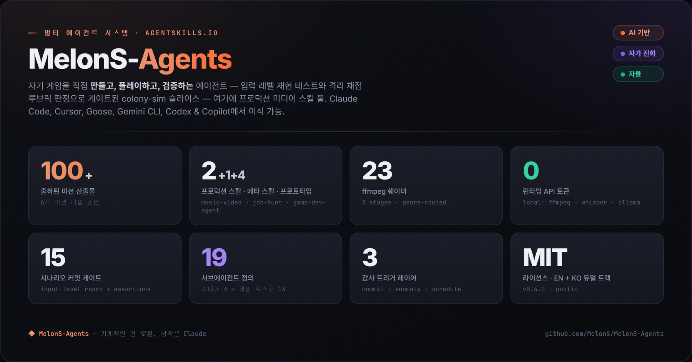
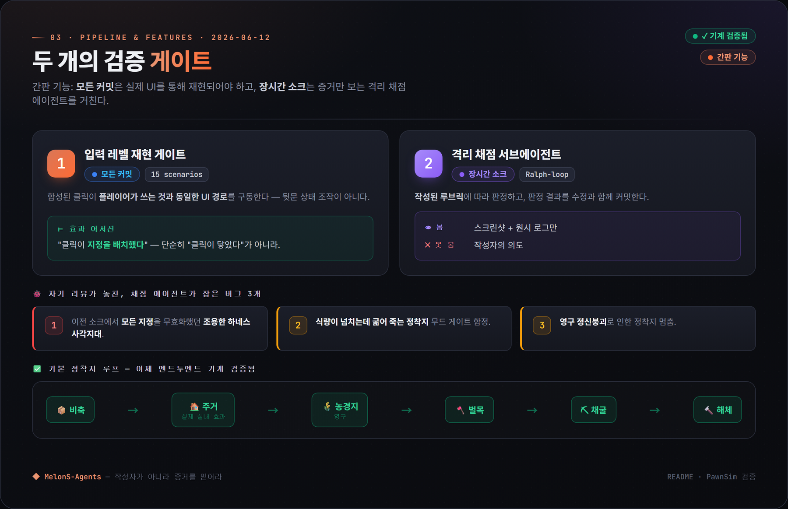
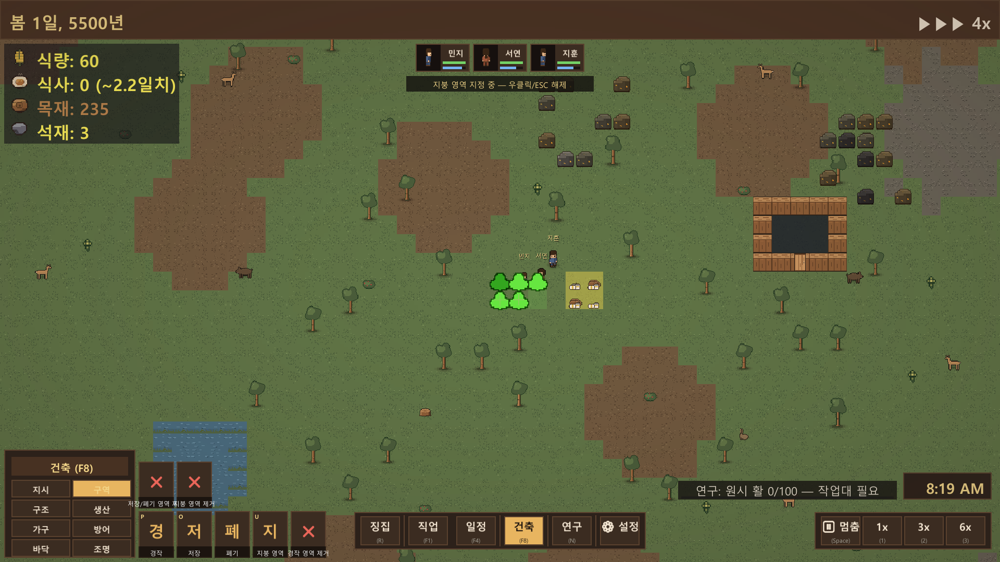
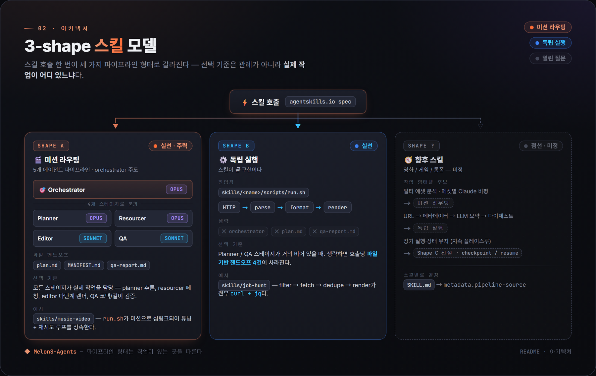

<div align="center">

# MelonS-Agents

**한국어** | [English](./README.md) · [**라이브 사이트 →**](https://melons.github.io/MelonS-Agents/)

### 혼자서 [Claude Code](https://docs.anthropic.com/claude-code)로 만든 멀티 에이전트 시스템입니다. 음악을 숏폼 영상으로 뽑아내고, 콜로니심 게임을 개발해 직접 플레이하며 스스로 검증합니다.

**런타임 API 비용 0 · 첫날부터 한국어 + 영어.**

[](https://github.com/MelonS/MelonS-Agents/actions/workflows/main-protection.yml)


*사람 손 하나 대지 않고 게임 내 16일을 돌린 장기 자동 플레이 — 이 게임을 에이전트가 만들고 **검증까지** 했습니다.*

</div>

- **실제로 내놓습니다.** **music-video** 파이프라인이 정해진 주기로 결과물을 냅니다: 음악 한 곡 → 60초 9:16 쇼츠(비트 컷·장르 그레이드). 두 번째 파이프라인 **content-shorts** 는 2026-07-01 첫 실제 쇼츠를 유튜브에 올렸고(아이돌 포맷), 아직 정기 주기엔 오르지 않았습니다.
- **런타임 비용은 0.** 기계적인 작업은 로컬 오픈소스 도구(ffmpeg · whisper.cpp · ollama · aubio)가 하고, Claude Code 에이전트는 지휘만 맡습니다. 그래서 미션 한 번에 **런타임 API 토큰 0개**.
- **자기 작업을 스스로 검증합니다.** 대표 사례인 콜로니심 **PawnSim** 은 에이전트가 *직접 만들고 플레이해서 검증*합니다. 실제 플레이어 클릭을 재생해 각 클릭이 게임 상태를 정말로 바꿨는지 확인하고, 오래 돌린 무인 플레이는 스크린샷만 보는 별도 서브에이전트가 채점합니다.

*운영자 한 명이 만든 에이전트 시스템을 그대로 공개한 저장소입니다. 미디어 파이프라인은 클론해서 바로 돌려 볼 수 있고(Mac/Linux), 게임과 그 안의 엔지니어링은 읽고 배우도록 열어 두었습니다.*



## 지금 무엇이 돌아가나

| 트랙 | 하는 일 | 상태 | 지금 실행 가능? |
|------|---------|------|-----------------|
| **music-video** | 음악 → 60초 9:16 쇼츠 (비트 정렬 컷, 빈티지 ffmpeg 쉐이더) | 프로덕션\* | ✅ Mac/Linux — `./scripts/first-touch.sh`, ~60초 |
| **job-hunt** | 키워드 하나 → 한국 채용공고 다이제스트 (소스 플러그인 11개) | 보류 | ❌ 한국 채용사이트가 스크래핑 차단 — mock/드라이런만 동작 |
| **PawnSim** · `game-dev-agent` 가 제작 | 자기 검증형 콜로니심 게임 프로토타입 | 개발 중 | ⚠️ Windows + Unity 6000.0.75f1 |
| **content-shorts** · 4팀 법률 검수 파이프라인이 제작 | 주제 → 출처를 갖추고 저작권 검수를 거친 9:16 쇼츠 (정보/뉴스/아이돌 포맷) | 개발 중 | ⚠️ 2026-07-01 첫 유튜브 쇼츠 출시(아이돌), 아직 정기 주기 아님, Pexels 키 필요 |
| **product-cf** | 제품 사진 → CF 스타일 쇼츠 | 보류 | ❌ 정직한 부정 결론으로 보류 |

<sub>\*"프로덕션" = 정해진 주기로 실제 결과물을 내놓는 트랙 (오늘 기준 **music-video** 하나만 해당). `game-dev-agent` 는 PawnSim 을 만드는 메타 스킬로, PawnSim 이 정기 출시 궤도에 오르면 프로덕션 카운트에 합류합니다.</sub>

## 자기 작업을 스스로 검증한다



에이전트에게 코드를 *만들어 내게* 하는 건 누구나 합니다. 어려운 건 그 결과가 실제로 작동한다는 걸 *증명*하는 일이고, 그게 이 프로젝트의 핵심입니다. PawnSim 은 코드가 반영되기 전에 두 개의 게이트를 통과합니다.

- **커밋마다 도는 15개 시나리오 재현 게이트.**  에이전트가 플레이어와 똑같은 UI 경로로 실제 클릭을 합성하고, 각 클릭이 (단지 닿은 게 아니라) 실제로 *효과*를 냈는지, 가령 "그 클릭이 지정(designation)을 정말 찍었는지"를 어서트합니다.
- **오래 돌린 무인 플레이에는 격리 채점 서브에이전트.**  증거(스크린샷 + 원본 로그)만 보고 작성자의 의도는 전혀 보지 않은 채, 미리 정해 둔 루브릭에 따라 실행을 채점합니다.

이 채점기는 셀프 리뷰가 놓친 문제들을 몇 번이나 잡아냈습니다. 모든 지정을 소리 없이 무효화하던 하네스(테스트 장치)의 사각지대, "식량이 넘치는데 콜로니가 굶어 죽는" 기분(mood) 게이트 함정, 영구 정신 붕괴로 콜로니 전체가 멈춰 버리는 버그 같은 것들입니다. 기본 루프(저장 → 집짓기 → 농사 → 벌목 → 채광)는 이제 처음부터 끝까지 기계로 검증되고, 그 루브릭 판정이 수정 커밋과 함께 남습니다. *문제 → 제약 → 결정 → 산출물* 형식으로 정리한 9개 인시던트: [`docs/engineering-case-studies.ko.md`](docs/engineering-case-studies.ko.md).

**핵심 용어** — *재현 게이트*: 실제 플레이어 클릭을 재생해 각 클릭이 효과를 냈는지 어서트하는 것. *격리 채점*: 스크린샷과 로그만으로 판정하는 별도 서브에이전트. *소크(soak)*: 길게 돌리는 무인 테스트 실행.

## 60초 안에 시작

> **사전 요구:** `ffmpeg`, `ollama`, `aubio` 가 PATH 에 있는 Mac 또는 Linux — 설치 마법사가 먼저 점검하고, 빠진 항목이 있으면 정확한 `brew` / `apt` 설치 명령을 알려 줍니다 (clone-and-go 는 macOS 에서 검증됨).

```bash
git clone --depth 1 https://github.com/MelonS/MelonS-Agents.git
cd MelonS-Agents
./scripts/first-touch.sh        # 가이드 데모: 도구 점검, 9:16 쇼츠 렌더, 결과 열기
```

Pexels 가입도, Suno 호출도, `.env` 편집도 필요 없습니다 — 마법사가 데모 캐시를 받아 함께 담긴 CC-BY 클립과 음악으로 60초 쇼츠를 렌더합니다. 수동·고급·스킬별 경로는 아래 **실행 경로**에 접어 두었습니다.

## 움직이는 PawnSim



콜로니스트는 유틸리티 AI 에 따라 벌목·채광·농사·요리·운반·건축·연구·전투를 하고, AI 디렉터가 불규칙한 주기로 위협을 배치하며, 플레이어는 폰을 전투에 징집하고 건축·지정 명령을 내립니다. 모든 스프라이트(완전한 **32px 아트 생성**), 모든 씬, 모든 C# 시스템을 [`game-dev-agent`](skills/game-dev-agent/) 가 CLI 로 스캐폴딩하며 **수동 Unity 에디터 작업은 전혀 없습니다**. 전체 기능 목록과 정직한 검증 상태(알려진 한계 포함): [`skills/game-prototype/README.md`](skills/game-prototype/README.md).

## 샘플 결과물 — music-video


음악이 주(主) 오디오가 되는 9:16 쇼츠입니다: 비트에 맞춘 컷, onset(음 시작점)에 맞춘 글리치 마이크로 에디트, 그리고 여섯 가지 장르별 컬러 그레이드(+ 중립 패스스루) 중 하나가 평범한 스톡 B-roll 을 장르 색이 입혀진 룩으로 바꿉니다. 2026-05-17 에 기존의 내레이션 기반 포맷을 밀어내고 채택됐습니다. 전체 파이프라인 — 23개 쉐이더, 장르 카탈로그, v1→v6 진화: [`docs/music-video-pipeline-reference.md`](docs/music-video-pipeline-reference.md).

## 어떻게 런타임 비용 0을 유지하나



이 시스템은 모든 스킬을 하나의 형태로 강제하지 않습니다. **Shape A** 는 5에이전트 미션 파이프라인(orchestrator + planner / resourcer / editor / qa)으로 흐르고, **Shape B** 는 planner/qa 단계가 거의 빌 때 쓰는 독립 스크립트입니다. 서브에이전트끼리는 대화 기록을 공유하지 않고, 커밋된 파일(`plan.md` / `MANIFEST.md` / `qa-report.md`)로만 작업을 넘겨줍니다. 그래서 각자의 컨텍스트와 비용이 일정 범위 안에 묶입니다. 역할별 모델 배정(planner/resourcer = opus, editor/qa = sonnet)과 비용 방화벽 덕분에 Anthropic 토큰은 오케스트레이션 단계에서만 쓰이고, 미션 실행은 전부 로컬 도구로 돌아 런타임 API 토큰이 **0**으로 유지됩니다. `.claude/agents/` 에는 정의가 **23개**(코어 6 + 게임 로스터 12 + 콘텐츠 파이프라인 팀 5) 있습니다. 전체 데이터 흐름도: [`docs/architecture.md`](docs/architecture.md) · 게임 프로토타입 빌드 체인: [`skills/game-dev-agent/ARCHITECTURE.md`](skills/game-dev-agent/ARCHITECTURE.md).

## 자율성 신호 — 주장이 아니라 측정


끊임없이 사람이 붙어 조종해야 하는 멀티 에이전트 시스템은, 애초에 덜어 주려던 그 수고를 결국 벗어나지 못한 셈입니다. 그래서 `main` 의 모든 커밋을 **사용자 개시** 와 **에이전트 자율** 로 분류하고, 운영자의 Claude Code 세션 로그에서 프롬프트 수와 활성 시간을 뽑아냅니다. 목표는 시스템이 더 많은 결정을 스스로 떠안으면서 두 패널이 모두 아래로 내려가는 것입니다. 분류 기준과 감축 분석: [`docs/research/2026-05-22-intervention-reduction.md`](docs/research/2026-05-22-intervention-reduction.md).

## 정직함을 설계 원칙으로 (Honest by design)

숨기지 않고 공개해 두는, 문서로 남긴 부정적 결과들입니다. 정직하게 그은 범위가 나머지 모든 것이 기대는 신뢰의 근거이기 때문입니다.

- **`product-cf` 는 보류** — 실제로 안 된다는 결론이 나왔기 때문입니다. 무료·로컬 도구로 "진짜 3D 처럼" 만드는 접근(depth-parallax, 실린더 래핑 턴테이블, 로컬 image-to-video)은 16GB 장비에서 실제 CF 수준의 품질 기준을 넘지 못했습니다. 설득력 있는 결과를 내려면 유료 클라우드 image-to-video 나 더 큰 GPU 가 필요합니다. 코드 트리에는 비활성 상태로 남겨 두었고, 방향은 아직 미정입니다.
- **`job-hunt` 은 보류** — 겨냥했던 한국 채용사이트(사람인·원티드·잡코리아·워크넷…)가 이제 스크래핑을 막아 라이브 다이제스트가 끝내 완성되지 못했습니다. mock/드라이런 데이터로만 돌아갑니다. 5월에 이틀 동안 붙여 만들다 멈췄고, 코드는 트리에 남아 있습니다.
- **셀 쉐이딩은 의도적으로 미룸** — ffmpeg 의 한계가 어디인지 아는 편이, 결과를 그럴싸하게 위장하는 것보다 낫기 때문입니다.
- **`출력 100+` 는 정확한 집계가 아니라 어림값** — 미션 출력물은 `records/`(gitignore) 아래 로컬에만 남기 때문에, 저장소만 봐서는 이 수치를 독립적으로 검증할 수 없습니다.

더 많은 부정적 결과와 미룬 범위: [`skills/game-prototype/README.md`](skills/game-prototype/README.md) (정직한 검증 상태 + out-of-scope). 해결된 이슈 기록(예: Homebrew ffmpeg/libass 분리): [`docs/known-limitations.md`](docs/known-limitations.md).

<details>
<summary><b>설계 노트 — 흔한 에이전트 데모와 다른 선택들</b></summary>

- **결과 계층과 작업 큐를 따로 둔다.**  [`docs/goal.md`](docs/goal.md) 는 지금 목표를 구체적 산출물로 적어 두고, [`docs/roadmap.md`](docs/roadmap.md) 는 일 단위 작업 큐를 담습니다. 큐가 비었다고 목표가 달성된 건 아닙니다. 이 구분은, 과거 24시간 동안 큐가 0인 채로 인프라 커밋만 11개 쌓이고 정작 산출물은 0개였던 사고 때문에 생겼습니다.
- **본체와 분리돼(out-of-band) 도는, 실시간 경보창이 달린 감사기.**  [`auditor`](.claude/agents/auditor.md) 서브에이전트는 세 가지 트리거(L1 post-commit 훅, L2 15분 주기 이상 감지 폴링, L3 매일 03:00 기준선 점검 — `launchd`/`cron`)로 돌면서 저장소 전체를 읽기 전용으로 훑고, 최신 판정이 non-CLEAN 일 때만 [`docs/audit/CURRENT-ALERT.md`](docs/audit/) 를 씁니다. 다음 세션은 목표를 잡기 전에 반드시 이 파일부터 읽어야 하는 계약이 걸려 있습니다.
- **상태 확인 질문을 운영자 대신 받아 주는 도구.**  `scripts/doctor.sh`(Claude 없이 ~2초 헬스 체크), `scripts/statusline.sh`, `scripts/morning-brief.sh` 가 "지금 상태가 어떤지 / 밤새 무슨 일이 있었는지"를 운영자가 직접 타이핑하지 않아도 답해 줍니다. 전체 목록: [`docs/operator-tooling.md`](docs/operator-tooling.md).

전체 운영 계약(하드 룰 12개 + 자율 모드)은 [`docs/operator-contract.md`](docs/operator-contract.md) 와 [`CLAUDE.md`](CLAUDE.md) 에 있습니다.

</details>

<details>
<summary><b>60초 이후의 실행 경로 — 수동 music-video · job-hunt · PawnSim 빌드</b></summary>

**수동 music-video** (클론 이후)
```bash
./scripts/bootstrap.sh                       # 도구 검증, 빠진 항목에 brew/apt 힌트 출력
MUSIC_VIDEO_DEMO_MODE=1 ./agents/missions/music-video/run.sh demo
```
출력은 `records/missions/<date>/music-video-demo-<HHMMSS>/outputs/short.mp4` 에 생깁니다. 모든 env 변수, 플래그, 쉐이더 카탈로그, 전체 Pexels + 운영자 음악 경로: [`docs/music-video-pipeline-reference.md`](docs/music-video-pipeline-reference.md).

**job-hunt** (보류 — mock/드라이런만)
```bash
skills/job-hunt/scripts/run.sh --seed "Problem Solver" --dry-run
```
한국 소스(사람인·원티드·잡코리아…)는 이제 스크래핑이 막혔고, `global-*` 플러그인(`JH_GLOBAL_ATS_LIVE=1 …`)은 해외 원격 공고를 라이브로 받을 수도 있습니다. 소스별 활성화 방법과 Claude 보강 유틸리티 4종: [`docs/skills/job-hunt.ko.md`](docs/skills/job-hunt.ko.md) · 샘플 다이제스트: [`docs/samples/job-hunt-digest-mock.md`](docs/samples/job-hunt-digest-mock.md).

**PawnSim** (Windows + Unity 6000.0.75f1 LTS)
```bash
cd skills/game-prototype
python ../game-dev-agent/scripts/agent.py integrate --project unity-project --method scenes
python ../game-dev-agent/scripts/agent.py integrate --project unity-project --method build --day PLAY
"$(ls -dt builds/day-*/ | head -1)PawnSim.exe"   # 항상 최신 빌드를 동적으로 잡음
```
미리 빌드한 `.exe` 는 커밋하지 않습니다 (`builds/` 는 gitignore). 전체 조작법과 플래그: [`skills/game-prototype/README.md`](skills/game-prototype/README.md).

두 미디어 스킬의 전체 레시피 모음: [`EXAMPLES.md`](EXAMPLES.md).

</details>

<details>
<summary><b>셋업 &amp; 플랫폼 — 지원 OS, 사전 요구사항, Claude Code 비용</b></summary>

**플랫폼.**  미디어 파이프라인은 macOS 가 주력이자 처음부터 끝까지 테스트된 플랫폼이고, PawnSim 빌드 체인은 Windows 주력(Unity batchmode)이며, Linux 는 미션 실행은 되지만 스케줄러에 OS별 손질이 필요합니다. clone-and-go 는 macOS 에서 검증됐습니다. Windows 셋업: [`docs/platform-windows.md`](docs/platform-windows.md).

**사전 요구사항.**  macOS 14+ / Linux / Windows 11 · [Claude Code](https://docs.anthropic.com/claude-code)(에이전트 구동 경로에만 필요하며, 스크립트는 없어도 돌아갑니다) · Homebrew 또는 `apt` · Apple Silicon 권장(`h264_videotoolbox`, 없으면 libx264 폴백) · 여유 디스크 ~3GB · B-roll 용 무료 [Pexels API 키](https://www.pexels.com/api/). `scripts/bootstrap.sh` 가 모든 도구(`ffmpeg`/`ffprobe`, `whisper.cpp`, `ollama`, `yt-dlp`, `aubio`, `jq`)를 점검하고 빠진 것에는 정확한 `brew` / `apt` 설치 명령을 알려 주므로, 도구가 빠져도 조용히 실패해 버리는 일이 없습니다.

**Claude Code 비용.**  에이전트 구동 경로는 오케스트레이션 중에만 Anthropic 토큰을 쓰고, 미션 스크립트는 독립 실행되어 토큰이 **0개**입니다. 보통은 미션 자체보다 운영자와의 채팅이 비용을 더 좌우합니다. Tier-1 / Tier-2 방화벽(무엇이 로컬이고 무엇이 Anthropic 으로 가는지): [`docs/cost-model.md`](docs/cost-model.md).

</details>

## 문서

| 영역 | 문서 |
|------|------|
| 엔지니어링 사례 연구 — 9개 인시던트, *문제 → 제약 → 결정 → 산출물* | [`docs/engineering-case-studies.ko.md`](docs/engineering-case-studies.ko.md) |
| 아키텍처 + 전체 데이터 흐름도 | [`docs/architecture.md`](docs/architecture.md) |
| music-video 파이프라인 레퍼런스 (쉐이더, 장르, env 변수) | [`docs/music-video-pipeline-reference.md`](docs/music-video-pipeline-reference.md) |
| content-shorts 파이프라인 — 4팀 리서치→제작⇄법률→출시 | [`docs/content-shorts-pipeline.md`](docs/content-shorts-pipeline.md) |
| 해결된 이슈 기록 (ffmpeg/libass 패키징 등) | [`docs/known-limitations.md`](docs/known-limitations.md) |
| 비용 모델 — Anthropic vs 로컬 | [`docs/cost-model.md`](docs/cost-model.md) |
| 플랫폼 / Windows 셋업 | [`docs/platform-windows.md`](docs/platform-windows.md) |
| 운영 계약 — 자율 규칙 | [`docs/operator-contract.md`](docs/operator-contract.md) |
| 파일럿 결정 로그 | [`docs/pilots/decision-log.md`](docs/pilots/decision-log.md) |

읽기 전용으로 살펴보시나요? [`docs/for-analysts.md`](docs/for-analysts.md) 부터 보세요 — 1차 파악에 맞춘 단일 진입점입니다.

## 코드 / 데이터 분리

| 레이어 | 경로 | 추적 |
|--------|------|------|
| 코드 (로직) | `.claude/agents/`, `agents/`, `config/`, `scripts/` | ✓ |
| 스킬 (agentskills.io 스펙 패키지) | `skills/<name>/` | ✓ |
| 데이터 (출력) | `records/missions/<date>/<id>/` | ✗ (gitignore) |
| 시크릿 | `.env` | ✗ (gitignore) |

저장소에는 에이전트 시스템 자체만 들어 있습니다. 미션 출력물(비디오, 트랜스크립트, 생성 에셋)은 `records/` 아래 로컬에 남습니다. GitHub 에 보이는 것은 시스템이 만든 산출물이 아니라, 시스템 자체가 어떻게 진화해 왔는지입니다.

## 라이선스

MIT. [`LICENSE`](LICENSE) 참조.
