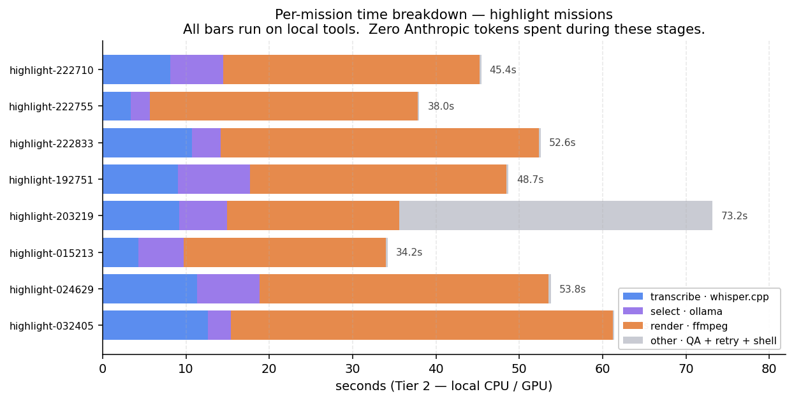
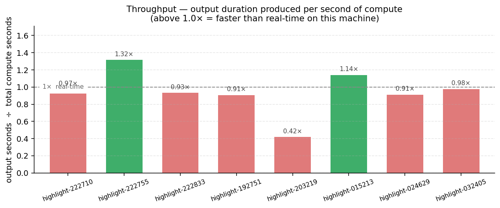

<div align="center">

# MelonS-Agents

**한국어** | [English](./README.md)


</div>

## 개요

> 숏폼 영상 제작을 위한 효율적인 macOS 기반 멀티 에이전트 시스템.
> 단 하나의 원칙 위에 만들어졌습니다 — **제작 파이프라인을 자동화하고,
> 시스템이 자신의 로직을 스스로 진화시키게 한다.** 이 저장소의 모든
> 커밋은 그 진화의 한 단계입니다. 히스토리는 산출물의 기록이 아니라,
> 에이전트 시스템 자체가 성장해 온 궤적입니다.

## 설계 노트

일반적인 에이전트 데모와 차별화되는 설계 선택들:

- **목표 계층과 작업 큐의 분리.** [`docs/goal.md`](docs/goal.md)는
  활성 목표를 구체적 산출물로 정의; [`docs/roadmap.md`](docs/roadmap.md)는
  일별 작업 큐. 큐가 비었다고 목표가 달성된 것은 **아님** — 목표의
  "Done when" 조건만이 달성을 정의함. 분리 이유: 이전 24시간 구간이
  인프라 커밋 11개를 쌓는 동안 큐는 0건이었고 실제 산출물도 0건이었던
  사고를 다시 막기 위함.
- **운영 계약은 커밋된 단일 출처.**
  [`docs/operator-contract.md`](docs/operator-contract.md) — 12개
  하드 룰 + 컨벤션. 에이전트의 로컬 메모리는 이 파일을 가리키는
  빠른 캐시; 두 곳이 어긋나면 이 파일이 이김.
- **오케스트레이션과 실행 사이의 비용 방화벽.** Anthropic API 토큰은
  Tier 1 오케스트레이션에서만 소비. 미션 실행(전사 → 선택 → 렌더
  → QA)은 `whisper.cpp` + `ollama` + `ffmpeg` 로컬 실행이며
  토큰 비용 0. [`docs/cost-model.md`](docs/cost-model.md) 참조.
- **별도 트랙 auditor + 능동 알림 surface.**
  [`auditor`](.claude/agents/auditor.md) 서브에이전트는 launchd로
  매일 03:00 발화, 저장소 전체를 읽기 전용 순회, 안정 채널에 기록:
  [`docs/audit/CURRENT-ALERT.md`](docs/audit/)는 최근 verdict이
  비-CLEAN일 때만 존재 — 다음 인터랙티브 세션은 목표를 잡기 전
  이 파일을 의무적으로 읽음.
- **파일 기반 서브에이전트 핸드오프.** 서브에이전트들은 대화
  히스토리를 공유하지 않음. 커밋되는 파일(`plan.md` / `MANIFEST.md`
  / `qa-report.md`)을 통해 통신. 각 서브에이전트의 컨텍스트는 자신의
  프롬프트 + 자신이 읽는 매니페스트로 한정됨 — 예측 가능한 토큰
  비용, 예측 가능한 실패 모드.

## 샘플 출력

지금까지 15건의 미션 출력이 생성되었습니다. 아래는 대표 프레임
몇 장, 최근 실행 테이블, 그리고 각 미션의 `metrics.json`에서
추출한 미션별 타이밍 차트입니다.

### 샘플 프레임

| 단일 하이라이트 | 숏츠 배치 |
|----------------|----------|
|  |  |
| `highlight-015213` · 39 초 · 첫 시도 PASS | `shorts-batch-024840 / short-01` · 44 초 · 첫 시도 PASS |

둘 다 *Sintel* 트레일러 (CC-BY-3.0, © Blender Foundation —
`durian.blender.org`)에서 추출. 공통 요소: 좌측 상단 출처
어트리뷰션 오버레이, 9:16 letterbox-blur 배경, 하단 safe-zone
박스 안의 libass 번인 자막.

### 최근 미션

| 미션 | 타입 | 소스 | 출력 | 총 소요 | QA |
|------|------|------|------|---------|----|
| `highlight-015213` | highlight | Sintel 1080p · Blender CC-BY-3.0 | 39 초 9:16 숏 (7.8 MB) | 34.2 초 | 첫 시도 PASS |
| `highlight-024629` | highlight | 한국어 강의 fixture | 49 초 9:16 숏 (13.0 MB) | 53.8 초 | 첫 시도 PASS |
| `shorts-batch-024840` | shorts-batch | Sintel 720p · Blender CC-BY-3.0 | 2 숏 (44 초 + 36 초) | 59.6 초 | 첫 시도 PASS |
| `summarize-025121` | summarize | Sintel 1080p · Blender CC-BY-3.0 | EN + KO `summary.md` (551 B) | — | 첫 시도 PASS |
| `highlight-203219` | highlight | 초기 개발 fixture | 30 초 숏 | 73.2 초 | **FAIL** — QA 게이트, 재시도 소진 |

마지막 행은 의도된 것입니다 — QA 게이트는 형식적 검사가 아닙니다.
`QA_RETRY_MAX` 소진 시 `records/blockers/<date>/<mission-id>.md`에
블로커 파일이 기록되고 미션이 정지합니다. 전체 미션 원장:
[`docs/metrics-dashboard.md`](docs/metrics-dashboard.md).

### 미션별 타이밍





차트는 각 미션의 `metrics.json`으로부터
[`scripts/generate-charts.py`](scripts/generate-charts.py)가
생성합니다. 위 그래프의 모든 초는 로컬 CPU / GPU 시간 — 전사는
`whisper.cpp`, 선택은 `ollama` (`llama3.2:3b`), 렌더는 `ffmpeg`.
**위 단계 동안 소비된 Anthropic API 토큰: 0.** Tier 1 / Tier 2
비용 방화벽은 [`docs/cost-model.md`](docs/cost-model.md) 참조.

## 분석가/리뷰어를 위한 안내

이 저장소에 대한 읽기 전용 분석을 시작한다면
[`docs/for-analysts.md`](docs/for-analysts.md)부터 보세요 — 1차
진단 정확도를 위한 단일 진입점입니다. [`docs/cost-model.md`](docs/cost-model.md)
(Anthropic 대 로컬 비용 구분)과 [`docs/architecture.md`](docs/architecture.md)
(전체 데이터 흐름)과 함께 보면 됩니다.

## 아키텍처

```
              ┌───────────────────┐
              │   Orchestrator    │   model: opus
              └─────────┬─────────┘
                        │ 미션을 순서대로 위임
                        ▼
              ┌───────────────────┐
              │      Planner      │   model: sonnet
              └─────────┬─────────┘
                        ▼
              ┌───────────────────┐
              │     Resourcer     │   model: sonnet
              └─────────┬─────────┘
                        ▼
              ┌───────────────────┐
              │       Editor      │   model: sonnet
              └─────────┬─────────┘
                        ▼
              ┌───────────────────┐
              │         QA        │   model: sonnet
              └───────────────────┘

              ┌───────────────────┐
              │      Auditor      │   model: sonnet  (별도 트랙)
              └───────────────────┘   read-only, 매일 03:00
                                       launchd 발화
```

| 에이전트 | 책임 | 산출물 |
|----------|------|--------|
| 🤖 **Orchestrator** (opus) | 미션 분해, 위임, 최종 통합 | 태스크 리스트 · `summary.md` |
| 🧠 **Planner** (sonnet) | 전략 수립, 작업 분해, 수락 기준 정의 | `plan.md` |
| 📦 **Resourcer** (sonnet) | 자산 수집, 외부 도구 실행 (ffmpeg / yt-dlp / whisper) | `resources/MANIFEST.md` |
| 🎞️ **Editor** (sonnet) | 출력 렌더링, 산출물 조립 | `outputs/CHANGELOG.md` |
| ✅ **QA** (sonnet) | 계획 기준 대비 검증, 회귀 감지 | `qa-report.md` |
| 🔍 **Auditor** (sonnet) | 저장소 전체 drift / contract / cost / security 감사 (별도 트랙, 매일 03:00) | `docs/audit/<date>-<focus>.md` + 비-CLEAN 시 `docs/audit/CURRENT-ALERT.md` |

서브 에이전트 정의: [`.claude/agents/`](.claude/agents/) · 미션 템플릿과 공용 셸 라이브러리: [`agents/`](agents/)

## 코드 / 데이터 분리

| 계층 | 경로 | 추적 여부 |
|------|------|-----------|
| 코드 (로직) | `.claude/agents/`, `agents/`, `config/`, `scripts/` | ✓ |
| 데이터 (산출물) | `records/missions/<date>/<id>/` | ✗ (gitignore) |
| 시크릿 | `.env` | ✗ (gitignore) |

저장소는 에이전트 시스템 자체만 보관합니다. 미션 산출물 — 영상,
전사, 생성된 자산 — 은 모두 로컬 `records/`에만 남습니다. GitHub에
드러나는 것은 산출물이 아니라 시스템의 진화 과정입니다.

## 이식성

모든 도구 경로와 엔드포인트는 환경 변수로 관리됩니다. macOS ↔ Linux
이전은 `.env` 교체만으로 충분하며, 코드 수정은 필요하지 않습니다.

## 자율 모드

[`config/policies.yaml`](config/policies.yaml)에 정의됩니다.

| 모드 | 플래그 | 동작 |
|------|--------|------|
| ⚙️ **Interactive** (기본값) | `AUTONOMY_MODE=false` | 로직 변경·파괴적 작업·외부 게시 전에 사용자 확인을 받습니다. |
| 🌙 **Autonomous** | `AUTONOMY_MODE=true` | `AUTONOMY_BUDGET_USD` 범위 안에서 무인 실행. 로직 파일(`agents/`, `.claude/agents/`)은 불변입니다. |

## 미션 흐름

1. 사용자가 미션을 지시합니다.
2. `orchestrator`가 `records/missions/<date>/<id>/`와 태스크 리스트를 생성합니다.
3. `planner` → 수락 기준이 포함된 `plan.md`.
4. `resourcer` → 자산과 `resources/MANIFEST.md`.
5. `editor` → 산출물과 `outputs/CHANGELOG.md`.
6. `qa` → 항목별 PASS / FAIL이 적힌 `qa-report.md`.
7. PASS 시 `orchestrator`가 `summary.md`를 작성합니다.

## 툴체인

`ffmpeg` (libass 정적 빌드) · `yt-dlp` · `whisper.cpp` (small, 다국어)
· `ollama` (`llama3.2:3b`) · 오케스트레이션용 Claude API.

## 빠른 시작

```bash
git clone git@github.com:MelonS/MelonS-Agents.git
cd MelonS-Agents
cp .env.example .env
./scripts/bootstrap.sh
./agents/missions/highlight/run.sh <URL 또는 로컬 경로>
```

여러 소스를 한 번에 처리:

```bash
./scripts/batch-mission.sh -f sources.txt
```

큐 기반 자율 실행 (launchd 스케줄러가 사용):

```bash
echo 'https://example.com/long.mp4' >> records/queue/pending.txt
./scripts/mission-queue.sh
```

야간 스케줄러 설치:

```bash
./scripts/install-scheduler.sh install
```

## 운영 계약

이 저장소는 전적으로 에이전트가 운영합니다. 일상 규칙:

- **에이전트가 모든 작업을 수행** — 설치, 편집, 설정, 커밋, 푸시, 스케줄링. 사용자는 터미널에서 명령을 실행하지 않습니다.
- 사용자는 **에이전트가 하드 가드레일에 막힐 때만** 개입 (예: 본인 권한 자체 수정, `main`에 강제 푸시) — 그 경우에도 클릭 한 번의 승인만, 절대 다단계 레시피 따라하기 아님.
- **현재 활성 목표**는 [`docs/roadmap.md`](docs/roadmap.md)에 있습니다. 아래의 "상태" 목록은 평면적 기능 원장 — TODO 리스트로 읽지 마세요. 로드맵의 *Now* 섹션이 "다음에 무엇을 할지"의 단일 출처입니다.
- **결제 방화벽**: 유료 API, SaaS 구독, 클라우드 리소스 생성은 사용자의 명시적 확인이 필요. 로컬 자원(Ollama, FFmpeg, whisper.cpp, brew)은 완전 자율.

전체 계약: [`CLAUDE.md`](CLAUDE.md) 및 [`config/policies.yaml`](config/policies.yaml) 자율 모드 규칙 참조.

## 상태

<!-- status:start -->
- [x] 계층형 에이전트 구조 (오케스트레이터 + 미션 서브 에이전트 4종 + 읽기 전용 auditor 1종)
- [x] 코드 / 데이터 분리 강제 (records/ gitignore)
- [x] 환경 변수 기반 도구 경로 (.env / .env.example)
- [x] PoC 엔드투엔드: 하이라이트 추출 (EN + KO)
- [x] libass 자막 번인 (ffmpeg 정적 빌드)
- [x] 다국어 whisper.cpp (small) + 언어 인식 하이라이트 프롬프트
- [x] 배치 실행기 (scripts/batch-mission.sh)
- [x] 로직 변경 시 origin/main 자동 커밋 + 자동 푸시
- [x] 자율 모드용 야간 launchd 스케줄러
- [x] 3종 미션 운영 가능: highlight, summarize, shorts-batch
- [x] 단일 패스 ffmpeg 렌더링 (~3× 렌더 속도 향상)
- [x] 이중 언어 요약 미션 (전사 → 구조화된 EN+KO 요약)
- [x] 미션별 비용 / 실행 시간 메트릭
- [x] 실 CC 라이선스 fixture (Blender 오픈 무비) + 다운로더
- [x] 표준 9:16 레이아웃 엔진 — safe zone 마진, 반투명 자막 박스, 상단 좌측 출처 오버레이
- [x] 3종 미션 전반에 source-attribution 와이어링 (`outputs/SOURCES.txt` + 번인 워터마크 + `summary.md` 푸터)
- [x] QA 피드백 재시도 루프 (실패 미션 `QA_RETRY_MAX`까지 자동 재시도, 이후 `records/blockers/`로)
- [x] 저작권 필터 v1 — 도메인 허용목록, 게시 게이트, 스트라이크 로그, 스트라이크 인지 거부
- [x] License-string probe — archive.org + commons.wikimedia.org
- [x] 일별 로드맵 [`docs/roadmap.md`](docs/roadmap.md) ("다음에 무엇을" 단일 출처)
- [x] 플랫폼별 재이용 규칙 — `scripts/publish-gate.sh` (`internal-demo` / `public` / `youtube` / `instagram` / `tiktok`, 4개 `publish_rules` 필드 모두 소비)
- [x] 저장소 auditor 서브에이전트 + 능동 surface (`docs/audit/CURRENT-ALERT.md` 자동 유지, `scripts/audit-run.sh`)
- [ ] 실제 사용자 URL fixture — _차단, 사용자 URL 대기 중_
- [ ] 다른 호스트용 License probe 추가 (Vimeo CC 채널 등) — _보류, Vimeo는 item별 license endpoint 없음; 필요 시 재검토_
- [ ] Audio fingerprint 체크 (chromaprint / `fpcalc`) — _보류, 비교용 fingerprint dataset 없음; 첫 takedown 이후 재검토_
- [ ] 소스 프레임 로고 / 워터마크 검출 — _보류, OCR 또는 학습 모델 필요; 실패 모드 관측 시 재검토_
- [ ] editor 내부 반복 QA-피드백 루프 (transcribe/select 재실행 없이 단일 출력 재컷) — _파킹, coarse retry가 compute 낭비할 때만 유용; 아직 미관측_
<!-- status:end -->

> 위 미체크 항목은 **모두 의도된 보류**입니다 — 각 항목에 사유가 인라인으로 적혀 있습니다. 일별 우선순위 큐는 여기가 아니라 [`docs/roadmap.md`](docs/roadmap.md)에 있습니다.

## 라이선스

MIT. [`LICENSE`](LICENSE) 파일을 참고하세요.
