<div align="center">

# MelonS-Agents

[한국어](./README.ko.md) | **English** · [**Live site →**](https://melons.github.io/MelonS-Agents/)

**An agent that builds, plays, and *verifies* its own game** — a colony-sim vertical slice gated by input-level repro tests and isolated-grader rubric verdicts — plus two production media skills (music-video shorts, Korean job-board digest), all [agentskills.io](https://agentskills.io)-spec compliant and portable across Claude Code, Cursor, Goose, Gemini CLI, OpenAI Codex, GitHub Copilot.

**Local for the mechanical, Claude for the creative.**  Phrase-aware ffmpeg shaders sync vintage visuals to music structure.  Short-keyword job-hunt expansion via role-synonym map.  Three trigger layers — commit, anomaly, schedule — so the system corrects its own drift.  English + Korean dual track from day 1.


[](https://github.com/MelonS/MelonS-Agents/actions/workflows/main-protection.yml)


*Unattended 16 in-game-day colony soak, agent-built and agent-verified — see [PawnSim](#pawnsim--the-prototype-the-agent-is-actively-iterating-on-2026-06-focus).*

</div>

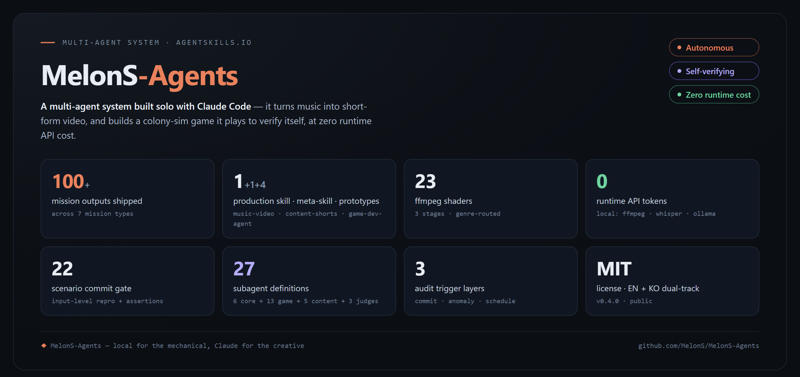

## Try it in ~60 seconds (zero accounts, zero `.env`)

```bash
git clone --depth 1 https://github.com/MelonS/MelonS-Agents.git
cd MelonS-Agents
./scripts/first-touch.sh        # single-command guided demo wizard
```

The wizard checks prerequisites, fetches the demo cache (~30 s),
renders a 60-second 9:16 short from bundled CC-BY Blender clips +
Kevin MacLeod music (~100 s), and opens the result.  No Pexels signup,
no Suno round-trip, no `.env` edit.  See
[Quick start](#quick-start) for the manual + advanced paths.

## Who this is for

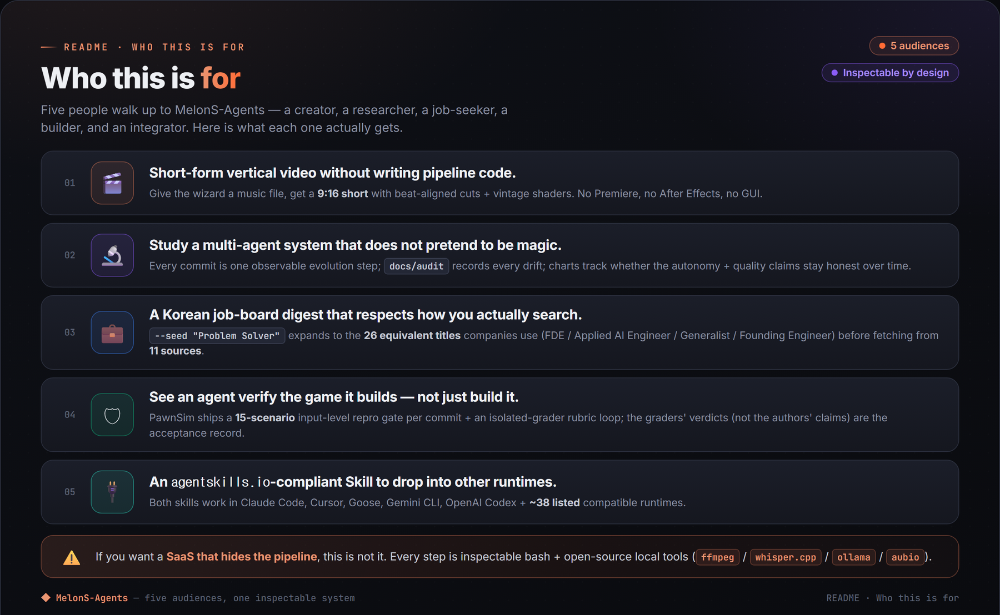

- **You want short-form vertical video output without writing pipeline code.**
  Give the wizard a music file, get back a 9:16 short with beat-aligned
  cuts and vintage shaders.  No Premiere, no After Effects, no GUI.
- **You want to study a working multi-agent system that doesn't pretend
  to be magic.**  Every commit on this repo is one observable step in
  how the system evolves; `docs/audit/` records every drift the auditor
  catches; `docs/metrics/quality-trend.png` + `intervention.png` chart
  whether the autonomy and quality claims are honest over time.
- **You want a Korean job-board digest that respects how you actually
  search.**  Pass `--seed "Problem Solver"`; the skill expands to the
  26 equivalent titles companies use (FDE / Applied AI Engineer /
  Generalist / Founding Engineer / …) before fetching from 11 sources.
- **You want to see an agent verify the game it builds — not just
  build it.**  PawnSim ships with a 15-scenario input-level repro
  gate on every commit and an isolated-grader rubric loop for long
  soaks; the graders' verdicts (not the author's claims) are the
  acceptance record, committed alongside the fixes.
- **You want an agentskills.io-compliant Skill you can drop into other
  runtimes.**  Both skills work in Claude Code, Cursor, Goose, Gemini
  CLI, OpenAI Codex, and the other ~38 listed compatible runtimes.

If you want a SaaS that hides the pipeline, this isn't it.  If you
want every step of the pipeline as inspectable bash + open-source
local tools (ffmpeg / whisper.cpp / ollama / aubio), it is.

## Overview

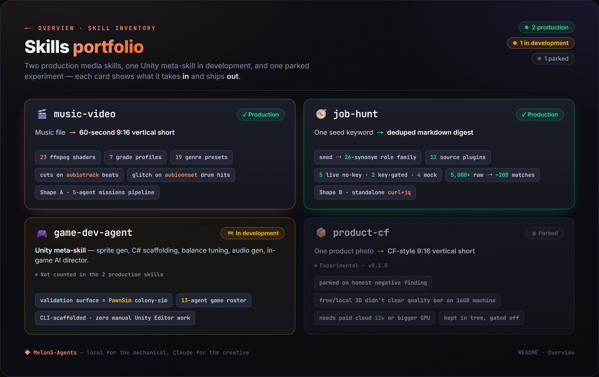

> A multi-agent system driven by
> [Claude Code](https://docs.anthropic.com/claude-code) — media
> pipeline primary on macOS, game-prototype track primary on
> Windows (Unity), Linux best-effort.  Latest tag
> is [**v0.4.0**](https://github.com/MelonS/MelonS-Agents/releases/tag/v0.4.0).
> Two production skills ship today; both are
> [agentskills.io](https://agentskills.io)-spec compliant so they
> drop into Claude Code, Cursor, Goose, Gemini CLI, and the rest of
> the compatible-runtime set unmodified.
>
<details>
<summary>▸ The four skills in depth · two ways to drive the repo · the design premise — click to expand</summary>

> **Skill #1 — `music-video`.**  Music file in, 60-second 9:16
> vertical short out.  Per-genre color grade (seven profiles) shapes
> generic Pexels B-roll into a genre-coded look; 23 ffmpeg shaders
> + phrase-aware structure (cuts on `aubiotrack` beats, glitch
> micro-edits on `aubioonset` drum hits, restraint gated per
> preset) compose on top.  The Sample-output section
> below shows a noir-detective render; the genre grid further down
> shows six of them side by side.  Implementation under
> [`agents/missions/music-video/run.sh`](agents/missions/music-video/run.sh) —
> the skill routes through the 5-agent mission pipeline (orchestrator
> + planner / resourcer / editor / qa) so re-rendering tuning flows
> into both surfaces.
>
> **Skill #2 — `job-hunt`.**  Single seed keyword in, deduplicated
> markdown digest out.  `--seed "Problem Solver"` expands to the
> 26-synonym role family companies actually use (FDE / Applied AI
> Engineer / Generalist / Founding Engineer / Forward Deployed / …)
> before fetching from 11 source plugins.  Five are live-ready
> without an API key — `global-ats` (Greenhouse + Ashby + Lever
> boards across ~27 AI / SaaS companies including Anthropic /
> OpenAI / Cursor / Stripe / Notion / Datadog), `global-remoteok`,
> `global-remotive`, `global-hn-whoshiring` (HN monthly via Algolia),
> `kr-worknet` (정부 공공고용서비스).  Two more (`kr-wanted`,
> `kr-saramin`) need an API key per source.  End-to-end live test:
> 5,000+ raw postings filtered to ~200 matches.  The skill is
> standalone (no orchestrator routing) — `skills/job-hunt/scripts/run.sh`
> is the canonical implementation because every planner / qa stage
> would be near-empty for a mechanical filter / fetch / dedupe pipeline.
>
> **Skill #3 — `game-dev-agent` (in development, not in the
> production count above).**  Unity-focused AI agent that
> orchestrates sprite generation, C# scaffolding, balance tuning,
> audio generation, and an in-game AI director — the meta-skill
> that drives the game prototype built alongside it.  Its empirical
> validation surface is **PawnSim**, a lightweight colony-sim vertical slice
> ([`skills/game-prototype/`](skills/game-prototype/)) that has grown
> across many autonomous multi-agent sessions into a deep slice —
> grid A* pathfinding, pawns with needs/health/skills/traits,
> drafted + ranged combat, research, build/deconstruct/designations,
> farming, hauling, director modes, sound, day/night, save/load.
> Every commit passes two gates: the 6-stage `refactor_check` build
> harness and, since 2026-06-12, a **15-scenario input-level repro
> gate** (synthesized clicks through the player's own UI path, with
> effect assertions), with long soaks graded by an isolated grader
> sub-agent against a written rubric — see the PawnSim section
> below for what that loop has caught.  Graduates into the
> production-skill count once the prototype hits its deliverable
> schedule.  Skill definitions live
> in [`skills/game-dev-agent/`](skills/game-dev-agent/); PawnSim's own
> README + PM milestones at
> [`skills/game-prototype/README.md`](skills/game-prototype/README.md).
>
> **A fourth media skill — `product-cf` (experimental, parked).**
> One product photo → a CF-style 9:16 vertical short, building on the
> music-video skill so the product stays a pixel-perfect real cutout
> while the world moves around it.  Shipped as v0.1.0, then **parked
> on an honest negative finding**: the free / local "make it genuinely
> 3D" approaches (depth-parallax, cylinder-wrap turntable, local
> LTX image-to-video) didn't clear a real-CF quality bar on a 16 GB
> machine — a convincing result needs paid cloud image-to-video or a
> larger GPU.  Kept in the tree, gated off, decision pending; the full
> write-up is
> [`docs/research/2026-06-15-product-cf-3d.md`](docs/research/2026-06-15-product-cf-3d.md).
> It is **not** counted in the two-production-skill total above.
>
> **Two ways to drive this repo.**
> - *Agent-driven* (primary) — install Claude Code, point it at the
>   cloned repo, type a mission.  Claude Code edits files, commits,
>   pushes.  Cost: a Max subscription absorbs orchestration; the
>   money firewall gates anything paid beyond that.
> - *Script-only* (fallback) — `./scripts/bootstrap.sh` then the bash
>   scripts run standalone.  No Claude Code needed; no commits or
>   pushes happen automatically, but the rendered output is identical.
>   Cost: $0 beyond the optional free Pexels API key.
>
> **The scaffold is general-purpose.**  Short-form video is the v1
> domain because the deliverable is visually verifiable and failure
> modes are fast to catch; the architecture itself doesn't assume
> short-form anything.  New skills pick the shape that fits — see
> the Architecture section below for the three-shape model and what
> a future skill (movie / game / longform) would likely route through.
>
> Built on a single premise: **automate the production pipeline, then
> let the system evolve its own logic.**  Every commit is one
> observable step of that evolution.  The history is the agent
> system's own growth, not a record of its outputs (those stay local
> in gitignored `records/`).

</details>

### PawnSim — the prototype the agent is actively iterating on (2026-06 focus)

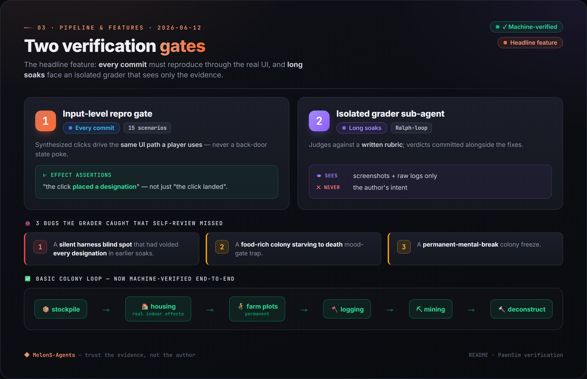

The most active validation surface right now is **PawnSim** (Skill #3-A) — the
agent builds *and* play-tests it in a tight loop, with the operator filing
in-game feedback that turns straight into the next batch of fixes.


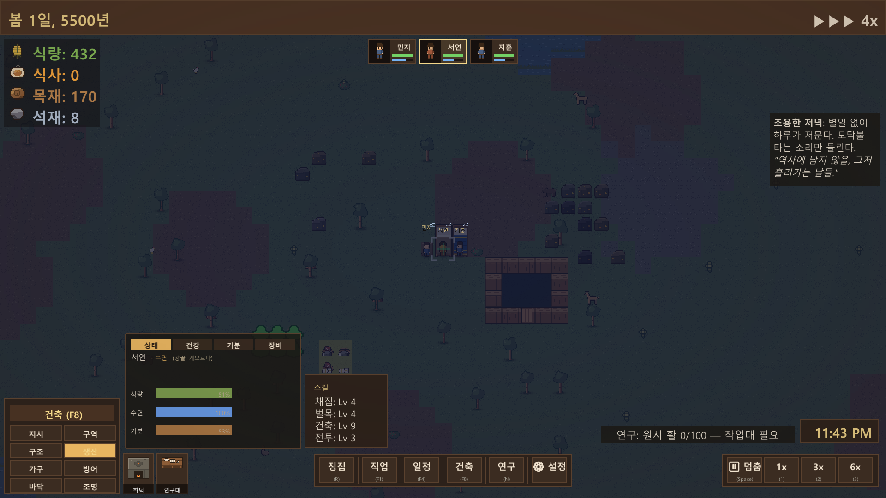

Colonists autonomously chop / mine / gather / farm / cook / haul / build /
research / fight under a utility AI; an AI Director schedules threats on a
jittered clock; the player drafts pawns and paints build + designation
orders.  Every sprite (a full **32px art generation**: 3-direction walk/work
pawn sheets, animals, terrain, furniture — all procedurally generated),
every scene, and every C# system is CLI-scaffolded by
[`game-dev-agent`](skills/game-dev-agent/) with no manual Unity Editor work.

**Verification is the headline feature (2026-06-12).**  Every commit passes a
15-scenario input-level repro gate (real synthesized clicks through the same
UI path a player uses, with *effect assertions* — "the click placed a
designation" — not just "the click landed").  Long-running soaks are graded
by an **isolated grader sub-agent** against a written rubric (Ralph-loop
pattern): the grader sees only evidence (screenshots + raw logs), never the
author's intent, and its verdicts repeatedly caught what self-review missed —
a silent harness blind spot that had voided every designation in earlier
soaks, a "food-rich colony starving to death" mood-gate trap, and a
permanent-mental-break colony freeze.  The basic colony loop (stockpile →
housing with real indoor effects → permanent farm plots → logging → mining →
deconstruct) is now **machine-verified end-to-end**, with the rubric verdicts
committed alongside the fixes.  Full feature breakdown + **honest**
verification status (including known gaps) in
[`skills/game-prototype/README.md`](skills/game-prototype/README.md).

> **Engineering decisions, one page.**
> [`docs/engineering-case-studies.md`](docs/engineering-case-studies.md)
> — nine production incidents and the minimum mechanism each one
> produced (Tier-1 routing, semaphore-bounded batch, content-quality
> feedback loop, three-layer reactive audit, shader-effects-in-ffmpeg
> / knowing-where-the-wall-is, onboarding-friction-kills-first-touch
> / zero-account demo path, declarative preset routing for genre-aware
> shaders, intervention-as-the-unmeasured-axis / autonomy signal +
> reduction levers, and the quality-bar-as-6-unenforced-contracts
> after the 2026-05-22 music-video QA pass).  Each entry follows
> *problem → constraint → decision → artifact*.

## Sample output


100+ mission outputs across **six** mission types.  The current
production format is the `music-video` mission — music-as-primary-audio
shorts (no narration, no captions, beat-aligned cuts, onset-aligned
glitch micro-edits), picked over the earlier narration-driven format
on 2026-05-17
([decision log](docs/pilots/decision-log.md#operator-pick--2026-05-17)).

### Recently shipped (rolling)

<details>
<summary>▸ Recent ship log (rolling) — click to expand</summary>

- **2026-06-12 PawnSim verification-loop adoption + basics overhaul**
  (Skill #3-A) — adopted a rubric + isolated-grader verification loop
  (grader sub-agents judging soak evidence with zero author context) and
  used it to drive ~40 gated commits in 36 hours: a 32px art generation
  swap (pawn walk/work sheets, animals, terrain, walls/doors/ore with
  top-down block grammar), camera range calibrated against reference
  screenshots, wood-economy parity, permanent farm plots
  (sow → harvest → re-sow), real indoor effects (roofed rooms block
  storms), randomized raid scheduling, manual-order priority, and a
  16-pair UI-overlap audit fixed to zero.  The graders' verdicts — not
  the author's claims — are the acceptance record, committed per round
  in [`skills/game-prototype/docs/`](skills/game-prototype/docs/).
- **2026-06-03 PawnSim playtest-fix batch** (Skill #3-A) — an operator
  play-test loop drove a 12-commit batch on
  [`skills/game-prototype/`](skills/game-prototype/): fixed a pawn-movement
  speed regression + chop-approach jitter (P0), wired needs→negative-thought
  mood so colonists actually get unhappy when hungry/tired/hurt, fixed a
  designation-dispatch reservation-key bug that made *every* idle pawn swarm one
  tree, moved the resource readout to a genre-standard top-left vertical list,
  rebuilt clustered ore veins + map-wide soil/rock terrain, and repaired the
  settings panel. Each fix is build- + screenshot/coordinate-verified; see
  [`docs/PLAYTEST-TODO.md`](skills/game-prototype/docs/PLAYTEST-TODO.md) for the
  per-item status (kept open until the operator confirms in-game).
- **2026-05-23 production batch** — 6 mp4s (`monday-v1/v2`,
  `convenience-v1/v2`, `smallhand-folk-v1/v2`) under
  [`outputs/publish/shorts-2026-05-23-batch/`](outputs/publish/) —
  the first multi-track batch produced through
  [`scripts/music-video-batch.sh`](scripts/music-video-batch.sh).
- **Kinetic lyric overlay** — `scripts/music-video-lyrics.sh` +
  whisper-derived LRC via `scripts/music-video-lyric-align.sh`.
  Visible on the `smallhand-folk` frame in the genre grid below
  ("가난이 너를 만든 게 / 아니라").  Sub-floor confidence lines mark
  autofilled; cross-platform safe-band positioning.
- **Pre-publish gate + thumbnail auto-extract** —
  `scripts/music-video-validate.sh` (combined duration / resolution /
  loudness / shader-anchor coverage / lyric-sync drift, exit 0/1/2)
  + `scripts/music-video-thumbnail.sh` (mid-climax JPG).  Both auto-chain
  post-render when `MUSIC_VIDEO_VALIDATE=1`.

</details>

### What's shipped on top of the v5 prototype

<details>
<summary>▸ Everything shipped on top of the v5 prototype — click to expand</summary>

- **23 ffmpeg shaders** in [`scripts/music-video-shaders.sh`](scripts/music-video-shaders.sh)
  across three stages — pond / halation / breathing / combo (first
  pass) + light_leak / duotone / vignette_pulse / scanline /
  chromatic_split / neon_edge / vhs / saturation_pulse / kaleidoscope
  / beat_burst / strobe / shake / color_burst / light_rays (genre-aware
  pass) + paper_grain / dust_speck / posterize / trail_echo /
  soft_bloom (Stage-2 + Stage-3).  Cartoon / cel-shading deliberately
  deferred — see [case study 5](docs/engineering-case-studies.md#5-shader-effects-in-ffmpeg--knowing-where-the-wall-is).
- **Genre-aware preset routing** — 19-genre table in
  [`skills/music-video/data/genre-presets.yaml`](skills/music-video/data/genre-presets.yaml)
  resolves a genre → preset → env overrides → post-shader chain (case
  study 7).  Ambient / classical / dreamcore route to a separate
  `scripts/music-video-stillzoom.sh` (image + music → 60-second slow
  Ken-Burns) for genres where ANY cut violates the contract.
- **Per-genre base color grade** — `grade_profile` field on every
  preset (kr_warm_pastel / hollywood_teal_orange / lofi_warm_grain /
  rnb_low_key / city_pop_neon / neutral) drives an ffmpeg `curves` +
  `eq` + `colorbalance` stage in
  [`scripts/music-video-grade.sh`](scripts/music-video-grade.sh) before
  shaders.  Transforms generic Pexels B-roll into a genre-coded look
  *before* the effect layer.  Research origin:
  [`docs/research/2026-05-22-music-video-pro-practices.md`](docs/research/2026-05-22-music-video-pro-practices.md)
  §2; visual A/B verdict in
  [`docs/research/2026-05-22-grade-profile-comparison.md`](docs/research/2026-05-22-grade-profile-comparison.md).
- **Director-discipline shot plan** (opt-in scaffold) —
  [`scripts/shot-plan.sh`](scripts/shot-plan.sh) generates a
  per-segment intent layer from the lyric LRC + phrase boundaries
  before B-roll fetch, paralleling working music-video director
  practice (write the shot list before the shoot).  Activated via
  `MUSIC_VIDEO_USE_SHOT_PLAN=1`.  Methodology research in
  [`docs/research/2026-05-22-music-video-director-methodology.md`](docs/research/2026-05-22-music-video-director-methodology.md).
- **Music-video quality bar — five contracts the system now enforces**
  ([case study 9](docs/engineering-case-studies.md#9-the-quality-bar-wasnt-a-bug--it-was-6-contracts-the-system-didnt-enforce)
  · full changelog at
  [`skills/music-video/CHANGELOG.md`](skills/music-video/CHANGELOG.md)):
  A.1 B-roll dedup registry (`records/youtube/broll-used.txt`,
  271 seeded ids), A.2 lyric vocal-onset alignment via whisper
  (`scripts/music-video-lyric-align.sh`, word-level KR /
  segment-level EN, LRC + JSON sidecar with drift verdict), A.3
  lang_anchor + person-anchored keyword injection at every 3rd
  segment with a QA gate (`scripts/music-video-qa-anchor.sh`,
  exit 0 PASS / 1 WARN / 2 FAIL), B.1 shader-vocabulary expansion
  to 23 effects across three stages, C.1 four shader-gate modes
  via `MUSIC_VIDEO_SHADER_GATE` (uniform / phrase_climax / onsets
  / beats) with event-count cap at 30 to dodge ffmpeg's expr-length
  budget.
- **Operator-facing utilities** — `scripts/first-touch.sh` wizard
  (single-command guided zero-account demo), `scripts/music-video-batch.sh`
  (multi-track render wrapper), `scripts/music-video-validate.sh`
  (combined pre-publish gate), `scripts/music-video-thumbnail.sh`
  (auto-extract upload-ready still), `scripts/lyric-extract.sh`
  (whisper-based lyric pull), `scripts/morning-brief.sh` (one-page
  overnight digest).  Full table in
  [`docs/music-video-pipeline-reference.md`](docs/music-video-pipeline-reference.md).
- **Skill #2 — `job-hunt`** v0.4.0 (separate from the music-video
  thread above) — short-keyword UX + 11 source plugins (5 live-ready
  no-key, 2 key-gated, 4 mock-fallback / permanent-mock) + 5
  enrichment scaffolds.  Walkthrough at
  [`docs/skills/job-hunt.md`](docs/skills/job-hunt.md).

The `faceless-short` mission (narration-driven shorts) remains the
showcase below; the v1 pipeline outputs (single-clip highlight +
shorts-batch) remain as the baseline reference further down.

</details>

### Music-video pilots (post-pivot, 2026-05-17)

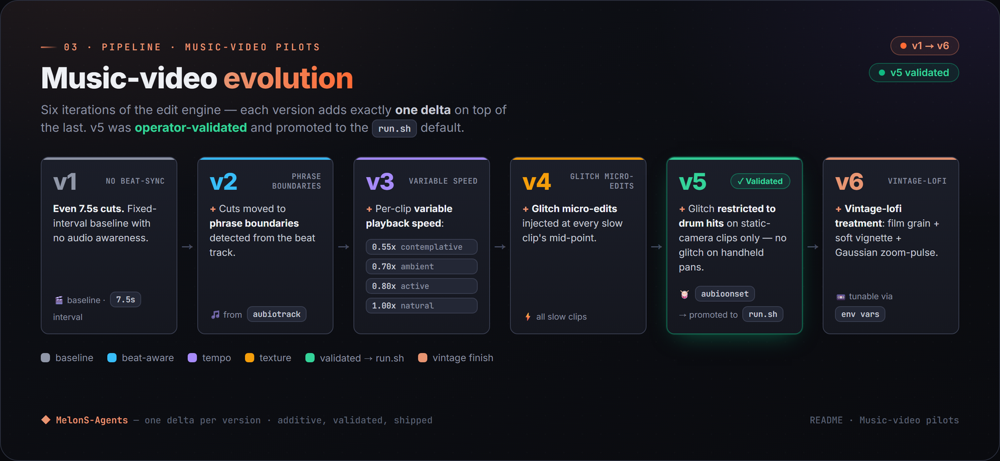

The `music-video` mission produces a 60-second 9:16 short where the
music IS the message: operator-supplied music track is the sole
audio; cuts land on aubiotrack-derived phrase boundaries; per-clip
playback speed is varied by mood (slow contemplative scenes at
0.55×, ambient at 0.70×, active at 0.80×, natural at 1.00×); micro
"scratch" glitches (0.2 s reverse + 0.2 s forward jump-cut) fire on
detected drum onsets but **only on clips classified as static-camera**
so the frame doesn't shake during the glitch; subtle film grain +
soft vignette + Gaussian zoom-pulse on each glitch onset add a
vintage lo-fi treatment.

Five prototype renders (v1 → v5) iterated through this design with
operator feedback at each step:

- v1: even 7.5 s cuts (no beat-sync)
- v2: cuts moved to phrase boundaries from `aubiotrack`
- v3: + per-clip variable playback speed (calm scenes slowed)
- v4: + glitch micro-edits at every slow clip's mid-point
- v5: + glitch placement restricted to `aubioonset` drum hits on
       static-camera clips only (no glitch on handheld pans)

v5 was operator-validated and promoted into
[`agents/missions/music-video/run.sh`](agents/missions/music-video/run.sh).
The v6 vintage-lofi visual treatment (grain + vignette + zoom-pulse)
landed on top of v5 in the same mission, tunable per render via
`MUSIC_VIDEO_FILM_GRAIN_INTENSITY`, `MUSIC_VIDEO_VIGNETTE_ANGLE`, and
`MUSIC_VIDEO_ZOOM_PULSE_AMP` env vars.  Output mp4s remain gitignored
(records/ directory); music files themselves are local-only by policy
([`assets/music/README.md`](assets/music/README.md)) — a "free to use
in your video" license is not the same as a "free to redistribute
the file" license, so the repo never carries audio assets.

#### Genre catalog at a glance (mid-climax frames from the 2026-05-20 → 2026-05-23 production batch)

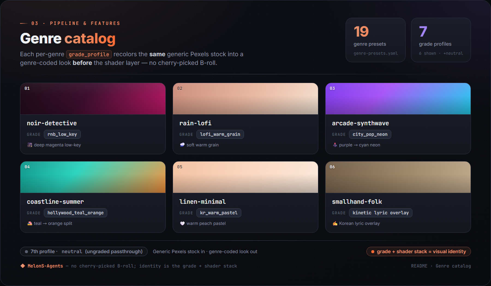

Six mid-climax frames pulled from recent renders.  Each row shows
how the per-genre `grade_profile` (rolled out 2026-05-22) transforms
the same generic Pexels stock into a genre-coded look *before* the
shader layer applies.  Captions identify the genre preset + grade
profile in effect.

| | | |
|---|---|---|
|  | 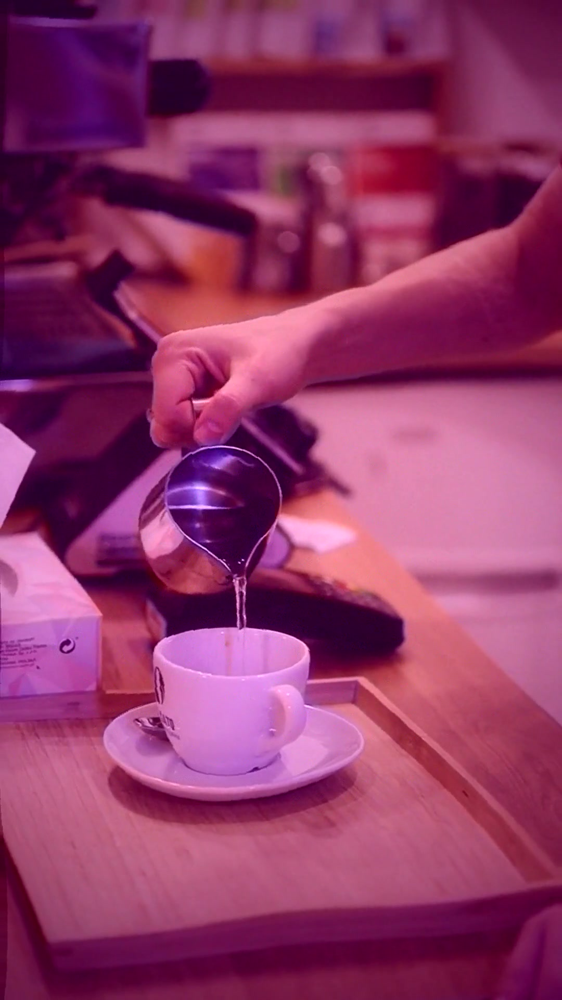 |  |
| **`noir-detective`** · rnb_low_key | **`rain-lofi`** · lofi_warm_grain | **`arcade-synthwave`** · city_pop_neon |
|  |  | 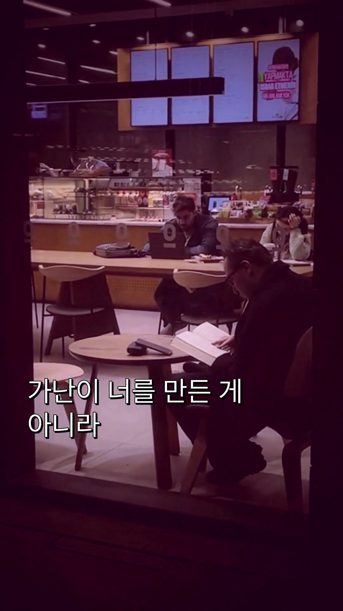 |
| **`coastline-summer`** · hollywood_teal_orange | **`linen-minimal`** · kr_warm_pastel | **`smallhand-folk`** · with kinetic lyric overlay |

The 19 genre presets resolved per-render via
[`skills/music-video/data/genre-presets.yaml`](skills/music-video/data/genre-presets.yaml);
7 grade profiles (six of them shown above) compiled into ffmpeg
filter graphs via
[`scripts/music-video-grade.sh`](scripts/music-video-grade.sh).  None
of these frames received any cherry-picked B-roll — every clip came
from the same generic Pexels mood-keyword fetch the pipeline runs
unattended.  The visual identity is the grade + shader stack.

Reproduction (any track → 9:16 short):

```bash
./agents/missions/music-video/run.sh <id> <path/to/music.mp3>
# or batch a directory:
./scripts/music-video-batch.sh assets/music/*.mp3
```

#### Post-processing shaders — first pass (2026-05-17 evening)

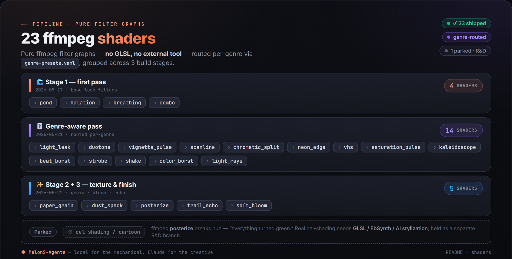

The narrative below covers the first four shaders shipped on
2026-05-17.  Nineteen more landed across 2026-05-21 (genre-aware
expansion: scanline / chromatic_split / neon_edge / vhs /
saturation_pulse / kaleidoscope / beat_burst / strobe / shake /
color_burst / light_rays) and 2026-05-22 (Stage-2 + Stage-3:
light_leak / duotone / vignette_pulse / paper_grain / dust_speck /
posterize / trail_echo / soft_bloom) — full catalog of 23 lives in
[`scripts/music-video-shaders.sh`](scripts/music-video-shaders.sh)
and routes per-genre via
[`skills/music-video/data/genre-presets.yaml`](skills/music-video/data/genre-presets.yaml).

Operator asked for shader-style effects on top of the v6 vintage-lofi
treatment.  Three effects landed via pure ffmpeg filter graphs (no GLSL,
no external tool) and one was deliberately deferred:

- **`pond`** — Animated water-surface displacement on the whole frame.
  Two procedural displacement maps (X and Y) are generated by `geq` as
  3-component sin wave fields at 540×960 (4× faster than full res),
  scaled up via bicubic to 1080×1920, then fed into `displace`.  Max
  ±13 px (~1.2 % of frame width) — visible across the entire image but
  not jarring.  Reads as "the whole screen IS a pond surface, gently
  sway".
- **`breathing`** — Continuous gentle scale wave, 5 s period, +0–5 %.
  Always upscale so the post-`crop` frame never under-runs (the
  first attempt with `sin(t)` range −1 to +1 crashed libx264 mid-frame
  when scale went below 1080; fixed by reformulating as
  `(0.5 + 0.5*sin)` so the multiplier is always ≥ 1.0).
- **`halation`** — Warm light bloom around bright pixels.  Split the
  source, brighten-threshold + 22 px gblur the copy, screen-blend back
  onto the original at 0.30 opacity.  Looks like 80s-film light leak
  on amber / neon regions — operator confirmed "확실히 티남" (clearly
  visible) on first pass.
- **`combo`** — `pond` + `halation` with **phrase-aware strength
  envelopes**.  Both effects' intensity is a function of `T` (time):
  off / quiet during intro (0–15 s), ramping up across the build
  (15–22.5 s), full during the climax (22.5–45 s), tapering through
  the wind-down (45–52.5 s), settling for the outro (52.5–60 s).
  The phrase boundaries on the original reference track match the
  95.8 BPM × 12-beat phrase = 7.5 s cadence; for other tracks the
  envelope is parameterised in the script.

What was *not* attempted: **cel-shading / cartoon** rendering.  ffmpeg
posterising luma and chroma independently (`lutyuv` with
`round(val/N)*N` quantisation) breaks hue — operator's reaction was
"완전 그냥 초록색만 나옴" (everything turned green).  Real cel-shading
requires either GLSL shaders (mpv + libplacebo, ~200–500 LOC),
EbSynth (paint one keyframe, propagate by motion), or AI stylisation
(Stable Diffusion + AnimateDiff, ComfyUI, RunwayML / Kaiber).  None
of those fit inside the ffmpeg pipeline, so the cartoon route is
parked as a separate R&D branch rather than half-implemented in
production.

Reproduction:

```bash
# Apply a single effect
./scripts/music-video-shaders.sh pond     <input.mp4> <output.mp4>
./scripts/music-video-shaders.sh halation <input.mp4> <output.mp4>

# Phrase-aware combo (the validated end product)
./scripts/music-video-shaders.sh combo    <input.mp4> <output.mp4>
```

<details>
<summary><b>Historical missions</b> — <code>faceless-short</code> (narration era) + v1 <code>highlight</code> / <code>shorts-batch</code> + faceless scorecard</summary>

These predate the music-video pivot and stay in the tree as alternate paths (not the current production format).  Collapsed because they no longer reflect what the pipeline actively ships, but preserved as evidence of how the system evolved.

#### `faceless-short` mission (narration-driven)

Topic prompt in → ollama drafts the script → Kokoro-ONNX (`am_michael`, or macOS `Yuna` for Korean) synthesizes voice → whisper.cpp transcribes for timing → script-aware caption correction maps proper nouns back to the original script → SRT cues split to single-line at punctuation breaks → ollama extracts one Pexels search term per narration window (8 windows) → Pexels fetches B-roll per window → ffmpeg crops 9:16, burns libass captions + attribution overlay.

Pilot deliverables (Hittites + Hydrogen, EN + KO each), per-pilot cost **$0**:

| | Hittites (history × Bible) | Hydrogen (science) |
|---|---|---|
| EN | 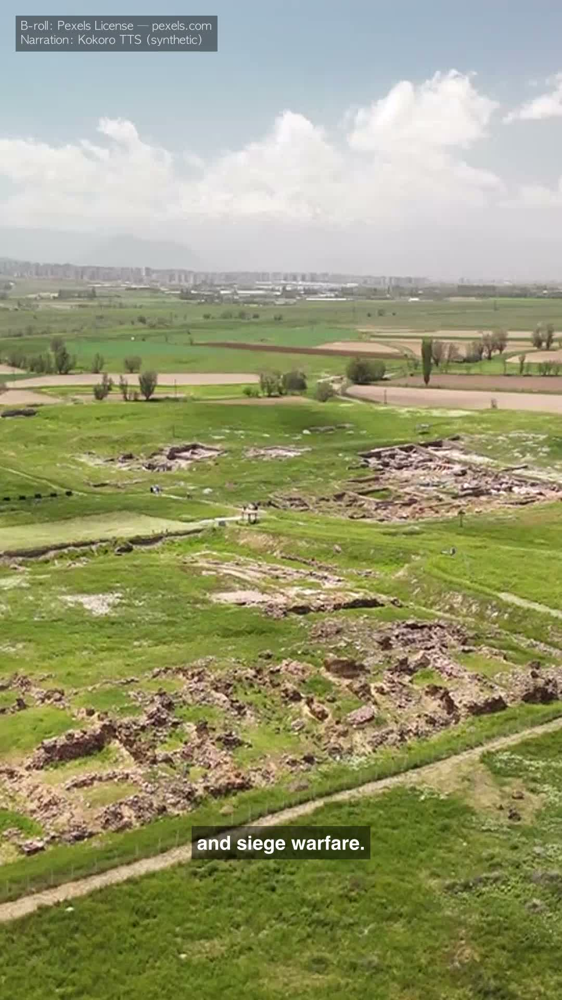 | 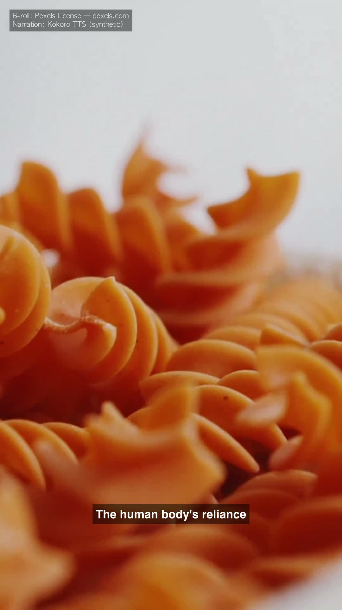 |
| KO | 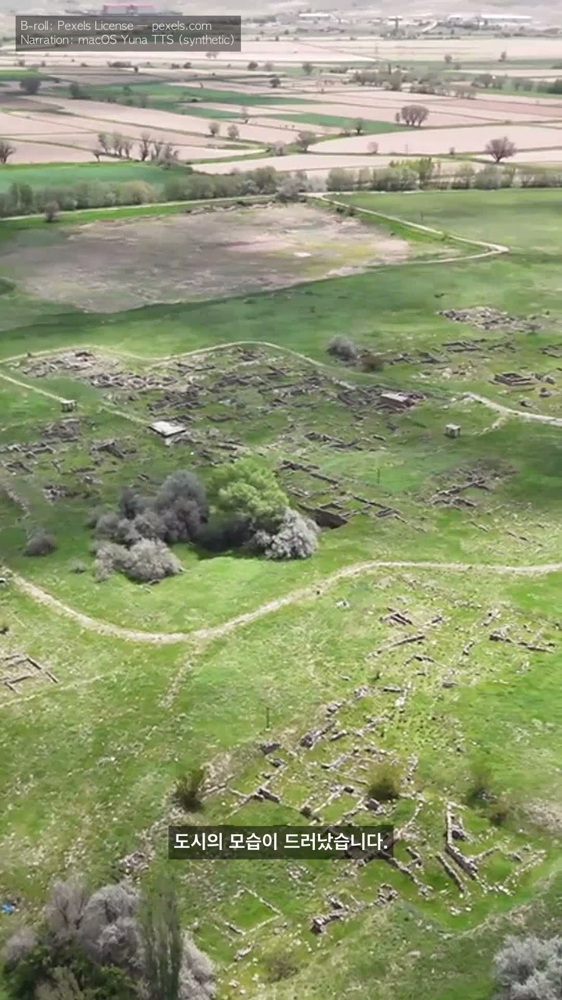 |  |

Each language variant picks its own B-roll from its own captions; `FACELESS_REUSE_BROLL=<en_mission_dir>` forces visual parity when an apples-to-apples "same visuals, swapped audio" test is wanted.  A/B notes + upload metadata + topic queue under [`docs/pilots/`](docs/pilots/).

#### v1 pipeline — `highlight` / `summarize` / `shorts-batch`

Takes a real source URL (e.g., a Creative-Commons video) and produces 9:16 outputs with burned-in source attribution + captions.  Still in active use when you want a clip *from* a video rather than a clip *of* a topic.

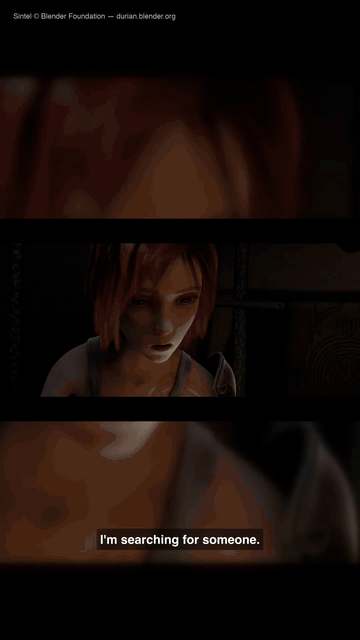

| Single highlight | Shorts batch |
|------------------|--------------|
| 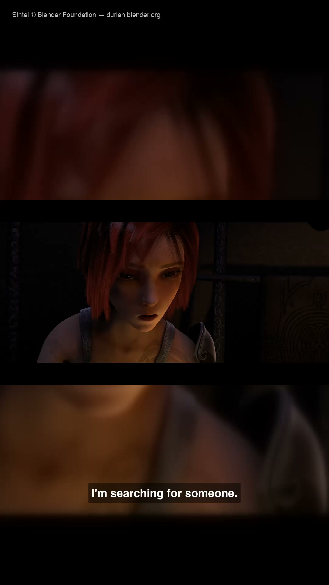 | 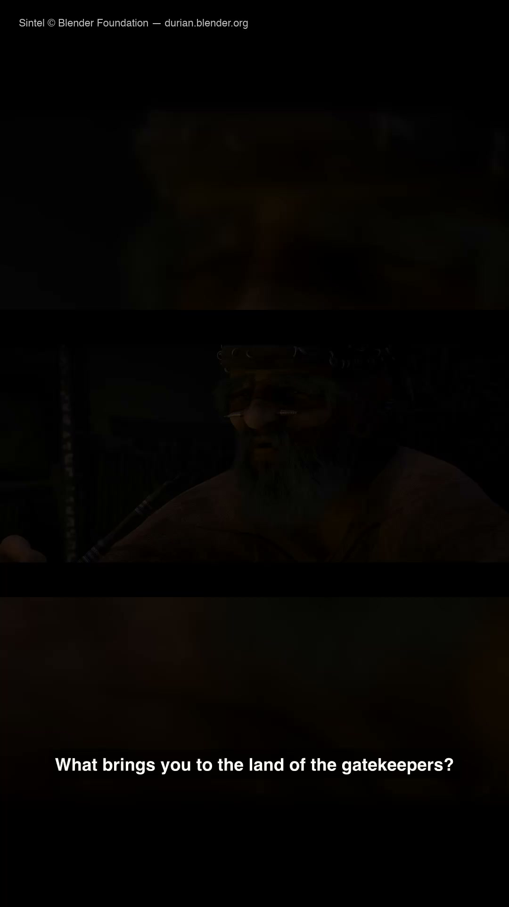 |
| `highlight-015213` · 39 s · PASS attempt 1 | `shorts-batch-024840 / short-01` · 44 s · PASS attempt 1 |

Both from the *Sintel* trailer (CC-BY-3.0, © Blender Foundation).

#### Faceless-pilot scorecard

Structured progress signal from the v4 → v5 → v6 iterations that preceded the music-video pivot.  The music-video mission uses platform watch-time data instead of per-dimension scoring; per-video metrics live under [`docs/pilots/`](docs/pilots/).


The v5 → v6 lift (+12 Hittites EN, +15 Hydrogen EN) came from swapping the script-generation stage from local `llama3.2:3b` to Claude Sonnet; gains concentrated in Hook and Factual coherence — exactly what the operator flagged as broken in v5.  Scores were Claude self-assessed, not a viewer panel.  Full breakdown in [`docs/pilots/scorecard.md`](docs/pilots/scorecard.md).

</details>

## Autonomy signal — operator-intervention trend

A multi-agent system that needs constant human steering hasn't
actually escaped the same effort it was meant to replace.  This
chart is the honest measurement of that — every commit on `main`
is classified as **user-initiated** (operator surfaced the need,
picked an option, approved a deliverable) or **agent-autonomous**
(audit caught drift, roadmap pull, infra maintenance), and the
operator's local Claude Code session logs are mined for prompt
count and active session minutes.


Goal: both panels trend down as the agent system absorbs more
decisions.  Rebuilt by
[`scripts/generate-intervention-chart.py`](scripts/generate-intervention-chart.py)
from `git log` + the local Claude Code session JSONLs — daily at
02:00 KST via launchd on the macOS workstation, manually during the
current Windows-based game sprint (the script went cross-platform
2026-06-12).  The engagement panel only counts sessions stored on
the machine that ran the regeneration, so days worked on another
machine show as gaps, not zero engagement.
Classification heuristics + reduction analysis at
[`docs/research/2026-05-22-intervention-reduction.md`](docs/research/2026-05-22-intervention-reduction.md).
Raw per-day data at [`docs/metrics/intervention.json`](docs/metrics/intervention.json).

## Quality signal — mission-outcome trend (render era, through 2026-05-22)

> **Historical — render era.**  This chart covers the music-video /
> faceless render missions through 2026-05-22, when shipping media was
> the active track.  Since 2026-06 the active track is the PawnSim game
> prototype (see [Overview](#overview)), whose quality signal is the
> verification loop — a 15-scenario input-level repro gate per commit +
> isolated-grader rubric verdicts — rather than a per-mission QA pass
> rate.  Kept as honest evidence of how the render pipeline's
> reliability trended.

The companion signal to autonomy.  *Autonomy* asks "is operator
involvement going down?"; *quality* asks "is the pipeline producing
more reliable output over time?".  Every
`records/missions/<date>/<id>/qa-report.md` is parsed for
`Verdict: PASS|FAIL` and `attempt N of M`; missions without a
qa-report (the music-video class — no per-mission retry harness) are
counted under "metrics.json only".


Panel B reads the system's evolution at a glance — the 2026-05-17
peak is the faceless-pilot batch (8 → 33 missions/day); the
post-pivot flat band is the music-video format that closed out the
render era at a sustainable 3–8 renders/day cadence.  Regenerate (from
local `records/`) via
`.venv/bin/python scripts/generate-quality-trend-chart.py`; raw
per-day data at [`docs/metrics/quality-trend.json`](docs/metrics/quality-trend.json).

## Architecture

The system does **not** force every skill through a single shape.
Two shapes ship today, both agentskills.io-compliant; new skills
pick whichever fits the work:


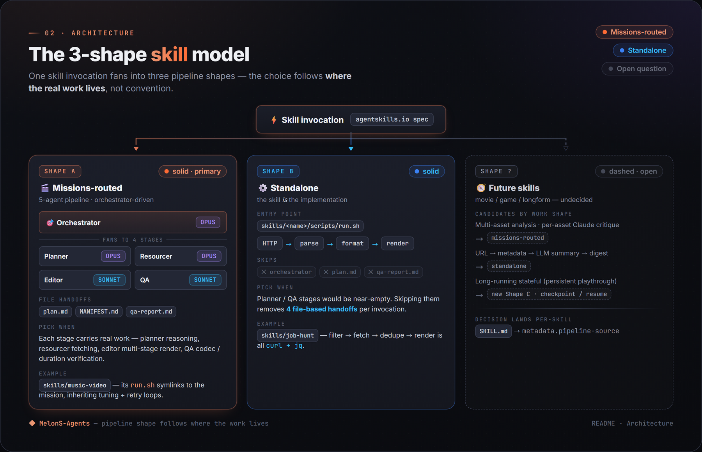


The Shape A subagents currently run at: **planner=opus**,
**resourcer=opus**, **editor=sonnet**, **qa=sonnet**.  Planner +
resourcer were upgraded to `opus` 2026-05-22 ~17:40 KST after a
single A/B run on the Hittites faceless-short brief (verdict in
[`docs/research/2026-05-22-abtest-planner-opus.md`](docs/research/2026-05-22-abtest-planner-opus.md)):
the measurable token / wall-clock delta was negligible (+5.9% tokens,
identical wall-clock), but opus showed one observable cross-stage
reasoning advantage that warranted a multi-week production trial
rather than a one-shot revert.  Re-evaluate after ~10-20 production
missions have accumulated under the new setting; if the opus signal
doesn't compound across a real workload, revert to sonnet.  Editor +
qa stay on sonnet — those stages are the most bash-scripted in
practice, with little room for opus's reasoning depth to bite.

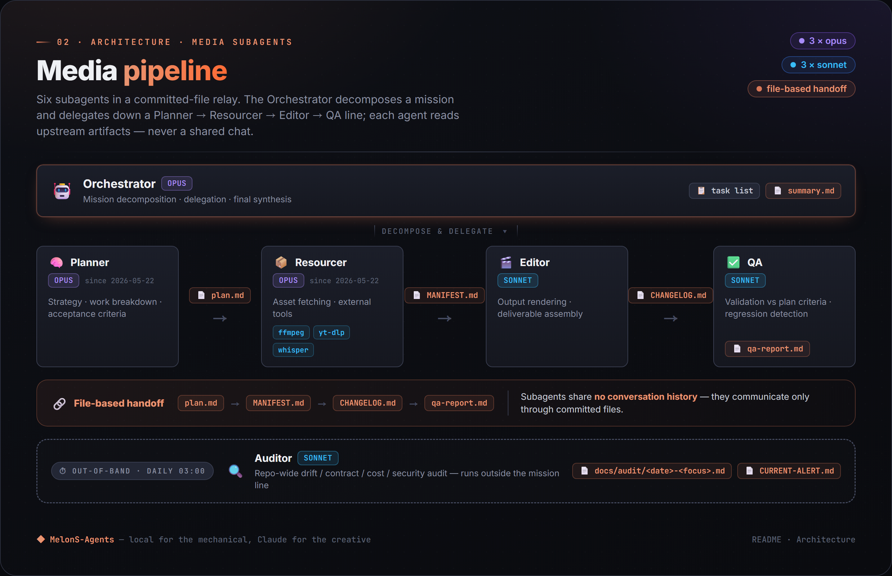

Subagent definitions: [`.claude/agents/`](.claude/agents/) · Mission templates and shared shell libs: [`agents/`](agents/)

The end-to-end media-mission flow — from the operator's prompt to the orchestrator's `summary.md`:

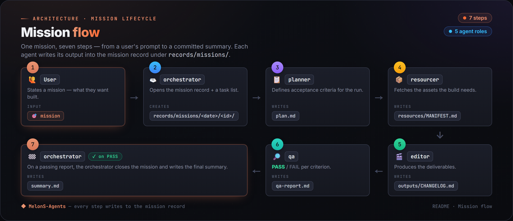

### Game prototype architecture (Skill #3-A — PawnSim)

The game prototype is a separate Unity codebase that the **`game-dev-agent`**
meta-skill scaffolds end-to-end from the CLI. Its architecture is two layers:
the *generator* (agent-side, the build chain) and the *generated* (the Unity
project itself).


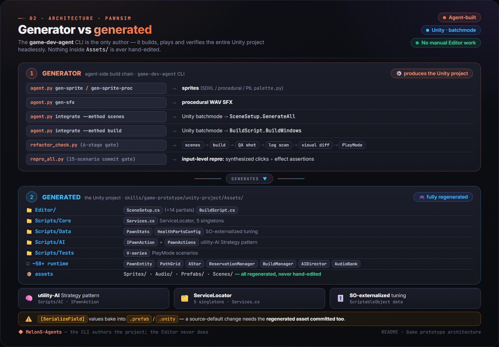


Three design choices carry the game's internal architecture: **utility-AI
Strategy pattern** (each colonist job is an `IPawnAction` scored per tick, so
behaviours compose without a giant state machine), **ServiceLocator** (5
runtime singletons resolved through a testable lookup instead of static refs),
and **SO-externalized tuning** (pawn/health numbers live in ScriptableObjects,
not hard-coded). `SceneSetup.cs` was split 1057L → ~310L across 14 partials so
scene generation stays reviewable. One sharp edge worth flagging here:
`[SerializeField]` values **bake into `.prefab`/`.unity`**, so a source-default
change only takes effect once the regenerated prefab/scene is committed too —
several "fix didn't apply" incidents trace back to this.

The game track also runs its **own 13-agent roster** — separate from the
6-agent media pipeline above, all scaffolded and invoked through
`game-dev-agent` (so [`.claude/agents/`](.claude/agents/) holds **19**
definitions in total, not 6):

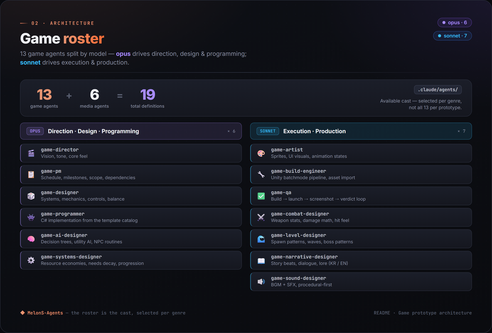

opus drives the direction / design / programming roles; sonnet drives the
execution / production roles.  Not every prototype activates all 13 — the
roster is the available cast, selected per genre.

Full structure, controls, feature coverage, and the honest verification status:
[`skills/game-prototype/README.md`](skills/game-prototype/README.md). The
meta-skill that drives it: [`skills/game-dev-agent/`](skills/game-dev-agent/).

## Design notes

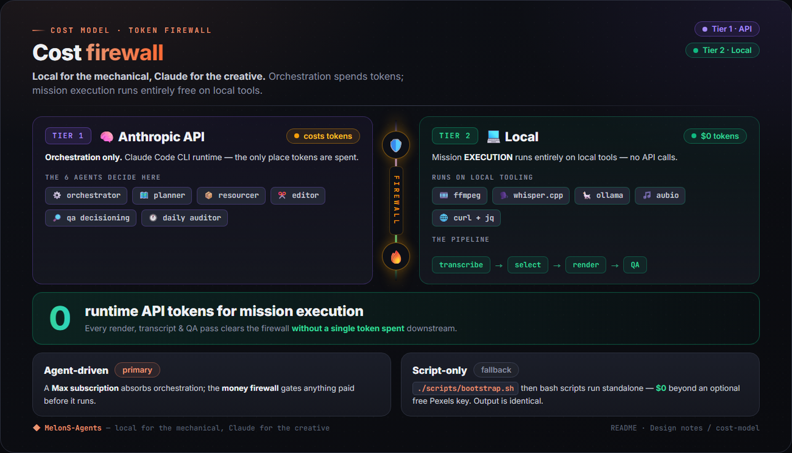

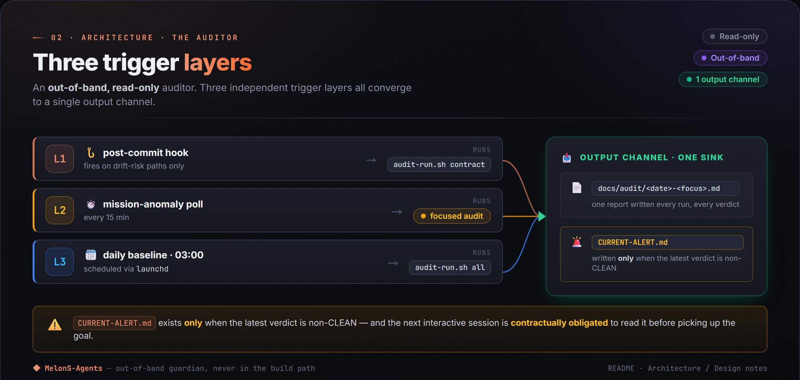

A few choices that distinguish this from a typical agent demo:

<details>
<summary>▸ Design notes — choices that set this apart from a typical agent demo — click to expand</summary>

- **Outcome layer vs. work queue, kept separate.** [`docs/goal.md`](docs/goal.md)
  holds the active goal as a concrete deliverable; [`docs/roadmap.md`](docs/roadmap.md)
  holds the day-level work queue. An empty queue does **not** mean the
  goal is achieved — only the goal's "Done when" criteria do. The split
  exists because an earlier 24-hour stretch produced 11 infra commits
  with the queue reading 0 open items and 0 actual outputs.
- **Operator contract as canonical, committed source of truth.**
  Split across two files on 2026-05-22 for portability:
  [`docs/operator-contract.md`](docs/operator-contract.md) holds this
  project's 12 hard rules + project-specific conventions (this repo's
  README structure, README maintenance cadence).
  [`config/claude-global.template.md`](config/claude-global.template.md)
  holds the operator-style preferences that travel across projects
  (dual-stack reporting, terminal format, batch execution, writing
  tone, idle-state signaling, scrum-master footer); the install
  script renders it idempotently into `~/.claude/CLAUDE.md` between
  BEGIN/END markers. The agent's local memory is a fast-access
  cache that links back to whichever file holds each rule's canonical
  text; if the two disagree, the file wins and the memory entry is
  corrected.
- **Cost firewall between orchestration and execution.** Anthropic API
  tokens are spent only during orchestration (Tier 1). Mission execution
  (transcribe → select → render → QA) runs entirely on local tools —
  `whisper.cpp` + `ollama` + `ffmpeg` — and costs zero tokens. See
  [`docs/cost-model.md`](docs/cost-model.md).
- **Out-of-band auditor with an active alert surface.** The
  [`auditor`](.claude/agents/auditor.md) subagent runs daily at 03:00
  via `launchd`, walks the whole repo read-only, and writes to a stable
  channel: [`docs/audit/CURRENT-ALERT.md`](docs/audit/) exists iff the
  latest verdict is non-CLEAN; the next interactive session is
  contractually obligated to read it before picking up the goal.
- **File-based subagent handoff.** Subagents do not share conversation
  history. They communicate through committed files (`plan.md` /
  `MANIFEST.md` / `qa-report.md`). Each subagent's context is bounded
  by its prompt + the manifest it reads — predictable token cost,
  predictable failure modes.
- **Operator tooling.** Scripts that surface system state and
  absorb routine status-check prompts so the operator doesn't have
  to type them.
  [`scripts/doctor.sh`](scripts/doctor.sh) is a Claude-free
  ~2-second health check — CLI tools, env keys, schedulers, audit
  alerts, git state, disk, per-skill activation, skill manifest
  drift; `--json` output includes an `actionable_warn` field that
  excludes opt-in env keys + git-tree so the signal isn't noisy.
  [`scripts/audit-skill-drift.sh`](scripts/audit-skill-drift.sh) is
  the 13th audit rule, verifying each skill's declared LIVE-flag
  manifest matches its scripts' gating.
  [`scripts/statusline.sh`](scripts/statusline.sh) is the Claude
  Code statusline — it reads doctor's JSON cache (60s background
  regen) and the goal-lock skill to render
  `doctor:⚠N · goal:N/M · audit⚠` continuously, so "what's the
  state?" gets answered without typing.
  [`scripts/log-decision.sh`](scripts/log-decision.sh) appends a
  one-line entry to
  [`docs/autonomous-decisions.md`](docs/autonomous-decisions.md) —
  the agent records unilateral decisions during overnight work so
  the operator scans one page in the morning instead of typing
  "what happened?" prompts.
  [`outputs/review-queue/`](outputs/review-queue/) + three scripts
  (`review-queue-add.sh` / `-digest.sh` / `-decide.sh`) is the
  batched taste-decision queue — music-video renders auto-enqueue
  here instead of pinging the operator per-mp4.
  [`scripts/morning-brief.sh`](scripts/morning-brief.sh) — single
  command that combines all the above into a one-page overnight
  digest: doctor verdict, audit status, intervention trend (7-day
  Δ), commits since 12h ago + attribution, today's autonomous
  decisions, review-queue pending count, blockers.  Read-only;
  the canonical answer to "what happened overnight?".
  Full catalog with what/when/output table:
  [`docs/operator-tooling.md`](docs/operator-tooling.md).

</details>

## Platform support

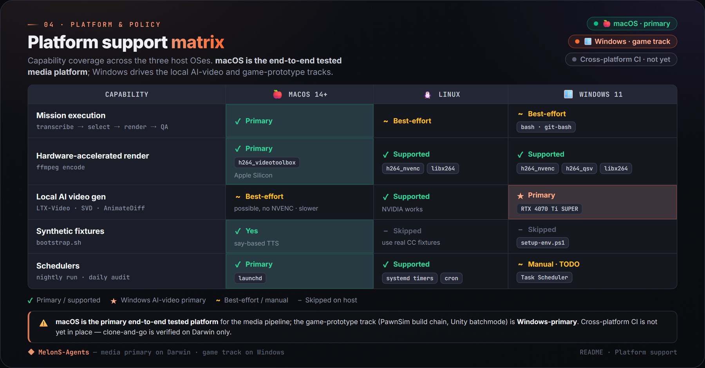

macOS is the **primary, end-to-end tested** platform for the media
pipeline; the game-prototype track (PawnSim build chain, Unity
batchmode) is **Windows-primary**.  Linux works for
mission execution but the schedulers and synthetic-fixture generation
need OS-specific adaptation.  Cross-platform CI is not yet in place;
the clone-and-go flow is verified on Darwin only.

All tool paths and endpoints are env-managed — `agents/lib/env.sh`
resolves any blank `*_BIN` var via `command -v`, so a working PATH
install is enough.  Override in `.env` only when needed.

## Prerequisites

- **macOS 14+** (primary, fully tested) or **Linux** (best-effort) or **Windows 11** (best-effort, NVIDIA + git-bash path — primary for local AI video work) —
  see [Platform support](#platform-support) above; Windows setup at [`docs/platform-windows.md`](docs/platform-windows.md).
- **[Claude Code](https://docs.anthropic.com/claude-code)** — only
  required for the **agent-driven path** (orchestrator + subagents
  taking over the whole pipeline).  The script-only path runs without
  it.  See the [Claude Code pricing + usage guidance](#claude-code-pricing--usage-guidance) section below for plan selection.
- **Homebrew** on macOS, or `apt` / `pacman` / equivalent on Linux
- **Apple Silicon recommended** — `h264_videotoolbox` is used for
  hardware-accelerated render; `-allow_sw 1` is set so the pipeline
  falls back to libx264 on Intel / Linux
- **~3 GB free disk** — whisper.cpp `small` model (~150 MB), Pexels
  B-roll downloads (~50 MB / mission, auto-cleaned), output mp4s
- **Tools**: the full mission toolchain (`ffmpeg`/`ffprobe`,
  `whisper.cpp`, `ollama`, `yt-dlp`, `aubio`, `jq`) is detailed under
  **Toolchain** below.  `scripts/bootstrap.sh` checks all of them and
  prints an exact `brew install …` / `apt install …` command for
  anything missing, so a missing tool isn't a silent failure.
- **API key**: free [Pexels API key](https://www.pexels.com/api/)
  (200 req/hour — plenty for personal use) for B-roll fetch.
  `bootstrap.sh` warns if `PEXELS_API_KEY` isn't set in `.env`.

**Toolchain**

**Agent layer**: [Claude Code](https://docs.anthropic.com/claude-code)
(Anthropic CLI — drives the multi-agent orchestration; subagent
definitions in [`.claude/agents/`](.claude/agents/), per-project
configuration in [`CLAUDE.md`](CLAUDE.md) +
[`.claude/settings.json`](.claude/settings.json)).

**Mission tools**: `ffmpeg` (libass-enabled — `brew install ffmpeg-full`
on macOS, `apt install ffmpeg` on Linux) · `aubio` (beat / onset
detection — `brew install aubio`) · `jq` · `yt-dlp` · `whisper.cpp`
(`small`, multilingual) · `ollama` (`llama3.2:3b`) · `Kokoro-ONNX`
(TTS, Apache 2.0 — faceless-short narration) · macOS `say` (Korean +
fallback voice) · Pexels Videos API (free tier — B-roll for
music-video + faceless-short).

## Claude Code pricing + usage guidance

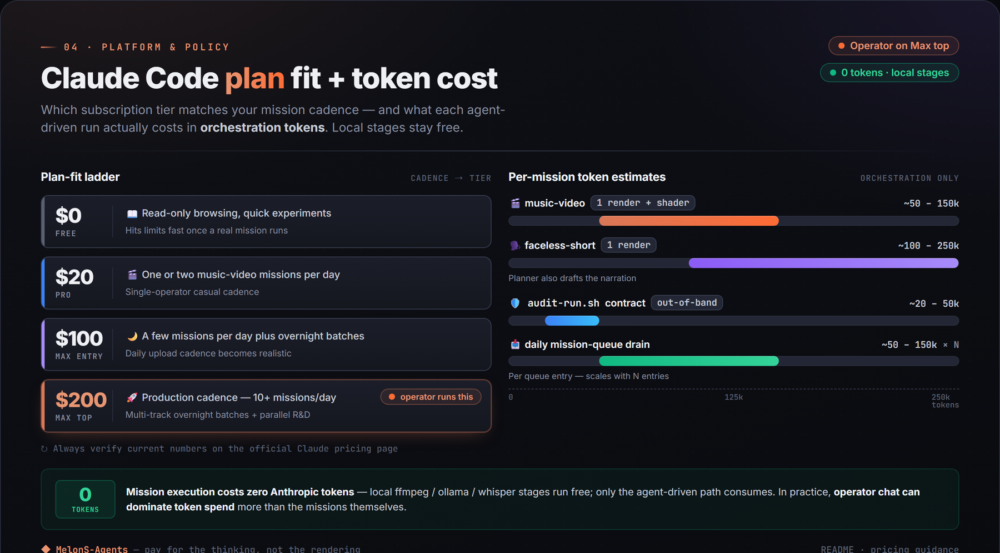

Claude Code is what drives the multi-agent layer (orchestrator → planner
→ resourcer → editor → QA + the daily auditor).  The mission scripts
themselves run standalone and burn **zero** Anthropic tokens; only the
agent-driven path consumes tokens.

**Current Anthropic plans** (always verify on the
[official pricing page](https://www.anthropic.com/pricing) — these
change):

**Rough token usage per mission** (orchestration only — the local
ffmpeg / ollama / whisper.cpp stages are free):

These are **rough**.  Real numbers vary with caption complexity, retry
counts (the QA feedback loop re-runs a failing stage), and how much
operator dialogue happens in the orchestrator turn.  The Tier-1 / Tier-2
firewall — what stays local vs what goes to Anthropic — is documented
in [`docs/cost-model.md`](docs/cost-model.md).

**Cost-stability tips**:
- Operator-facing chat with Claude Code can dominate token spend more
  than the missions themselves; keep planning conversations focused.
- The `autonomous` mode (`AUTONOMY_MODE=true`) enforces
  `AUTONOMY_BUDGET_USD` — useful for overnight batches.
- Token receipts land in your Anthropic console; check after the first
  few mission runs to calibrate your plan choice.

## Quick start

> **Latest stable tag**: `v0.4.0` — Skill #2 (`job-hunt`) shipped
> on top of `v0.3.0`'s permission bootstrap + pluggable B-roll
> and `v0.2.0`'s Skills framework + zero-account demo path.
> Cloning the tag is the recommended first-touch entry point;
> `main` may contain in-flight work past the tag.

### Skill #1 — music-video zero-account demo (~2 minutes from clone to playable mp4)

No Pexels signup, no Suno round-trip, no `.env` edit.  Uses
bundled CC-BY Blender Foundation clips + Kevin MacLeod tracks
(both CC-BY 4.0 / 3.0 with attribution baked into
`outputs/SOURCES.txt`).  Designed for "see what it produces
before committing accounts".

```bash
# 1) clone (any host with Mac/Linux + ffmpeg + ollama + aubio works)
git clone --depth 1 https://github.com/MelonS/MelonS-Agents.git
cd MelonS-Agents

# 2) one-command guided wizard — checks prerequisites, runs the
#    demo, opens the result.  Single Y/n decision; rest is automatic.
./scripts/first-touch.sh

# OR — manual path:
# 2a) bootstrap (verifies tools, prints brew/apt hints for anything missing;
#     detects no-key/no-music state and recommends the demo path automatically)
./scripts/bootstrap.sh
# 2b) zero-account demo — first run fetches the demo cache (~30s) then
#     renders (~100s).  Output at:
#     records/missions/<YYYY-MM-DD>/music-video-demo-<HHMMSS>/outputs/short.mp4
MUSIC_VIDEO_DEMO_MODE=1 ./agents/missions/music-video/run.sh demo
```

Reference for all music-video env vars + flags + shader catalog:
[`docs/music-video-pipeline-reference.md`](docs/music-video-pipeline-reference.md).

### Skill #2 — job-hunt short-keyword demo (~5 seconds, no network)

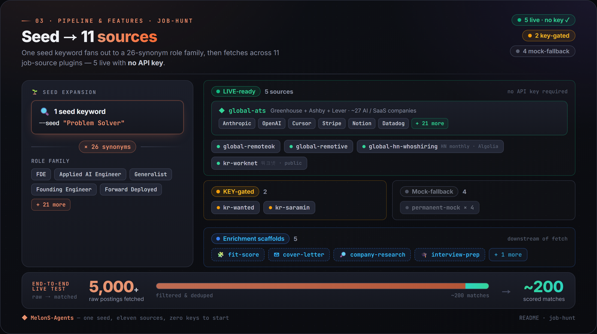

Single keyword expands to a full role family + emits a markdown
digest from mock-fallback sources (no live HTTP, no API keys, no
operator-profile.md required).

```bash
# After the clone + bootstrap above:
skills/job-hunt/scripts/run.sh --seed "Problem Solver" --dry-run
# Output: digest.md path printed on stdout; open it to see the
# mock postings spanning multiple sources, all matched against the
# 26 synonym keywords in the "problem-solver" family.

# Try other seeds in the same family — all produce identical results:
skills/job-hunt/scripts/run.sh --seed "FDE" --dry-run
skills/job-hunt/scripts/run.sh --seed "Forward Deployed" --dry-run
skills/job-hunt/scripts/run.sh --seed "Generalist" --dry-run
```

For real postings without operator setup, flip the global-*
plugins to live mode — no key required:

```bash
JH_GLOBAL_ATS_LIVE=1 JH_GLOBAL_REMOTEOK_LIVE=1 \
JH_GLOBAL_REMOTIVE_LIVE=1 JH_GLOBAL_HN_LIVE=1 \
JH_WORKNET_LIVE=1 \
skills/job-hunt/scripts/run.sh --seed "Problem Solver"
# Pulls Greenhouse + Ashby + Lever ATS boards (27 companies),
# RemoteOK / Remotive / HN monthly thread / 워크넷; ~5k raw
# postings filtered to the 26-keyword Problem Solver family.
# See docs/research/job-sources-survey-2026-05-21.md for the
# legal-and-technical audit behind which sources are live-ready.
```

See [`docs/samples/job-hunt-digest-mock.md`](docs/samples/job-hunt-digest-mock.md)
for what a digest looks like, and [`EXAMPLES.md`](EXAMPLES.md) for
the full recipe collection covering both skills.

To activate live HTTP per source (Wanted API key, Saramin
OpenAPI key, etc.) or live Claude calls for the 4 enrichment
utilities (fit-score / cover-letter / company-research /
interview-prep), see the walkthrough
[`docs/skills/job-hunt.md`](docs/skills/job-hunt.md) (English) or
[`docs/skills/job-hunt.ko.md`](docs/skills/job-hunt.ko.md) (한국어).

Reproducibility gate: `scripts/test-demo-mode.sh` exercises the
whole path against a freshly-cloned tree (asserts `short.mp4`
≥ 1 MB, ≥ 50 s, `SOURCES.txt` with ≥ 2 CC-BY credit lines).  PASS
log persists at
[`docs/onboarding/demo-mode-log.txt`](docs/onboarding/demo-mode-log.txt).

See [`docs/onboarding/demo-mode.md`](docs/onboarding/demo-mode.md)
for source customization, attribution requirements, and the
graduation path to the full Pexels + operator-music flow below.

### Full path — operator music + per-keyword Pexels B-roll

For the unlocked mood-keyword catalog and operator-supplied tracks:

```bash
# 1) edit .env — set PEXELS_API_KEY (free; sign up at https://www.pexels.com/api/)

# 2) generate one or more music tracks on Suno (free tier, suno.com)
#    with prompts like "late night jazz lofi, soft piano, 60 BPM,
#    [Instrumental]" — download the mp3 and drop into assets/music/
#    (gitignored — license trail noted in assets/music/SOURCES.md)

# 3) run the music-video mission against your music file
./agents/missions/music-video/run.sh upload1 "assets/music/<your_track>.mp3"

# 4) (optional, but the whole point) apply the phrase-aware shader combo
#    — pond surface ripple + warm halation with envelope tied to a 95.8
#    BPM phrase cadence (tunable inside the script for other tempos):
./scripts/music-video-shaders.sh combo \
    records/missions/$(date +%Y-%m-%d)/music-video-upload1-*/outputs/short.mp4 \
    outputs/publish/my-first-short.mp4
```

The mission writes its base output to
`records/missions/<date>/music-video-<id>-<HHMMSS>/outputs/short.mp4`
(gitignored — products stay on your machine; only the agent system
itself is on GitHub).  The shader step copies a final mp4 into
`outputs/publish/`, where you can pick it up for upload.

For a hands-off daily cadence, queue tracks in
`records/queue/music-video-pending.txt` and run
`scripts/daily-music-video.sh --all` (or schedule it via launchd / cron).

### v1 flow — single-clip highlight (kept as a baseline)

```bash
./agents/missions/highlight/run.sh https://download.blender.org/durian/trailer/sintel_trailer-1080p.mp4
```

Multi-source batch and the autonomous queue drainer also exist for the
v1 flow:

```bash
./scripts/batch-mission.sh -f sources.txt
echo 'https://example.com/long.mp4' >> records/queue/pending.txt
./scripts/mission-queue.sh
./scripts/install-scheduler.sh install      # nightly launchd
```

### Skill #3 — game prototype (PawnSim) build + run

In development (not in the production-skill count), and the agent's most active
play-test loop. Requires **Windows + Unity 6000.0.75f1 LTS** (the build chain
runs the Editor in batchmode); the rest of the repo is Mac/Linux.

```bash
cd skills/game-prototype

# 1) regenerate scenes + prefabs (programmatic — no manual Editor work)
python ../game-dev-agent/scripts/agent.py integrate --project unity-project --method scenes

# 2) build the Windows .exe (headless)
python ../game-dev-agent/scripts/agent.py integrate --project unity-project --method build --day PLAY

# 3) run the NEWEST build — the per-day folder is date-stamped, so always
#    resolve it dynamically (a hardcoded date silently runs a stale build):
"$(ls -dt builds/day-*/ | head -1)PawnSim.exe"
```

No pre-built `.exe` is committed (`builds/` is gitignored); step 2 produces it.
Useful flags: `-starthour 22` (night demo), `-delay 12 -screenshot <abs-path>`
(headless capture), `-opensettings` (open the settings panel before capture).
Full controls, feature coverage, and the honest verification status live in
[`skills/game-prototype/README.md`](skills/game-prototype/README.md).

## Code / Data separation

| Layer | Path | Tracked |
|-------|------|---------|
| Code (logic) | `.claude/agents/`, `agents/`, `config/`, `scripts/` | ✓ |
| Skills (agentskills.io-spec packages) | `skills/<name>/` | ✓ |
| Data (outputs) | `records/missions/<date>/<id>/` | ✗ (gitignored) |
| Secrets | `.env` | ✗ (gitignored) |

The repository contains only the agent system itself. Mission outputs —
videos, transcripts, generated assets — stay local under `records/`.
What appears on GitHub is the system's own evolution, not its products.

## Operator contract

This repository is fully agent-operated. The day-to-day rules:

- The **agent does all the work** — installs, edits, configs, commits, pushes, scheduling. The user does not run commands in the terminal.
- The user steps in **only** when a hard guardrail blocks the agent (e.g., self-modifying its own permissions, force-pushing to `main`) — and even then only as a single click of approval, never a multi-step recipe.
- **Outcome vs work queue, kept separate.** [`docs/goal.md`](docs/goal.md) holds the active goal as a concrete deliverable; [`docs/roadmap.md`](docs/roadmap.md) holds the day-level work queue (its *Now* section is the source of truth for "what to work on next").
- **Money firewall**: paid APIs, SaaS subscriptions, and cloud-resource creation require explicit user confirmation. Local resources (Ollama, FFmpeg, whisper.cpp, brew) stay fully autonomous.

**Autonomy modes** — interactive (default) vs autonomous, plus the money firewall:

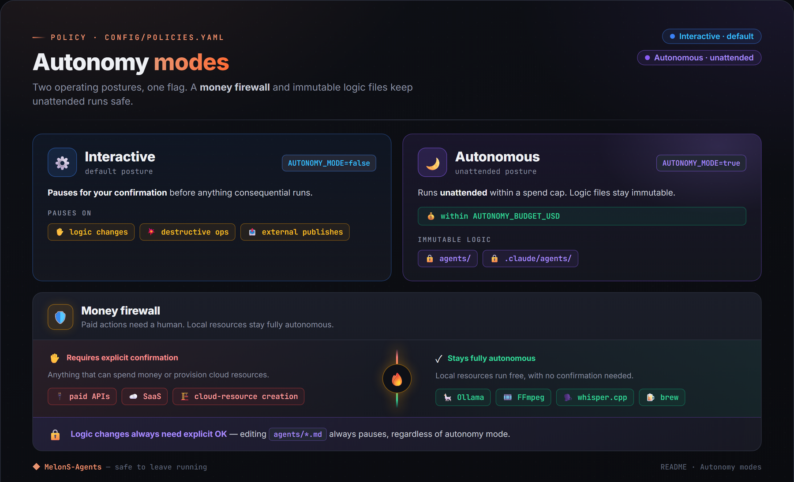

Full contract: see [`CLAUDE.md`](CLAUDE.md) and the [`config/policies.yaml`](config/policies.yaml) autonomy rules.

## For analysts / reviewers

Doing a read-only analysis of this repository? Start at
[`docs/for-analysts.md`](docs/for-analysts.md) — a single-file entry
point optimized for first-pass diagnosis. Pairs with
[`docs/cost-model.md`](docs/cost-model.md) (where Anthropic vs. local
cost lives) and [`docs/architecture.md`](docs/architecture.md) (full
data-flow map).

## License

MIT. See [`LICENSE`](LICENSE).
