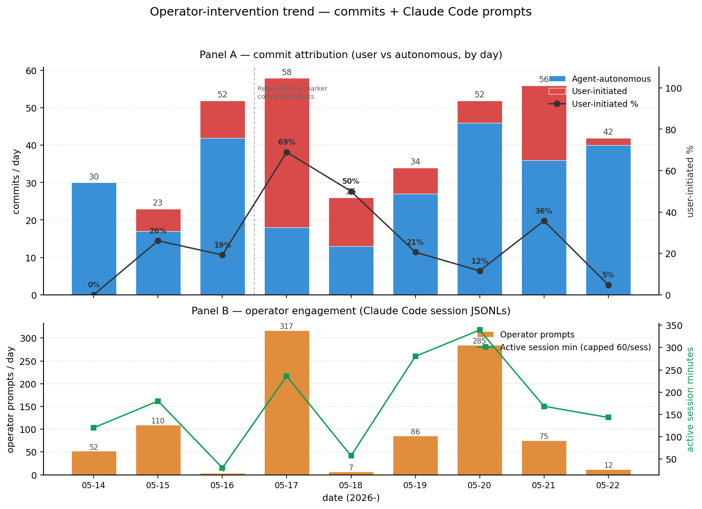

<div align="center">

# MelonS-Agents

[한국어](./README.ko.md) | **English** · [**Live site →**](https://melons.github.io/MelonS-Agents/)

**Two production skills:** music-video shorts + Korean job-board digest.  Both [agentskills.io](https://agentskills.io)-spec compliant — portable across Claude Code, Cursor, Goose, Gemini CLI, OpenAI Codex, GitHub Copilot.

**Local for the mechanical, Claude for the creative.**  Phrase-aware ffmpeg shaders sync vintage visuals to music structure.  Short-keyword job-hunt expansion via role-synonym map.  Three trigger layers — commit, anomaly, schedule — so the system corrects its own drift.  English + Korean dual track from day 1.

`69+ mission outputs · 5 mission types · 2 portable skills + 1 meta-skill · 0 runtime API tokens · 3 audit layers · MIT`


[](https://github.com/MelonS/MelonS-Agents/actions/workflows/main-protection.yml)


</div>

## Overview

> A macOS-based multi-agent system **driven by [Claude Code](https://docs.anthropic.com/claude-code)**
> (the Anthropic CLI), shipping two production skills as of v0.4.0:
>
> **Skill #1 — `music-video`** (1.0.0): music track in, 9:16 vertical
> short out, with phrase-aware ffmpeg shaders syncing vintage visuals
> to the music's structure.  Demo above is from this skill.  Missions-
> routed shape — invokes the 5-agent (orchestrator + planner +
> resourcer + editor + qa) pipeline via
> [`agents/missions/music-video/run.sh`](agents/missions/music-video/run.sh).
>
> **Skill #2 — `job-hunt`** (0.1.0): job-board digest with
> short-keyword UX.  Pass a single seed like `--seed "Problem Solver"`
> and the skill expands to the full family of equivalent titles used
> at different companies (FDE / Applied AI Engineer / Generalist /
> etc.), fetches matching postings, deduplicates across sources, and
> produces a dated markdown digest.  Five live-ready source plugins
> (no API key required): **`global-ats`** (Greenhouse + Ashby + Lever
> public boards spanning ~27 AI / SaaS companies including Anthropic /
> OpenAI / Cursor / Stripe / Notion / Datadog), **`global-remoteok`**,
> **`global-remotive`**, **`global-hn-whoshiring`** (monthly "Who is
> hiring?" thread via Algolia HN Search), and **`kr-worknet`**
> (정부 공공고용서비스).  End-to-end live test pulled 5,000+ raw
> postings → 200 matching the "problem-solver" 24-synonym filter.
> Two key-gated KR plugins (`kr-wanted`, `kr-saramin`) ship scaffolded
> for operator validation.  Standalone shape — no missions-routed
> pipeline, the skill is the canonical implementation.
>
> Earlier mission types (`faceless-short` narration-driven shorts +
> v1 `highlight` / `summarize` / `shorts-batch`) remain in the tree
> as alternate paths.
>
> Two ways to use this repo:
> - **Agent-driven (the primary path)** — install Claude Code on a Mac,
>   point it at the cloned repo, and the orchestrator + 4 mission
>   subagents (defined under [`.claude/agents/`](.claude/agents/)) take
>   over.  The operator types a mission; Claude Code runs the planner →
>   resourcer → editor → QA pipeline, edits files, commits, and pushes.
>   Cost: a Claude Code subscription (Anthropic Max recommended);
>   external paid APIs gated by the money firewall (see contract below).
> - **Script-only (fallback)** — the bash mission scripts and the
>   shader recipes run standalone via `./scripts/bootstrap.sh` + the
>   reproduction commands further down.  No Claude Code, no
>   orchestration, no auto-commit — but the music-video output is
>   identical.  Cost: $0 beyond the optional free Pexels API key.
>
> **The system itself is not shorts-specific.**  The scaffold —
> orchestrator + 4 mission subagents + file-based handoff + 3-layer
> reactive audit + Tier-1/Tier-2 cost routing — is general-purpose by
> design; short-form video is the v1 mission type chosen to exercise
> the architecture against a concrete, visually verifiable deliverable.
> Additional mission types (research workflows, multi-stage data
> pipelines, automation jobs the operator picks up next) will land on
> the same scaffold as the project matures.
>
> Built on a single premise: **automate the production pipeline, then
> let the system evolve its own logic.**  Every commit in this
> repository is a step in that evolution — the history is not a record
> of outputs, but of how the agent system itself grows over time.

> **Engineering decisions, one page.**
> [`docs/engineering-case-studies.md`](docs/engineering-case-studies.md)
> — six production incidents and the minimum mechanism each one
> produced (Tier-1 routing, semaphore-bounded batch, content-quality
> feedback loop, three-layer reactive audit, shader-effects-in-ffmpeg
> / knowing-where-the-wall-is, and onboarding-friction-kills-first-touch
> / zero-account demo path).  Each entry follows
> *problem → constraint → decision → artifact*.

## Design notes

A few choices that distinguish this from a typical agent demo:

- **Outcome layer vs. work queue, kept separate.** [`docs/goal.md`](docs/goal.md)
  holds the active goal as a concrete deliverable; [`docs/roadmap.md`](docs/roadmap.md)
  holds the day-level work queue. An empty queue does **not** mean the
  goal is achieved — only the goal's "Done when" criteria do. The split
  exists because an earlier 24-hour stretch produced 11 infra commits
  with the queue reading 0 open items and 0 actual outputs.
- **Operator contract as canonical, committed source of truth.**
  Split across two files on 2026-05-22 for portability:
  [`docs/operator-contract.md`](docs/operator-contract.md) holds this
  project's 12 hard rules + project-specific conventions (this repo's
  README structure, README maintenance cadence).
  [`config/claude-global.template.md`](config/claude-global.template.md)
  holds the operator-style preferences that travel across projects
  (dual-stack reporting, terminal format, batch execution, writing
  tone, idle-state signaling, scrum-master footer); the install
  script renders it idempotently into `~/.claude/CLAUDE.md` between
  BEGIN/END markers. The agent's local memory is a fast-access
  cache that links back to whichever file holds each rule's canonical
  text; if the two disagree, the file wins and the memory entry is
  corrected.
- **Cost firewall between orchestration and execution.** Anthropic API
  tokens are spent only during orchestration (Tier 1). Mission execution
  (transcribe → select → render → QA) runs entirely on local tools —
  `whisper.cpp` + `ollama` + `ffmpeg` — and costs zero tokens. See
  [`docs/cost-model.md`](docs/cost-model.md).
- **Out-of-band auditor with an active alert surface.** The
  [`auditor`](.claude/agents/auditor.md) subagent runs daily at 03:00
  via `launchd`, walks the whole repo read-only, and writes to a stable
  channel: [`docs/audit/CURRENT-ALERT.md`](docs/audit/) exists iff the
  latest verdict is non-CLEAN; the next interactive session is
  contractually obligated to read it before picking up the goal.
- **File-based subagent handoff.** Subagents do not share conversation
  history. They communicate through committed files (`plan.md` /
  `MANIFEST.md` / `qa-report.md`). Each subagent's context is bounded
  by its prompt + the manifest it reads — predictable token cost,
  predictable failure modes.
- **Operator tooling.** Scripts that surface system state and
  absorb routine status-check prompts so the operator doesn't have
  to type them.
  [`scripts/doctor.sh`](scripts/doctor.sh) is a Claude-free
  ~2-second health check — CLI tools, env keys, schedulers, audit
  alerts, git state, disk, per-skill activation, skill manifest
  drift; `--json` output includes an `actionable_warn` field that
  excludes opt-in env keys + git-tree so the signal isn't noisy.
  [`scripts/audit-skill-drift.sh`](scripts/audit-skill-drift.sh) is
  the 13th audit rule, verifying each skill's declared LIVE-flag
  manifest matches its scripts' gating.
  [`scripts/statusline.sh`](scripts/statusline.sh) is the Claude
  Code statusline — it reads doctor's JSON cache (60s background
  regen) and the goal-lock skill to render
  `doctor:⚠N · goal:N/M · audit⚠` continuously, so "what's the
  state?" gets answered without typing.
  [`scripts/log-decision.sh`](scripts/log-decision.sh) appends a
  one-line entry to
  [`docs/autonomous-decisions.md`](docs/autonomous-decisions.md) —
  the agent records unilateral decisions during overnight work so
  the operator scans one page in the morning instead of typing
  "what happened?" prompts.
  [`outputs/review-queue/`](outputs/review-queue/) + three scripts
  (`review-queue-add.sh` / `-digest.sh` / `-decide.sh`) is the
  batched taste-decision queue — music-video renders auto-enqueue
  here instead of pinging the operator per-mp4.
  [`scripts/morning-brief.sh`](scripts/morning-brief.sh) — single
  command that combines all the above into a one-page overnight
  digest: doctor verdict, audit status, intervention trend (7-day
  Δ), commits since 12h ago + attribution, today's autonomous
  decisions, review-queue pending count, blockers.  Read-only;
  the canonical answer to "what happened overnight?".

## Autonomy signal — operator-intervention trend

A multi-agent system that needs constant human steering hasn't
actually escaped the same effort it was meant to replace.  This
chart is the honest measurement of that — every commit on `main`
is classified as **user-initiated** (operator surfaced the need,
picked an option, approved a deliverable) or **agent-autonomous**
(audit caught drift, roadmap pull, infra maintenance), and the
operator's local Claude Code session logs are mined for prompt
count and active session minutes.



Goal: both panels trend down as the agent system absorbs more
decisions.  Updated daily at 02:00 KST by the
`com.melons.agents.intervention-chart` launchd job
([`scripts/intervention-chart-collect.sh`](scripts/intervention-chart-collect.sh)),
which calls
[`scripts/generate-intervention-chart.py`](scripts/generate-intervention-chart.py)
to rebuild both panels from `git log` + `~/.claude/projects/-Users-melons-ai/*.jsonl`.
Classification heuristics + reduction analysis at
[`docs/research/2026-05-22-intervention-reduction.md`](docs/research/2026-05-22-intervention-reduction.md).
Raw per-day data at [`docs/metrics/intervention.json`](docs/metrics/intervention.json).

## Sample output

69+ mission outputs have been produced to date across **five** mission
types.  Most recent focus (2026-05-17) is the new `music-video`
mission — music-as-primary-audio shorts (no narration, no captions,
beat-aligned cuts, onset-aligned glitch micro-edits) — chosen via
operator pilot pick documented in
[`docs/pilots/decision-log.md`](docs/pilots/decision-log.md#operator-pick--2026-05-17).
A four-effect post-processing shader layer landed the same evening
(pond surface, breathing zoom, halation, phrase-aware combo;
cartoon deferred — see [case study 5](docs/engineering-case-studies.md#5-shader-effects-in-ffmpeg--knowing-where-the-wall-is)),
and `scripts/daily-music-video.sh` wraps the mission + shader as a
queue runner suitable for cron / launchd daily-upload cadence.
The `faceless-short` mission (narration-driven shorts) remains the
showcase below; the v1 pipeline outputs (single-clip highlight +
shorts-batch) remain as the baseline reference further down.

### Music-video pilots (post-pivot, 2026-05-17)

The `music-video` mission produces a 60-second 9:16 short where the
music IS the message: operator-supplied music track is the sole
audio; cuts land on aubiotrack-derived phrase boundaries; per-clip
playback speed is varied by mood (slow contemplative scenes at
0.55×, ambient at 0.70×, active at 0.80×, natural at 1.00×); micro
"scratch" glitches (0.2 s reverse + 0.2 s forward jump-cut) fire on
detected drum onsets but **only on clips classified as static-camera**
so the frame doesn't shake during the glitch; subtle film grain +
soft vignette + Gaussian zoom-pulse on each glitch onset add a
vintage lo-fi treatment.

Five prototype renders (v1 → v5) iterated through this design with
operator feedback at each step:

- v1: even 7.5 s cuts (no beat-sync)
- v2: cuts moved to phrase boundaries from `aubiotrack`
- v3: + per-clip variable playback speed (calm scenes slowed)
- v4: + glitch micro-edits at every slow clip's mid-point
- v5: + glitch placement restricted to `aubioonset` drum hits on
       static-camera clips only (no glitch on handheld pans)

v5 was operator-validated and promoted into
[`agents/missions/music-video/run.sh`](agents/missions/music-video/run.sh).
The v6 vintage-lofi visual treatment (grain + vignette + zoom-pulse)
landed on top of v5 in the same mission, tunable per render via
`MUSIC_VIDEO_FILM_GRAIN_INTENSITY`, `MUSIC_VIDEO_VIGNETTE_ANGLE`, and
`MUSIC_VIDEO_ZOOM_PULSE_AMP` env vars.  Output mp4s remain gitignored
(records/ directory); music files themselves are local-only by policy
([`assets/music/README.md`](assets/music/README.md)) — a "free to use
in your video" license is not the same as a "free to redistribute
the file" license, so the repo never carries audio assets.

Mid-climax frame (t = 30 s) from the first uploaded short — operator-approved deliverable that closed the 2026-05-17 goal, currently live on the operator's YouTube Shorts channel:


Reproduction:

```bash
./agents/missions/music-video/run.sh <id> <path/to/music.mp3>
```

#### Post-processing shaders (2026-05-17 evening)

Operator asked for shader-style effects on top of the v6 vintage-lofi
treatment.  Three effects landed via pure ffmpeg filter graphs (no GLSL,
no external tool) and one was deliberately deferred:

- **`pond`** — Animated water-surface displacement on the whole frame.
  Two procedural displacement maps (X and Y) are generated by `geq` as
  3-component sin wave fields at 540×960 (4× faster than full res),
  scaled up via bicubic to 1080×1920, then fed into `displace`.  Max
  ±13 px (~1.2 % of frame width) — visible across the entire image but
  not jarring.  Reads as "the whole screen IS a pond surface, gently
  sway".
- **`breathing`** — Continuous gentle scale wave, 5 s period, +0–5 %.
  Always upscale so the post-`crop` frame never under-runs (the
  first attempt with `sin(t)` range −1 to +1 crashed libx264 mid-frame
  when scale went below 1080; fixed by reformulating as
  `(0.5 + 0.5*sin)` so the multiplier is always ≥ 1.0).
- **`halation`** — Warm light bloom around bright pixels.  Split the
  source, brighten-threshold + 22 px gblur the copy, screen-blend back
  onto the original at 0.30 opacity.  Looks like 80s-film light leak
  on amber / neon regions — operator confirmed "확실히 티남" (clearly
  visible) on first pass.
- **`combo`** — `pond` + `halation` with **phrase-aware strength
  envelopes**.  Both effects' intensity is a function of `T` (time):
  off / quiet during intro (0–15 s), ramping up across the build
  (15–22.5 s), full during the climax (22.5–45 s), tapering through
  the wind-down (45–52.5 s), settling for the outro (52.5–60 s).
  The phrase boundaries match the Velvet Turntable reference track's
  95.8 BPM × 12-beat phrase = 7.5 s cadence; for other tracks the
  envelope is parameterised in the script.

What was *not* attempted: **cel-shading / cartoon** rendering.  ffmpeg
posterising luma and chroma independently (`lutyuv` with
`round(val/N)*N` quantisation) breaks hue — operator's reaction was
"완전 그냥 초록색만 나옴" (everything turned green).  Real cel-shading
requires either GLSL shaders (mpv + libplacebo, ~200–500 LOC),
EbSynth (paint one keyframe, propagate by motion), or AI stylisation
(Stable Diffusion + AnimateDiff, ComfyUI, RunwayML / Kaiber).  None
of those fit inside the ffmpeg pipeline, so the cartoon route is
parked as a separate R&D branch rather than half-implemented in
production.

Reproduction:

```bash
# Apply a single effect
./scripts/music-video-shaders.sh pond     <input.mp4> <output.mp4>
./scripts/music-video-shaders.sh halation <input.mp4> <output.mp4>

# Phrase-aware combo (the validated end product)
./scripts/music-video-shaders.sh combo    <input.mp4> <output.mp4>
```

### Faceless pilots (English + Korean A/B)

The `faceless-short` mission produces a complete 60-second short from a topic prompt alone — no input video.  Pipeline: ollama drafts the narration script → Kokoro-ONNX (`am_michael`, or macOS `Yuna` for Korean) synthesizes voice → whisper.cpp transcribes for timing → script-aware caption correction maps proper nouns back to the original script → SRT cues split to single-line at natural punctuation breaks (stops 2-line opaque-box overlap on mobile) → ollama extracts one Pexels search term per temporal narration window (8 windows) → Pexels Videos API fetches one B-roll clip per window → ffmpeg trims each clip to its window's duration, crops to 9:16 screen-fill, burns libass captions and an attribution overlay.

Each topic is rendered in two language variants so the operator can A/B voice + caption rendering side by side:

| | Hittites (history × Bible) | Hydrogen (science) |
|---|---|---|
| EN |  |  |
| KO |  |  |

Each language variant picks its OWN B-roll by extracting Pexels search terms from its own captions per window — so the EN and KO shorts share script structure but not always identical clips (the v3/v4 design picked per-window keywords for narration-beat alignment).  Pass `FACELESS_REUSE_BROLL=<en_mission_dir>` to force the KO render to reuse the EN stitched B-roll when an apples-to-apples "same visuals, swapped audio" test is wanted.

A/B production notes, per-platform upload metadata, and the next-10 topic queue all live under [`docs/pilots/`](docs/pilots/).  Per-pilot cost: **$0** (Pexels free tier, all other stages local).

### v1 pipeline (single-clip highlight / shorts-batch)

The original v1 missions — `highlight`, `summarize`, `shorts-batch` — take a real source URL (e.g., a Creative-Commons video) and produce 9:16 outputs with burned-in source attribution + captions.  These predate `faceless-short`; they're still in active use when you want a clip *from* a video rather than a clip *of* a topic.


Six-second slice of `highlight-015213/outputs/short.mp4` — Sintel trailer (CC-BY-3.0, © Blender Foundation), 39 s 9:16 with watermark + captions.  Full mp4 lives under `records/` (gitignored); this GIF is a size-optimized excerpt (360 px wide, 12 fps, ≈ 2.8 MB) generated by ffmpeg with palette dithering, kept in `docs/demo/` as durable evidence of the v1 pipeline.

| Single highlight | Shorts batch |
|------------------|--------------|
|  |  |
| `highlight-015213` · 39 s · PASS attempt 1 | `shorts-batch-024840 / short-01` · 44 s · PASS attempt 1 |

Both sourced from the *Sintel* trailer (CC-BY-3.0, © Blender Foundation — `durian.blender.org`).  Top-left source-attribution overlay, 9:16 letterbox-blur background, libass-burned caption inside the bottom safe-zone box.

### Faceless-pilot scorecard (historical — narration era)

Below is the scorecard for the **earlier** `faceless-short` mission
(narration-driven shorts).  It is preserved as the structured progress
signal from the v4 → v5 → v6 iterations that preceded the music-video
pivot.  The music-video mission has no equivalent scorecard yet —
operator approval + platform watch-time data (post first upload) will
replace per-dimension scoring for the current focus.


The lift from v5 → v6 (single-line caption was already in place at
v5; v6 swapped the script-generation stage from local `llama3.2:3b`
to Claude Sonnet) is +12 points on Hittites EN and +15 on Hydrogen
EN.  Most of the v5→v6 delta is **Hook** and **Factual coherence**
— exactly the dimensions the operator surfaced as broken in v5
("초반 5초에 시선 끌만한게 없음", "10%인지 60%인지 헷갈리네").

Honest disclosure: scores were assigned by Claude, not a viewer
panel.  Full per-version breakdown + reasoning in
[`docs/pilots/scorecard.md`](docs/pilots/scorecard.md).

## For analysts / reviewers

Doing a read-only analysis of this repository? Start at
[`docs/for-analysts.md`](docs/for-analysts.md) — a single-file entry
point optimized for first-pass diagnosis. Pairs with
[`docs/cost-model.md`](docs/cost-model.md) (where Anthropic vs. local
cost lives) and [`docs/architecture.md`](docs/architecture.md) (full
data-flow map).

## Architecture

```
              ┌───────────────────┐
              │   Orchestrator    │   model: opus
              └─────────┬─────────┘
                        │ delegates the mission, in order
                        ▼
              ┌───────────────────┐
              │      Planner      │   model: sonnet
              └─────────┬─────────┘
                        ▼
              ┌───────────────────┐
              │     Resourcer     │   model: sonnet
              └─────────┬─────────┘
                        ▼
              ┌───────────────────┐
              │       Editor      │   model: sonnet
              └─────────┬─────────┘
                        ▼
              ┌───────────────────┐
              │         QA        │   model: sonnet
              └───────────────────┘

              ┌───────────────────┐
              │      Auditor      │   model: sonnet  (out-of-band)
              └───────────────────┘   read-only; scheduled daily
                                       at 03:00 via launchd
```

| Agent | Responsibility | Output |
|-------|----------------|--------|
| 🤖 **Orchestrator** (opus) | Mission decomposition, delegation, final synthesis | task list · `summary.md` |
| 🧠 **Planner** (sonnet) | Strategy, work breakdown, acceptance criteria | `plan.md` |
| 📦 **Resourcer** (sonnet) | Asset fetching, external tool execution (ffmpeg / yt-dlp / whisper) | `resources/MANIFEST.md` |
| 🎞️ **Editor** (sonnet) | Output rendering, deliverable assembly | `outputs/CHANGELOG.md` |
| ✅ **QA** (sonnet) | Validation against plan criteria, regression detection | `qa-report.md` |
| 🔍 **Auditor** (sonnet) | Repository-wide drift / contract / cost / security audit (out-of-band, daily 03:00) | `docs/audit/<date>-<focus>.md` + `docs/audit/CURRENT-ALERT.md` when non-CLEAN |

Subagent definitions: [`.claude/agents/`](.claude/agents/) · Mission templates and shared shell libs: [`agents/`](agents/)

## Code / Data separation

| Layer | Path | Tracked |
|-------|------|---------|
| Code (logic) | `.claude/agents/`, `agents/`, `config/`, `scripts/` | ✓ |
| Skills (agentskills.io-spec packages) | `skills/<name>/` | ✓ |
| Data (outputs) | `records/missions/<date>/<id>/` | ✗ (gitignored) |
| Secrets | `.env` | ✗ (gitignored) |

The repository contains only the agent system itself. Mission outputs —
videos, transcripts, generated assets — stay local under `records/`.
What appears on GitHub is the system's own evolution, not its products.

## Platform support

| Surface | macOS 14+ | Linux |
|---------|-----------|-------|
| Mission execution (transcribe → select → render → QA) | ✓ | ✓ (`ffmpeg` / `whisper.cpp` / `ollama` all available) |
| Hardware-accelerated render (`h264_videotoolbox`) | ✓ Apple Silicon | n/a — falls back to libx264 via `-allow_sw 1` |
| `bootstrap.sh` synthetic fixtures (macOS `say`-based TTS) | ✓ | skipped — point at real CC fixtures via `scripts/fetch-fixtures.sh` |
| `launchd` schedulers (nightly auto-run, daily audit) | ✓ | replace with systemd timers or cron — see `scripts/com.melons.agents.*.plist` for the schedule to mirror |

macOS is the **primary, end-to-end tested** platform.  Linux works for
mission execution but the schedulers and synthetic-fixture generation
need OS-specific adaptation.  Cross-platform CI is not yet in place;
the clone-and-go flow is verified on Darwin only.

All tool paths and endpoints are env-managed — `agents/lib/env.sh`
resolves any blank `*_BIN` var via `command -v`, so a working PATH
install is enough.  Override in `.env` only when needed.

## Autonomy modes

Defined in [`config/policies.yaml`](config/policies.yaml).

| Mode | Flag | Behavior |
|------|------|----------|
| ⚙️ **Interactive** (default) | `AUTONOMY_MODE=false` | Pauses for user confirmation on logic changes, destructive ops, and external publishes. |
| 🌙 **Autonomous** | `AUTONOMY_MODE=true` | Runs unattended within `AUTONOMY_BUDGET_USD`. Logic files (`agents/`, `.claude/agents/`) are immutable. |

## Mission flow

1. User states a mission.
2. `orchestrator` opens `records/missions/<date>/<id>/` + a task list.
3. `planner` → `plan.md` with acceptance criteria.
4. `resourcer` → assets + `resources/MANIFEST.md`.
5. `editor` → deliverables + `outputs/CHANGELOG.md`.
6. `qa` → `qa-report.md` with PASS / FAIL per criterion.
7. On PASS, `orchestrator` writes `summary.md`.

## Toolchain

**Agent layer**: [Claude Code](https://docs.anthropic.com/claude-code)
(Anthropic CLI — drives the multi-agent orchestration; subagent
definitions in [`.claude/agents/`](.claude/agents/), per-project
configuration in [`CLAUDE.md`](CLAUDE.md) +
[`.claude/settings.json`](.claude/settings.json)).

**Mission tools**: `ffmpeg` (libass-enabled — `brew install ffmpeg-full`
on macOS, `apt install ffmpeg` on Linux) · `aubio` (beat / onset
detection — `brew install aubio`) · `jq` · `yt-dlp` · `whisper.cpp`
(`small`, multilingual) · `ollama` (`llama3.2:3b`) · `Kokoro-ONNX`
(TTS, Apache 2.0 — faceless-short narration) · macOS `say` (Korean +
fallback voice) · Pexels Videos API (free tier — B-roll for
music-video + faceless-short).

## Prerequisites

- **macOS 14+** (primary, fully tested) or **Linux** (best-effort —
  see [Platform support](#platform-support) above)
- **[Claude Code](https://docs.anthropic.com/claude-code)** — only
  required for the **agent-driven path** (orchestrator + subagents
  taking over the whole pipeline).  The script-only path runs without
  it.  See the [Claude Code pricing + usage guidance](#claude-code-pricing--usage-guidance) section below for plan selection.
- **Homebrew** on macOS, or `apt` / `pacman` / equivalent on Linux
- **Apple Silicon recommended** — `h264_videotoolbox` is used for
  hardware-accelerated render; `-allow_sw 1` is set so the pipeline
  falls back to libx264 on Intel / Linux
- **~3 GB free disk** — whisper.cpp `small` model (~150 MB), Pexels
  B-roll downloads (~50 MB / mission, auto-cleaned), output mp4s
- **Tools**: `ffmpeg` (built with libass), `ffprobe`, `whisper.cpp`,
  `ollama`, `yt-dlp`, `aubio` (for the music-video mission's beat /
  onset detection), `jq`.  `scripts/bootstrap.sh` checks all of them
  and prints an exact `brew install …` / `apt install …` command for
  anything missing, so a missing tool isn't a silent failure.
- **API key**: free [Pexels API key](https://www.pexels.com/api/)
  (200 req/hour — plenty for personal use) for B-roll fetch.
  `bootstrap.sh` warns if `PEXELS_API_KEY` isn't set in `.env`.

## Claude Code pricing + usage guidance

Claude Code is what drives the multi-agent layer (orchestrator → planner
→ resourcer → editor → QA + the daily auditor).  The mission scripts
themselves run standalone and burn **zero** Anthropic tokens; only the
agent-driven path consumes tokens.

**Current Anthropic plans** (always verify on the
[official pricing page](https://www.anthropic.com/pricing) — these
change):

| Plan | Monthly | Typical fit for this repo |
|------|---------|---------------------------|
| **Free** | $0 | Read-only browsing / quick experiments.  Hits limits fast once a real mission runs. |
| **Pro** | $20 | One or two music-video missions per day.  Single-operator, casual cadence. |
| **Max — entry tier** | $100 | A few missions per day plus overnight batches.  Daily upload cadence becomes realistic. |
| **Max — top tier** | $200 | Production cadence (10+ missions / day, multi-track overnight batches, ongoing R&D in parallel).  This is what this repo's operator runs. |

**Rough token usage per mission** (orchestration only — the local
ffmpeg / ollama / whisper.cpp stages are free):

| Mission | Anthropic tokens (estimate) | Notes |
|---------|----------------------------|-------|
| `music-video` (one render + shader) | ~50–150 k | Orchestrator opus + 4 sonnet subagents.  Token spend dominated by planner + editor (filter-graph reasoning). |
| `faceless-short` (one render) | ~100–250 k | Higher because the planner also drafts the narration script.  v6 with Sonnet for script generation runs closer to the top of the range. |
| `audit-run.sh contract` (out-of-band) | ~20–50 k | One audit pass over the repo. |
| Daily `mission-queue.sh` drain | ~50–150 k × N entries | Same as a single music-video mission per queue entry. |

These are **rough**.  Real numbers vary with caption complexity, retry
counts (the QA feedback loop re-runs a failing stage), and how much
operator dialogue happens in the orchestrator turn.  The Tier-1 / Tier-2
firewall — what stays local vs what goes to Anthropic — is documented
in [`docs/cost-model.md`](docs/cost-model.md).

**Cost-stability tips**:
- Operator-facing chat with Claude Code can dominate token spend more
  than the missions themselves; keep planning conversations focused.
- The `autonomous` mode (`AUTONOMY_MODE=true`) enforces
  `AUTONOMY_BUDGET_USD` — useful for overnight batches.
- Token receipts land in your Anthropic console; check after the first
  few mission runs to calibrate your plan choice.

## Quick start

> **Latest stable tag**: `v0.4.0` — Skill #2 (`job-hunt`) shipped
> on top of `v0.3.0`'s permission bootstrap + pluggable B-roll
> and `v0.2.0`'s Skills framework + zero-account demo path.
> Cloning the tag is the recommended first-touch entry point;
> `main` may contain in-flight work past the tag.

### Skill #1 — music-video zero-account demo (~2 minutes from clone to playable mp4)

No Pexels signup, no Suno round-trip, no `.env` edit.  Uses
bundled CC-BY Blender Foundation clips + Kevin MacLeod tracks
(both CC-BY 4.0 / 3.0 with attribution baked into
`outputs/SOURCES.txt`).  Designed for "see what it produces
before committing accounts".

```bash
# 1) clone (any host with Mac/Linux + ffmpeg + ollama + aubio works)
git clone --branch v0.4.0 --depth 1 https://github.com/MelonS/MelonS-Agents.git
cd MelonS-Agents

# 2) bootstrap (verifies tools, prints brew/apt hints for anything missing;
#    detects no-key/no-music state and recommends the demo path automatically)
./scripts/bootstrap.sh

# 3) zero-account demo — first run fetches the demo cache (~30s) then
#    renders (~100s).  Output at:
#    records/missions/<YYYY-MM-DD>/music-video-demo-<HHMMSS>/outputs/short.mp4
MUSIC_VIDEO_DEMO_MODE=1 ./agents/missions/music-video/run.sh demo
```

### Skill #2 — job-hunt short-keyword demo (~5 seconds, no network)

Single keyword expands to a full role family + emits a markdown
digest from mock-fallback sources (no live HTTP, no API keys, no
operator-profile.md required).

```bash
# After the clone + bootstrap above:
skills/job-hunt/scripts/run.sh --seed "Problem Solver" --dry-run
# Output: digest.md path printed on stdout; open it to see the
# mock postings spanning multiple sources, all matched against the
# 24 synonym keywords in the "problem-solver" family.

# Try other seeds in the same family — all produce identical results:
skills/job-hunt/scripts/run.sh --seed "FDE" --dry-run
skills/job-hunt/scripts/run.sh --seed "Forward Deployed" --dry-run
skills/job-hunt/scripts/run.sh --seed "Generalist" --dry-run
```

For real postings without operator setup, flip the global-*
plugins to live mode — no key required:

```bash
JH_GLOBAL_ATS_LIVE=1 JH_GLOBAL_REMOTEOK_LIVE=1 \
JH_GLOBAL_REMOTIVE_LIVE=1 JH_GLOBAL_HN_LIVE=1 \
JH_WORKNET_LIVE=1 \
skills/job-hunt/scripts/run.sh --seed "Problem Solver"
# Pulls Greenhouse + Ashby + Lever ATS boards (27 companies),
# RemoteOK / Remotive / HN monthly thread / 워크넷; ~5k raw
# postings filtered to the 24-keyword Problem Solver family.
# See docs/research/job-sources-survey-2026-05-21.md for the
# legal-and-technical audit behind which sources are live-ready.
```

See [`docs/samples/job-hunt-digest-mock.md`](docs/samples/job-hunt-digest-mock.md)
for what a digest looks like, and [`EXAMPLES.md`](EXAMPLES.md) for
the full recipe collection covering both skills.

To activate live HTTP per source (Wanted API key, Saramin
OpenAPI key, etc.) or live Claude calls for the 4 enrichment
utilities (fit-score / cover-letter / company-research /
interview-prep), see the walkthrough
[`docs/skills/job-hunt.md`](docs/skills/job-hunt.md) (English) or
[`docs/skills/job-hunt.ko.md`](docs/skills/job-hunt.ko.md) (한국어).

Reproducibility gate: `scripts/test-demo-mode.sh` exercises the
whole path against a freshly-cloned tree (asserts `short.mp4`
≥ 1 MB, ≥ 50 s, `SOURCES.txt` with ≥ 2 CC-BY credit lines).  PASS
log persists at
[`docs/onboarding/demo-mode-log.txt`](docs/onboarding/demo-mode-log.txt).

See [`docs/onboarding/demo-mode.md`](docs/onboarding/demo-mode.md)
for source customization, attribution requirements, and the
graduation path to the full Pexels + operator-music flow below.

### Full path — operator music + per-keyword Pexels B-roll

For the unlocked mood-keyword catalog and operator-supplied tracks:

```bash
# 1) edit .env — set PEXELS_API_KEY (free; sign up at https://www.pexels.com/api/)

# 2) generate one or more music tracks on Suno (free tier, suno.com)
#    with prompts like "late night jazz lofi, soft piano, 60 BPM,
#    [Instrumental]" — download the mp3 and drop into assets/music/
#    (gitignored — license trail noted in assets/music/SOURCES.md)

# 3) run the music-video mission against your music file
./agents/missions/music-video/run.sh upload1 "assets/music/<your_track>.mp3"

# 4) (optional, but the whole point) apply the phrase-aware shader combo
#    — pond surface ripple + warm halation with envelope tied to a 95.8
#    BPM phrase cadence (tunable inside the script for other tempos):
./scripts/music-video-shaders.sh combo \
    records/missions/$(date +%Y-%m-%d)/music-video-upload1-*/outputs/short.mp4 \
    outputs/publish/my-first-short.mp4
```

The mission writes its base output to
`records/missions/<date>/music-video-<id>-<HHMMSS>/outputs/short.mp4`
(gitignored — products stay on your machine; only the agent system
itself is on GitHub).  The shader step copies a final mp4 into
`outputs/publish/`, where you can pick it up for upload.

For a hands-off daily cadence, queue tracks in
`records/queue/music-video-pending.txt` and run
`scripts/daily-music-video.sh --all` (or schedule it via launchd / cron).

### v1 flow — single-clip highlight (kept as a baseline)

```bash
./agents/missions/highlight/run.sh https://download.blender.org/durian/trailer/sintel_trailer-1080p.mp4
```

Multi-source batch and the autonomous queue drainer also exist for the
v1 flow:

```bash
./scripts/batch-mission.sh -f sources.txt
echo 'https://example.com/long.mp4' >> records/queue/pending.txt
./scripts/mission-queue.sh
./scripts/install-scheduler.sh install      # nightly launchd
```

## Operator contract

This repository is fully agent-operated. The day-to-day rules:

- The **agent does all the work** — installs, edits, configs, commits, pushes, scheduling. The user does not run commands in the terminal.
- The user steps in **only** when a hard guardrail blocks the agent (e.g., self-modifying its own permissions, force-pushing to `main`) — and even then only as a single click of approval, never a multi-step recipe.
- **Outcome vs work queue, kept separate.** [`docs/goal.md`](docs/goal.md) holds the active goal as a concrete deliverable; [`docs/roadmap.md`](docs/roadmap.md) holds the day-level work queue (its *Now* section is the source of truth for "what to work on next").
- **Money firewall**: paid APIs, SaaS subscriptions, and cloud-resource creation require explicit user confirmation. Local resources (Ollama, FFmpeg, whisper.cpp, brew) stay fully autonomous.

Full contract: see [`CLAUDE.md`](CLAUDE.md) and the [`config/policies.yaml`](config/policies.yaml) autonomy rules.

## License

MIT. See [`LICENSE`](LICENSE).
