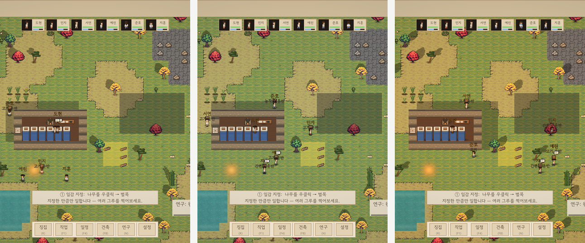

# AI 활용 기술 문서 — PawnSim

<!--internal-->
> NAN 2026 사전과제 제출물 ④.  요강 요구: *AI 활용에 대한 기술적 설명(구조 설명,
> AI 대상 주요 프롬프트 및 지시 사항) + 외부 에셋·오픈소스 출처.*
>
> 이 블록은 `md2print.py` 가 인쇄본에서 제거한다 (심사자용 아님).

---
<!--/internal-->

## 1. 개요

PawnSim은 조선 산골 마을을 배경으로 한 콜로니 시뮬레이션이다. 플레이어는 주민
개개인의 행동을 직접 지정하지 않는다. 벌목·채굴 대상을 지정하고 작업 우선순위와
하루 일정을 설정하면, 주민은 자신의 숙련도와 현재 상태(허기·피로·기분)를 따져
무엇을 언제 할지 스스로 정한다.

제작 과정도 같은 방식으로 구성했다. 작업 범위와 제약 조건을 지정하면 역할별
AI 에이전트가 구체적인 구현을 수행한다. 코드를 한 줄씩 받아쓰는 대신, 각
에이전트가 자기 판단 범위 안에서 결정하고 그 결과를 게이트가 검증한다.

이 문서는 후자, 즉 **제작 과정에서의 AI 활용**을 설명한다. 게임 자체의 조작법과
플레이 방법은 제출물 ③ 게임 소개 문서에 있다.

### 요강 요구 항목의 위치

| 요구 항목 | 해당 장 |
|---|---|
| 구조 설명 | 2장 (제작 구조), 4장 (검증 시스템) |
| AI 대상 주요 프롬프트 및 지시 사항 | 3장 |
| 외부 에셋·오픈소스 출처 | 7장 |

### 용어

- **에이전트** — 역할과 도구 권한이 정해진 AI 작업자. 정의는 `.claude/agents/*.md`에 있다.
- **재현 시나리오(harness)** — 게임을 자동으로 조작하고 결과를 검사하는 실행 모드.
  발견한 버그는 시나리오 파일로 남겨 회귀 테스트가 된다.
- **게이트** — 커밋 전에 자동으로 도는 검사. 통과하지 못하면 커밋하지 않는다.
- **레퍼런스 콜로니심** — 이 장르의 대표적인 상용 게임. 상표 문제를 피해 이렇게 표기한다.

---

## 2. 제작 구조

### 2.1 에이전트 구성

게임 제작에 실제로 사용한 에이전트는 다음과 같다. 각각 도구 권한이 다르며,
권한 차이가 곧 역할 분리다.

| 에이전트 | 담당 | 도구 권한 |
|---|---|---|
| `game-designer` | 시스템·메카닉·조작 설계 | 읽기, 쓰기 |
| `game-programmer` | 스크립트 구현 | 읽기, 쓰기, 편집, 실행 |
| `game-build-engineer` | 씬 조립, 빌드 자동화 | 읽기, 쓰기, 편집, 실행 |
| `game-qa` | 빌드 실행 → 스크린샷 → 판정 | 읽기, 실행 |
| `ta` | 아트 자산의 품질 채점 | 읽기, 실행 |
| `auditor` | 저장소 전반의 드리프트 감사 | 읽기, 실행 |

`ta`와 `auditor`에는 쓰기 권한을 주지 않았다. 두 에이전트는 판정과 수정 지시만
내고, 실제 수정은 제작 에이전트가 한다. 제작과 검증을 분리하기 위한 구성이다.

### 2.2 작업 흐름

```
운영자              작업 범위와 제약 조건 지정
  ↓
planner             작업을 단계로 분해
  ↓
programmer / artist 구현
  ↓
build-engineer      씬 조립 → 빌드
  ↓
qa                  빌드 실행 → 스크린샷 → 판정
  ↓
ta / auditor        별도 판정 (제작 에이전트와 분리)
  ↓
게이트              통과해야 커밋
```

`auditor`는 이 흐름 밖에서도 주기적으로 동작한다. 커밋 후 훅, 15분 폴링, 매일
03:00 기준선 검사의 세 경로가 있고, 결과는 `docs/audit/<날짜>-<focus>.md`에
기록한다.

---

## 3. AI 대상 주요 프롬프트 및 지시 사항

AI에게 주는 지시는 네 개 파일 계층으로 나뉜다. 대화창에 그때그때 입력하는 것이
아니라 저장소에 커밋된 파일이므로, 세션이 바뀌어도 같은 지시가 적용된다.

| 계층 | 파일 | 내용 |
|---|---|---|
| 1 | `CLAUDE.md` | 세션 시작 절차, 작업 방식, 커밋 규칙 |
| 2 | `docs/operator-contract.md` | 하드 룰 13개 |
| 3 | `config/policies.yaml` | 자율 범위 — 확인이 필요한 작업의 목록 |
| 4 | `.claude/agents/*.md` | 역할별 시스템 프롬프트 |

### 3.1 세션 시작 절차 (`CLAUDE.md`)

```
모든 대화는 두 파일을 순서대로 읽는다.
1. docs/goal.md — 결과 층. "무엇이 완성이면 성공인가."
   할 일 목록이 비었다고 목표가 달성된 것이 아니다.
2. docs/roadmap.md — 작업 큐. "오늘 무엇부터."
```

이 순서는 2026-05-15~16에 발생한 문제를 계기로 정했다. 이틀 동안 인프라 커밋이
11개 쌓였고 작업 큐는 0건이었지만, 실제로 만들어야 할 결과물은 0개였다. 큐가
비었다는 신호를 완료로 해석한 것이다. 결과 층과 작업 층을 분리하고 결과 층을
먼저 읽도록 바꿨다.

같은 파일에 작업 방식 지시도 있다.

```
- 작업 중간에 확인 질문으로 멈추지 말 것. 판단이 갈리는 지점은 합리적인
  기본값을 스스로 정하고 계속 진행한 뒤, 어떤 가정을 했는지 최종 보고에 정리할 것.
- 계획만 세우고 멈추지 말 것. 계획을 세웠으면 승인을 기다리지 말고 바로 실행할 것.
- 오류가 나면 보고하고 멈추지 말고, 원인을 찾아 수정한 뒤 계속 진행할 것.
- 작업이 끝나면 테스트나 빌드로 스스로 검증한 뒤 결과를 보고할 것.
```

### 3.2 하드 룰 (`operator-contract.md`)

13개 규칙 중 게임 제작에 직접 작동한 것은 다음 넷이다.

```
§1  에이전트가 모든 작업을 한다 — 사용자는 터미널을 만지지 않는다.
    설치·편집·설정·커밋·푸시 전부 에이전트가 한다.
§3  돈 방화벽 — 유료 API·SaaS·클라우드 자원 생성은 반드시 사용자 확인.
    로컬 자원(ffmpeg, ollama, whisper)은 확인 없이 사용.
§4  로직 변경은 명시적 승인 — agents/*.md 편집은 자율 모드와 무관하게 정지.
§5  지시 없이는 멈추지 않는다 — 사용자는 비동기다.
```

§4에 따라 에이전트는 자기 정의 파일을 수정할 수 없다. 품질 게이트를 통과하지
못했을 때 게이트 임계값을 낮추는 것도 같은 이유로 금지한다.

### 3.3 자율 범위 (`config/policies.yaml`)

확인이 필요한 작업과 그냥 진행하는 작업을 구분한다.

```yaml
mode:
  default: interactive          # interactive | autonomous
  switch_via: AUTONOMY_MODE

interactive:
  pause_for:
    - logic_change              # agents/*.md 편집
    - destructive_fs            # rm -rf, 디스크 초기화
    - external_publish          # 업로드·배포
    - paid_api                  # 유료 호출

autonomous:
  budget_usd: <상한>            # 초과 시 중단 로그를 남기고 정지
  never:
    - agent_definition_edit     # 무인 상태에서는 편집 불가
```

### 3.4 역할별 시스템 프롬프트 (`.claude/agents/*.md`)

에이전트마다 판단 기준이 다르다. 아래는 아트 품질을 채점하는 `ta`의 프롬프트
앞부분이다.

```
너는 이 프로젝트의 테크니컬 아티스트(TA)다. 역할은 둘:

1. 아트 디렉션 수호자 — 정본 art-style-guide-v3.md 의 집행자.
   규정: 채도 3단(지형≤0.45 / 오브젝트≤0.65 / 캐릭터≤0.75),
   밸류 3계급(지형 어두움 < 오브젝트 < 캐릭터·포커스),
   무광(글로시 금지), 좌상광, 계절 고정,
   아웃라인은 인터랙티브 오브젝트만.

2. 디자인 QA — 제작 과정을 모르는 신선한 눈으로 채점.
```

채점 기준을 수치로 명시했다. "채도가 높다" 같은 표현 대신 상한값을 적어
판정이 사람에 따라 달라지지 않게 했다.

---

## 4. 자동 검증

### 4.1 게이트 목록

커밋 전에 도는 검사는 다음과 같다.

| 게이트 | 검출 대상 |
|---|---|
| `check-art-tone.py` | 아트 팩 톤 이탈 — 외곽선 휘도, 색 수, 채도, 명도 |
| `check-asset-refs.py` | 끊긴 스프라이트 참조 (화면에 아무것도 안 그려짐) |
| `check-sprite-ppu.py` | 등록 PPU와 `.meta` 불일치 (크기가 어긋남) |
| `check-font-coverage.py` | 폰트에 없는 문자 (빈칸으로 그려짐) |
| `check-scene-overrides.py` | 씬에 굳은 값이 코드 기본값을 덮는 경우 |
| `check-asset-drift.py` | 같은 이름 자산의 내용·PPU 불일치 |
| `spec-sync.py` | 기획서와 구현의 드리프트 |
| `repro_all.py` | 재현 시나리오 24종 (기능 회귀) |
| `UiSweepQA` | 모든 버튼을 눌러 보고 반응 없는 것 |

이 중 아트·자산 계열 검사는 공통점이 있다. 빌드는 성공하고 컴파일 오류도 없는데
화면만 잘못되는 종류를 잡는다. 컴파일러와 단위 테스트가 볼 수 없는 영역이다.

재현 시나리오는 게이트용 24종과 측정 전용 24종으로 나뉜다. 측정 전용은 파일명이
`_`로 시작하며 게이트에서 제외한다. 배율·그림자·UI 겹침 등을 재는 용도라
통과·실패 판정이 없기 때문이다.

### 4.2 게이트의 자체 검증

임계값을 감으로 정하면 그 게이트를 신뢰할 수 없다. 각 게이트는 `--self-test`로
기준선이 자기 임계를 통과하는지 확인한다.

- `check-art-tone.py --self-test` — 아트 팩 원본 12종이 전부 통과해야 한다.
- `spec-sync.py --self-test` — 알려진 사고 4종을 재현해 탐지기가 실제로 잡는지 확인한다.

### 4.3 재현 시나리오

시나리오는 JSON으로 작성한다. 클릭·우클릭·키 입력·대기·스크린샷·단정으로
구성되며, 게임을 실제 플레이어와 같은 경로로 조작한다.

```json
{
  "name": "P1 폭풍 mood — 폭풍 노출에도 mood 폭주 하락이 없어야 한다",
  "steps": [
    { "op": "worldclick", "target": "pawn" },
    { "op": "worldright", "target": "tree" },
    { "op": "assert", "probe": "pawnMoved", "min": 2.0, "withinSec": 15 },
    { "op": "setWeather", "name": "storm" },
    { "op": "assert", "probe": "hasThought", "contains": "야외 폭풍", "withinSec": 12 },
    { "op": "assert", "probe": "needDropsAtMost", "name": "mood", "min": 20, "withinSec": 60 }
  ]
}
```

버그를 고칠 때마다 그 상황을 시나리오로 남긴다. 현재 24종이 매 커밋마다 돈다.



---

## 5. 적용 사례

아래 네 건은 검증 시스템이나 별도 판정 에이전트가 실제로 발견한 문제다. 각각
커밋과 스크린샷이 저장소에 남아 있다.

### 5.1 테스트 하네스 10종이 7주간 실행되지 않고 있었다

**문제**
통합·유닛·롱플레이·오토QA 등 하네스 10종이 실행 직후 멈춰 있었다. 리포트 파일이
생성되지 않았지만 아무도 알아채지 못했다.

**기존 테스트에서 발견되지 않은 이유**
예외도 실패 로그도 없었다. 리포트 파일이 생성되지 않는 것이 유일한 증상이었다.
재현 시나리오 묶음만은 정상 동작하고 있었고, 그 결과가 계속 통과로 표시되어
"검증이 돌고 있다"는 인상을 만들었다.

**추적 방법**
`auditor` 에이전트가 코드베이스 전체를 대상으로 감사를 수행했다. "부팅 시
일시정지가 하네스 인자 처리보다 먼저 걸린다"는 가설을 세우고, 그 가설이 참이라면
리포트 JSON이 존재하지 않아야 한다는 점을 파일 시스템에서 직접 확인했다.

**원인**
게임은 일시정지 상태로 부팅한다. 플레이어가 맵을 둘러본 뒤 직접 시작하는 편이
이 장르에 맞기 때문이다. 그런데 이 일시정지가 `-testmode`, `-integration` 같은
하네스 인자를 읽기 전에 적용됐다. 모든 하네스는 첫 단계가 게임 시간 기준
대기(`WaitForSeconds`)라, 시간이 0배속이면 깨어나지 않는다.

일시정지 면제 조건은 `!ReproHarness.Enabled`였다. 특정 하네스 이름 하나만
예외로 둔 것이라 나머지 하네스에는 적용되지 않았다.

**수정**
일시정지 판정을 `Core/AutomatedRun.cs` 한 곳으로 모으고, 하네스 플래그 13종을
그 파일의 한 목록에 넣었다. 새 하네스를 추가하는 사람이 목록에 이름만 추가하면
된다.

**수정 후 검증**
전체 검증을 실행해 51개 중 50개가 통과했다. 유일한 실패는 테스트가 `Btn_4x`를
찾는데 실제 배속 버튼이 1x/3x/6x로 바뀐 드리프트였다. 7주 동안 아무도 확인하지
못한 항목이다.

**재발 방지**
면제 조건을 개별 클래스 이름이 아니라 플래그 목록으로 관리한다. 또한 검증 결과를
집계할 때 "몇 개가 통과했는가"와 함께 "몇 개가 실행됐는가"를 확인한다.

### 5.2 코드를 고쳐도 동작이 바뀌지 않았다 — 씬 직렬화 값

**문제**
재미 점수의 '긴장' 축이 0/15였다. 첫 습격이 심사자가 게임을 보는 시간대(5~15분)
밖인 16~27분에 발생하는 것이 원인으로 보였다.

**추적 과정**
`AIDirector.RaidGraceDays` 기본값을 2에서 1로 고치고 다시 측정했다. 습격은
여전히 0건이었다. 첫 습격 전용 대기 필드(`FirstRaidWaitDays = 0.8`)를 새로
추가했다. 역시 0건이었다.

**원인**
세 번째 시도에서 코드가 아니라 씬 파일을 확인했다.

```
Assets/Scenes/Game.unity
  RaidGraceDays: 2      ← 씬에 직렬화된 값
```

Unity의 `[SerializeField]` 필드는 씬에 값이 저장돼 있으면 코드의 초기값이
무시된다. 컴파일도 되고 게이트도 통과하며, 아무 일도 일어나지 않는다. 코드를
읽으면 `= 1`이라고 적혀 있으므로 코드만 봐서는 확인할 수 없다.

같은 함정을 이전에도 겪었다.

| 시점 | 씬에 굳어 있던 값 | 증상 |
|---|---|---|
| 이전 | 스폰 좌표, 동물 스탯, 광맥 스탯, 수종 | 코드 수정이 화면에 반영되지 않음 |
| 이전 | 가구 그림자 자식 (`m_RemovedGameObjects`) | 그림자 방향이 이상하다고 판단했으나 실제로는 그림자가 없었음 |
| 이번 | `RaidGraceDays` | 습격이 발생하지 않음 |

**수정**
씬 값을 직접 수정했다.

**재발 방지**
`scripts/check-scene-overrides.py`를 추가했다. `[SerializeField]` 필드의 코드
기본값을 파싱해 씬 YAML의 같은 이름 값과 비교하고, 다른 항목을 전부 보고한다.
첫 실행에서 39건이 나왔으며 대부분은 의도적인 씬 튜닝이었다(동물 개체별 이동
속도 등). 이 검사는 값의 옳고 그름을 판정하지 않고, "이 값은 코드를 고쳐도
바뀌지 않는다"는 사실만 보고한다. 판단은 사람이 한다.

### 5.3 재미를 수치로 측정하는 구조를 도입했다

**문제**
운영자 피드백이 사흘에 걸쳐 세 번 나왔는데, 표현은 달랐지만 같은 문제였다.

| 날짜 | 피드백 | 실제 문제 |
|---|---|---|
| 07-30 | "영상 100점 만점에 2점" | 사건이 없다 |
| 07-31 | "뭐 하고 있는건지 모르겠음" | 활력이 없다 |
| 08-02 | "10분간 숫자가 안 움직인다" | 진행감이 없다 |

아트 톤과 자산 드리프트는 이미 수치로 판정하고 있었지만(`check-art-tone.py`,
`check-asset-drift.py`) 재미는 감상으로만 남아 있었다. 수정할 때마다 다른 축을
건드렸고, 개선 여부를 확인할 방법도 없었다.

**도입한 구조**

```
FunTelemetry.cs        5초마다 게임 상태를 JSONL로 기록 (-funscore 인자가 있을 때만)
scripts/fun-score.py   100점 루브릭 → 축별 점수와 가장 낮은 축 산출
docs/fun-rubric.md     기준, 근거, 점수 이력
```

루브릭은 심사자가 게임을 보는 10분을 기준으로 삼았다(게임잼 심사는 엔트리당
5~15분이 일반적이다). 30시간 뒤에 재미있는 요소는 이 기준에서 0점이다.

설계에서 두 가지를 명시적으로 정했다.

첫째, 사건은 콜백 훅이 아니라 상태 변화에서 유도한다. 시스템마다 콜백을 심으면
훅이 늘어날 때마다 계측이 갈라진다. 목표 수, 구조물 수, 연구 수, 적 수의 증감을
관찰해 사건을 판정하므로 계측 대상이 늘어도 파일 하나만 수정하면 된다.

둘째, 루브릭은 게임 밖에 둔다. 루브릭은 자주 바뀌지만 게임은 자주 빌드할 수 없다.
게임은 사실만 기록하고 해석은 밖에서 한다. 과거 세션의 JSONL을 새 루브릭으로
다시 채점할 수도 있다.

**결과**

| 시점 | 총점 | 진행감 | 사건 | 활력 | 긴장 | 다양성 |
|---|---|---|---|---|---|---|
| 2026-08-02 | 46.7 | 16.5/30 | 7.2/25 | 13.0/20 | 0.0/15 | 10.0/10 |
| 2026-08-07 | 78.1 | 20.5/30 | 19.3/25 | 13.3/20 | 15.0/15 | 10.0/10 |

첫 측정은 10.6분·표본 128개, 두 번째는 계측 결함 3종을 수정한 뒤의 값이다.

**계측 자체의 결함**
같은 빌드가 78.7과 56.8로 측정되는 문제가 있었다. 원인은 셋이었다. 순간 폴링이라
3배속 전투를 놓쳤고, 습격의 30%를 차지하는 광기 동물 무리를 세지 않았으며,
처치 수 카운터가 없었다. 누적 카운터로 바꿔 해결했다.

### 5.4 아트 자산의 품질을 별도 에이전트가 채점한다

**문제**
시작 주민 여섯 명이 화면에서 거의 같아 보였다. 제작 과정에서는 발견되지 않았다.

**발견 방법**
`ta` 에이전트가 제작 과정을 모르는 상태에서 스크린샷만 보고 채점하는 과정에서
지적했다.

**원인**
주민 외형 변형 스프라이트 배정 자체는 성공했다. 그런데 배정 대상 스프라이트가
없어 대체 경로로 넘어갔고, 시작 주민이 공교롭게 전부 같은 계열로 배정됐다.
배정 로직은 정상 동작했으므로 로그에도 오류가 남지 않았다.

**수정과 재발 방지**
대체 경로로 넘어간 경우를 로그에 남기도록 바꾸고, `check-asset-refs.py`로 끊긴
참조를 커밋 전에 검출한다.

---

## 6. 아트 파이프라인

생성형 AI만으로 아트를 제작했을 때 장면 간 스타일 드리프트가 발생해 연쇄 반려로
이어졌다. 이후 대상에 따라 방법을 나눴다.

| 대상 | 방법 | 선택 이유 |
|---|---|---|
| 지형·자원·유닛 | 외부 에셋 팩 | 톤의 기준점. 일관성이 이미 보장됨 |
| 가구·구조물·아이콘 | 절차 드로잉 (코드가 직접 그림) | 드리프트가 발생하지 않음. 팩 팔레트와 아웃라인 규약을 코드로 강제 |
| 유기물 (나무 등) | 팩 스타일 LoRA 기반 생성 | 팩에 없는 종류를 팩 톤으로 생성 |

생성 파이프라인(`gen-trees-lora.py`)의 지시 내용은 다음과 같다.

```
트리거:  "tswords style game sprite, a <종 묘사>, top-down three-quarter view,
          centered on plain flat solid violet purple background, no shadow,
          no gradient, isolated object"
LoRA:    tswords_v1.safetensors  (팩 스타일로 자체 훈련)
후처리:  모서리 시드 flood fill 키잉 → 크롭·축소 → 채도 정렬 → 팔레트 양자화
          → 팩 아웃라인 확정
게이트:  check-art-tone.py 통과해야 반입
```

배경색을 청보라로 지정한 이유는 실측 결과다. 1차에는 마젠타를 썼는데 단풍 빨강과
색상각이 30°밖에 떨어지지 않아, 잔상 제거 임계를 조금만 올려도 단풍 잎이 함께
제거됐다(tol80에서 27.6% 손실). 청보라는 이 게임의 나무 색 전체와 82° 이상
떨어진다. 키잉은 단순 색거리 임계 대신 연결성 기반(flood fill)을 쓴다.

---

## 7. 외부 에셋 및 오픈소스 출처

정본은 저장소 루트의 [`ATTRIBUTIONS.md`](../../../ATTRIBUTIONS.md)에 있다.

| 자산 | 출처 | 라이선스 | 비고 |
|---|---|---|---|
| 지형·나무·자원·유닛 스프라이트 | Tiny Swords (Pixel Frog) | 무료, 상업적 사용 가능, 크레딧 불요, **재배포 금지** | `ts_*`는 git 미추적. `extract-tinyswords.py`로 재현 |
| 한국풍 자산 전량 | 자체 생성 (절차 드로잉) | 자작 | `_gen_hanok*.py` |
| 수종 5종·대나무·진달래·묘목 | 자체 생성 (절차 드로잉) | 자작 | `_gen_hanok_flora.py` |
| 석재·광맥·바위·암반 타일 | 자체 생성 (절차 드로잉) | 자작 | `_gen_hanok_rock.py`, `_gen_hanok_stone_item.py` |
| 주민 스프라이트(한복·갓·짚신) | 자체 생성 (절차 드로잉) | 자작 | `_gen_pawn32.py` |
| UI 아이콘·가구 | 자체 생성 (절차 드로잉) | 자작 | LoRA는 위 팩으로 자체 훈련 |
| BGM | ElevenLabs Music | 유료 구독(Starter), 상업 이용 허용 | Studio Games 예외 비해당 |
| SFX 14종 | ElevenLabs Sound Effects | 동일 | 원본 절차 생성본 백업 보존 |
| 본문 폰트 | 고운돋움 | SIL OFL 1.1 | |
| 타이틀 폰트 | DNF BitBit v2 | 무료 배포(출처 표기) | |
| 한글 폴백 | Noto Sans KR | SIL OFL 1.1 | |
| 초기 SFX·절차 자산 | 자체 생성 | 퍼블릭 도메인 | |

한국풍 자산에는 한옥 벽·기와·대청마루·창호문·부뚜막·서안·소반·등잔·석등·요와
이불·돌담·전돌·싸리울·봉분·장독대·당산나무가 포함된다.

절차 생성기는 `Assets/Sprites/_gen_*.py`에 34개가 커밋돼 있다. 색은 전부
`palette.py`의 기준 램프에서 파생되므로 생성기를 다시 실행하면 같은 이미지가
나온다. 산출물이 이미지 파일이 아니라 그리는 코드다.

Tiny Swords는 재배포가 금지돼 있어 추출물을 저장소에 커밋하지 않았다. 팩이 없는
클린 클론에서도 게임이 정상 빌드되도록 절차 생성 대체 경로를 갖췄다(지형 16조각과
자체 생성 수종 5종). 라이선스를 지키면서 재현 가능성을 유지하기 위한 구성이다.

---

## 8. 본선에서 재사용 가능한 부분

본선 산출물은 게임 프로토타입, 에이전트 설계서, 디렉팅 명세서 세 가지다. 이
문서의 2장이 에이전트 설계서에, 3~5장이 디렉팅 명세서에 해당한다. 본선용으로
새로 작성한 것이 아니라 현재 동작 중인 구조를 기술한 것이다.

본선은 주제를 모르는 상태에서 시작한다. 미리 준비할 수 있는 것은 특정 게임이
아니라 제작 구조다. 아래는 장르가 바뀌어도 그대로 쓰는 부분이다.

| 구성 요소 | 장르 의존성이 낮은 이유 |
|---|---|
| 역할 에이전트 6종 | 기획·구현·아트·검증의 분업은 장르와 무관하다 |
| 재현 시나리오 하네스 | 게임을 자동 조작해 결과를 검사한다. 조작 방식은 게임마다 다르지만 구조는 같다 |
| 아트·자산 계열 게이트 | 톤 이탈, 끊긴 참조, PPU 불일치는 어느 프로젝트에서나 발생한다 |
| 재미 점수 루브릭 | 축과 목표선을 정의하는 절차 자체가 재사용 가능하다 |
| 촬영·문서 파이프라인 | 제출 마감 직전에 영상과 PDF를 만드느라 시간을 쓰지 않는다 |

이번 사전과제에서 다음 세 작업에 각각 하루가 걸렸다.

- 세계관 전환 (판타지 → 조선 산골). 아트가 절차 생성이라 자산을 다시 그리지 않았다.
- 재미 점수 도입과 개선 (46.7 → 78.1).
- 시연 영상 재제작. 촬영 방법 자체를 새로 정의했다.
