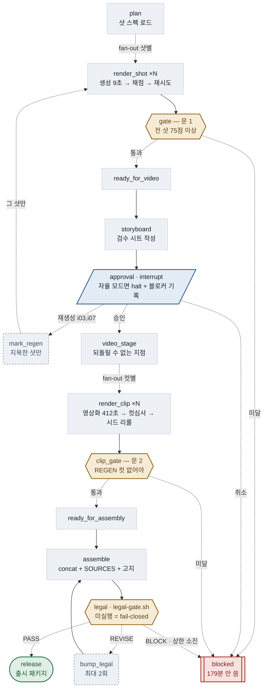
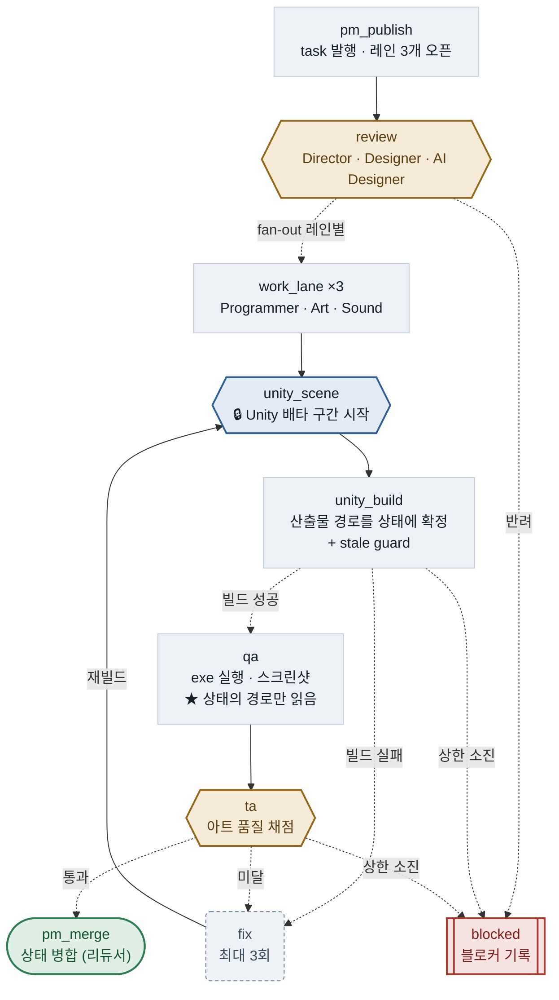

# graph/ — 쇼츠 파이프라인 실행 엔진 (LangGraph)

> **한 줄:** 3시간짜리 영상화 단계 앞에 10초짜리 문을 세운다.

```
스틸 → 🚪문1 → 🧑승인 → 영상화 → 🚪문2 → 조립 → ⚖️법률 → 출시
```

## 왜 이게 있는가

한 편을 만드는 데 3시간이 걸린다. 그런데 시간이 어디로 가는지 보면:

**실측** (1샷 완주 507초, RTX 4070 Ti SUPER 16GB):

| 단계 | 실측 | 비중 | 26컷 환산 |
|---|---:|---:|---:|
| 스틸 생성 (Z-Image) | 10.2s | 2% | 4분 |
| 스틸 심사 (이미지 1장) | 22.8s | 4% | 10분 |
| **영상화 (Wan A14B)** | **412.3s** | **81%** | **2시간 58분** |
| 컷 심사 (프레임 3장) | 61.9s | 12% | 27분 |

**전체의 81%가 마지막 한 단계**이고, 그 앞은 다 합쳐 6%다.
스틸 1장(10초) 대 영상 1컷(412초) = **1:40** — 여기가 문을 세운 자리다.

[`docs/generative-shorts-pipeline.md`](../docs/generative-shorts-pipeline.md) §4.5는 이미
그렇게 하라고 적어두고 있다:

> **"싼 단계에서 실패시켜라: REGEN은 스틸(9초)에서, 영상(7분)에서 하지 않는다"**
> **"75 미만은 prompt_fix를 반영해 그 샷만 자동 재생성 (최대 3라운드)"**
> **"전 샷 승인 후에만 5번(영상화) 진입"**

정답이 다 적혀 있었다. 문제는 그게 **문서**라서 사람이 매번 기억해 손으로 지켜야
했다는 것이고, 한 번 건너뛰면 3시간이 날아갔다. 이 패키지는 그 규칙을 **코드**로
만든다. 전 샷이 임계 점수를 넘지 못하면 영상화로 가는 엣지 자체가 열리지 않는다.

## 구조

아래 두 장은 손으로 그린 게 아니다. 실행 중인 그래프에서 위상을 그대로 뽑고
(`graph/diagram.py`) 레이아웃·라벨만 입힌다. 코드에 노드가 하나 늘고 배치되지 않으면
생성이 `RuntimeError` 로 실패한다. **그래서 낡지 않는다.**

```bash
python -m graph.shorts_graph diagram --compact          # 아래 그림 (한국어)
python -m graph.shorts_graph diagram --compact --lang en
python -m graph.shorts_graph diagram                    # 원본 자동 출력 3종 (노드 전부)
python -m graph.game_graph   diagram --compact
python scripts/sync-readme-graph.py                     # README 3곳에 밀어 넣기
```

### 쇼츠 라인 — 스틸 → 문 1 → 사람 승인 → 영상화 → 문 2 → 법률 → 출시

<!-- graph:shorts:begin -->

<!-- graph:shorts:end -->

### 게임 라인 — 발행 → 검토 → 제작 병렬 → Unity 뮤텍스 → 검증 → 병합

<!-- graph:game:begin -->

<!-- graph:game:end -->


샷 하나(생성 → 채점 → 재시도)와 컷 하나(영상화 → 컷심사 → 시드 리롤)의 내부는 위 그림에서
`스틸 라운드` · `컷 라운드` 노드로 접혀 있다. 펼친 그림은 `diagram` (--compact 없이) 이
그래프에서 직접 출력한다.

## 쓰는 법

```bash
# 설치 (한 번)
python -m venv .venv
.venv/Scripts/python -m pip install -r graph/requirements.txt   # Windows
.venv/bin/python     -m pip install -r graph/requirements.txt   # macOS/Linux

# 배선 검증 — GPU·ComfyUI 없이 그래프만 돈다
.venv/Scripts/python -m graph.shorts_graph run \
    --spec graph/examples/shots.example.json --mock --thread demo

# 실제 실행 — ComfyUI가 떠 있어야 한다 (COMFYUI_URL, 기본 127.0.0.1:8188)
.venv/Scripts/python -m graph.shorts_graph run \
    --spec my-shots.json --judge cli --thread ep12

# 구조도
.venv/Scripts/python -m graph.shorts_graph diagram
```

**종료 코드:** `0` 문 통과(영상화 가능) · `2` 문에서 차단 · `1` 오류.
CI나 배치 스크립트에서 `|| exit` 로 그대로 물릴 수 있다.

**이어서 하기:** `--thread` 에 같은 값을 주면 체크포인트에서 재개한다.
26컷 중 19컷에서 죽어도 남은 7컷만 돈다. 처음부터 다시 하려면 `--restart`.

### 샷 스펙

[`examples/shots.example.json`](examples/shots.example.json) 참조. 필드는
`.claude/agents/still-judge.md` 의 입력 계약을 그대로 따른다.

```json
{
  "short_id": "ep12",
  "style_lock": "cinematic night, luminous not muddy, ...",
  "character_lock": "young traveler, dark robe #2B2E4A, ...",
  "shots": [
    { "id": "i01", "beat": "산길에 밤이 내린다",
      "must": ["좁은 산길", "안개"], "prompt": "...", "seed": 1101 }
  ]
}
```

## 심사위원 백엔드

| `--judge` | 동작 | 비용 |
|---|---|---|
| `mock` (기본) | 결정론 가짜 채점. 회차가 오를수록 점수 상승 | 없음 |
| `cli` | `claude` CLI 헤드리스 호출 → `still-judge` 루브릭 채점 | Max 쿼터 |

기본값이 `mock`인 이유는 [`config/policies.yaml`](../config/policies.yaml)의 머니
방화벽이다 — 모델 호출은 **명시적으로 켜야** 일어난다.

`cli` 백엔드는 운영자 머신의 `claude` 바이너리에 의존한다. 첫 사용 전 한 번
수동 확인할 것.

## 안 건드리는 것

그래프는 **아무것도 직접 만들지 않는다.** 순서·재시도·게이트만 책임진다.
외부 프로세스 호출은 전부 [`tools.py`](tools.py) 한 파일을 지나간다.

- `scripts/zimage-still.py` — 스틸 생성 (그대로 호출)
- `scripts/legal-gate.sh` — 법률 게이트 (Phase 3에서 그대로 호출)
- `agents/missions/*/run.sh`, `agents/lib/*.sh` — 무변경
- `.claude/agents/*.md` — 무변경 (operator-contract §5: 로직 변경은 명시 승인)

## 검증된 것

`--mock` 으로 확인한 항목:

| 확인 | 결과 |
|---|---|
| 스틸 6장 무인 완주 | ✅ 재시도 r2~r3 발생 후 전 샷 통과, 문 열림, exit 0 |
| 문이 실제로 막는가 | ✅ 1개 샷 미달 → `exit 2`, 영상화 진입 차단 |
| 재시도 상한 | ✅ 3회 소진 후 FAILED 확정 (무한루프 없음) |
| 체크포인트 재개 | ✅ 산출물 지우고 같은 `--thread` 재실행 → 0.0초, 재작업 0건 |
| 구조도 자동 생성 | ✅ `diagram` 이 현재 코드 기준 mermaid 출력 |

**아직 안 한 것:** 실제 ComfyUI 연결(`--mock` 없이), `--judge cli` 실물 채점.
둘 다 운영자 머신에서 한 번 돌려봐야 한다.

## 다음 (Phase 2~)

이 문 **뒤에** 붙는다. 앞은 안 건드린다.

1. **I2V** — `wan-a14b-i2v.py` 를 같은 fan-out 모양으로. 문을 통과한 샷만 들어온다.
2. **HITL** — 스토리보드 승인을 `interrupt()` 로. 지금은 자동 채점만 있고 사람 승인 지점이 없다.
3. **법률 루프** — `legal-gate.sh` PASS/REVISE/BLOCK 을 조건부 엣지로 (`content-director.md` 의 산문 루프 승격).

## 설계 메모

- **Windows 함정:** 레포의 bash 스크립트는 `python3` 를 쓰는데, Windows에서
  `python3` 는 Microsoft Store 스텁이라 조용히 아무 일도 안 한다.
  여기서는 항상 `sys.executable` 을 쓴다.
- **체크포인트 위치:** `$RECORDS_DIR/graph/checkpoints.sqlite`.
  체크포인트도 데이터이므로 코드/데이터 분리 규칙에 따라 gitignore 대상.
- **리듀서:** 병렬 노드가 동시에 쓸 수 있는 필드는 `Annotated[..., reducer]` 가
  붙은 것뿐이다 (`state.py`). `.claude/whiteboard.json` 의 "병렬 에이전트는 공유
  파일을 직접 쓰지 않는다" 규칙과 같은 얘기인데, 여기서는 타입으로 강제된다.
