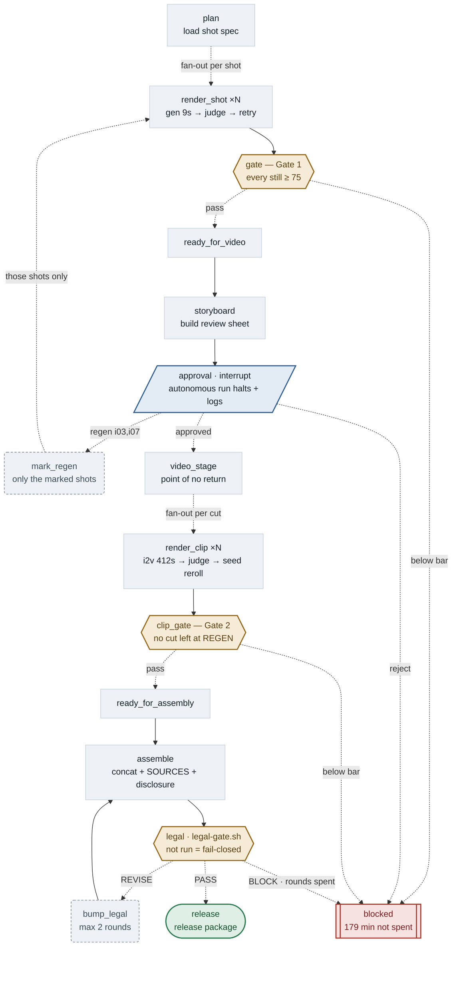
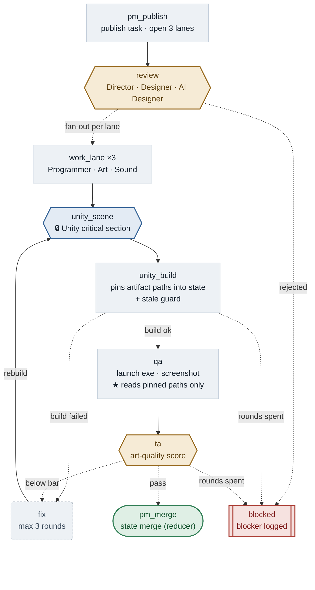

# graph/ — shorts pipeline execution engine (LangGraph)

**English** · [한국어](./README.ko.md)

> **One line:** a 10-second door in front of a 3-hour video stage.

```
still → 🚪gate1 → 🧑approval → video → 🚪gate2 → assemble → ⚖️legal → release
```

## Why this exists

One short takes about three hours to make. Look at where the time actually goes:

**Measured** (one shot end-to-end, 507s, RTX 4070 Ti SUPER 16GB):

| Step | Measured | Share | At 26 cuts |
|---|---:|---:|---:|
| Still generation (Z-Image) | 10.2s | 2% | 4 min |
| Still judging (1 image) | 22.8s | 4% | 10 min |
| **Video (Wan A14B)** | **412.3s** | **81%** | **2 h 58 min** |
| Cut judging (3 frames) | 61.9s | 12% | 27 min |

**81% of the whole run is one step**, and everything before it is 6% combined.
A still (10s) versus the cut rendered from it (412s) is a **1:40 ratio** — that's where the gate sits.

[`docs/generative-shorts-pipeline.md`](../docs/generative-shorts-pipeline.md) §4.5 already
said to do exactly this:

> **"Fail at the cheap stage: REGEN happens at the still (9s), not the video (7min)."**
> **"Below 75, apply prompt_fix and auto-regenerate just that shot (max 3 rounds)."**
> **"Only enter step 5 (video) after every shot is approved."**

The answer was already written down. The problem was that it lived in a **document**, so a
human had to remember and enforce it by hand every time, and skipping it once burned three
hours. This package turns that rule into **code**. If any shot fails to clear the threshold,
the edge to the video stage simply never opens.

## Structure

The two figures below were not hand-drawn. They're pulled straight from the running graph's
topology (`graph/diagram.py`) with only layout and labels applied. If a node is added to the
code without being placed in the layout, generation fails with a `RuntimeError`. **That's why
they can't quietly go stale.**

```bash
python -m graph.shorts_graph diagram --compact --lang en  # figure below
python -m graph.shorts_graph diagram --compact             # Korean labels
python -m graph.shorts_graph diagram                        # raw auto-dump, all nodes, 3 graphs
python -m graph.game_graph   diagram --compact --lang en
python scripts/sync-readme-graph.py                         # push the figures into this file
```

### Shorts line — still → gate 1 → human approval → video → gate 2 → legal → release

<!-- graph:shorts:begin -->

<!-- graph:shorts:end -->

### Game line — publish → review → parallel build → Unity mutex → verify → merge

<!-- graph:game:begin -->

<!-- graph:game:end -->

The inside of one shot (generate → judge → retry) and one cut (video → cut-judge → seed
reroll) are collapsed into the `still round` / `cut round` nodes above. The expanded view
comes straight from the graph via `diagram` (without `--compact`).

## Usage

```bash
# install (once)
python -m venv .venv
.venv/Scripts/python -m pip install -r graph/requirements.txt   # Windows
.venv/bin/python     -m pip install -r graph/requirements.txt   # macOS/Linux

# wiring check — runs the graph with zero GPU / ComfyUI calls
.venv/Scripts/python -m graph.shorts_graph run \
    --spec graph/examples/shots.example.json --mock --thread demo

# real run — ComfyUI must be up (COMFYUI_URL, default 127.0.0.1:8188)
.venv/Scripts/python -m graph.shorts_graph run \
    --spec my-shots.json --judge cli --thread ep12

# diagram
.venv/Scripts/python -m graph.shorts_graph diagram
```

**Exit codes:** `0` gate cleared (video stage allowed) · `2` blocked at a gate · `1` error.
A CI or batch script can chain on `|| exit` directly.

**Resuming:** passing the same value to `--thread` resumes from the checkpoint. Dying on
cut 19 of 26 costs the remaining 7, not all 26. `--restart` starts over from scratch.

### Shot spec

See [`examples/shots.example.json`](examples/shots.example.json). The fields follow the
input contract of `.claude/agents/still-judge.md` directly.

```json
{
  "short_id": "ep12",
  "style_lock": "cinematic night, luminous not muddy, ...",
  "character_lock": "young traveler, dark robe #2B2E4A, ...",
  "shots": [
    { "id": "i01", "beat": "night falls over the mountain trail",
      "must": ["narrow mountain trail", "fog"], "prompt": "...", "seed": 1101 }
  ]
}
```

## Judge backends

| `--judge` | Behavior | Cost |
|---|---|---|
| `mock` (default) | Deterministic fake scoring; score rises with each round | none |
| `cli` | Headless `claude` CLI call → scored against the `still-judge` rubric | Max plan quota |

The default is `mock` because of the money firewall in
[`config/policies.yaml`](../config/policies.yaml) — model calls only happen when
**explicitly turned on**.

The `cli` backend depends on the `claude` binary being available on the operator's machine.
Verify it manually once before first use.

## What this doesn't touch

The graph **doesn't generate anything itself.** It's responsible only for order, retries,
and gates. Every external process call goes through a single file,
[`tools.py`](tools.py).

- `scripts/zimage-still.py` — still generation (called as-is)
- `scripts/legal-gate.sh` — legal gate (called as-is in Phase 3)
- `agents/missions/*/run.sh`, `agents/lib/*.sh` — unchanged
- `.claude/agents/*.md` — unchanged (operator-contract §5: logic changes need explicit OK)

## What's verified

Confirmed with `--mock`:

| Check | Result |
|---|---|
| 6 stills complete unattended | ✅ retries r2–r3 fire, every shot passes, gate opens, exit 0 |
| Does the gate actually block | ✅ 1 shot below bar → `exit 2`, video stage entry blocked |
| Retry cap | ✅ 3 rounds exhausted → FAILED confirmed (no infinite loop) |
| Checkpoint resume | ✅ delete outputs, rerun same `--thread` → 0.0s, 0 rework |
| Diagram auto-generation | ✅ `diagram` emits mermaid straight from current code |

**Not yet done:** a real ComfyUI connection (without `--mock`), a real `--judge cli` scoring
pass. Both need one run on the operator's machine.

## Next (Phase 2+)

This attaches **after** the gate. What's before it stays untouched.

1. **I2V** — bring `wan-a14b-i2v.py` into the same fan-out shape. Only shots that cleared
   the gate enter.
2. **HITL** — turn storyboard approval into an `interrupt()`. Right now there's only
   automated scoring and no human approval point.
3. **Legal loop** — turn `legal-gate.sh`'s PASS/REVISE/BLOCK into a conditional edge
   (promoting the prose loop in `content-director.md`).

## Design notes

- **Windows trap:** the repo's bash scripts call `python3`, but on Windows `python3` is a
  Microsoft Store stub that silently does nothing. This code always uses `sys.executable`
  instead.
- **Checkpoint location:** `$RECORDS_DIR/graph/checkpoints.sqlite`. The checkpoint is data
  too, so per the code/data separation rule it's gitignored.
- **Reducers:** the only fields a parallel node can write to concurrently are the ones
  annotated `Annotated[..., reducer]` (`state.py`). It's the same rule as
  `.claude/whiteboard.json`'s "parallel agents don't write a shared file directly" — here
  it's enforced by the type system instead.
