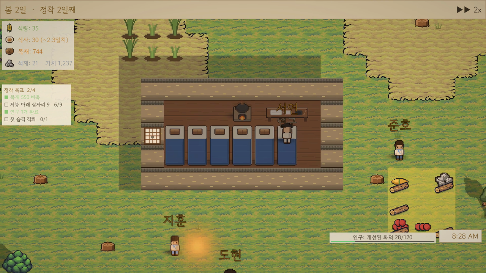
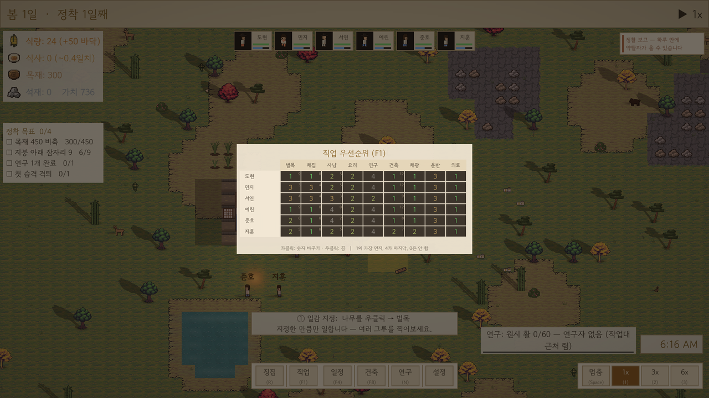
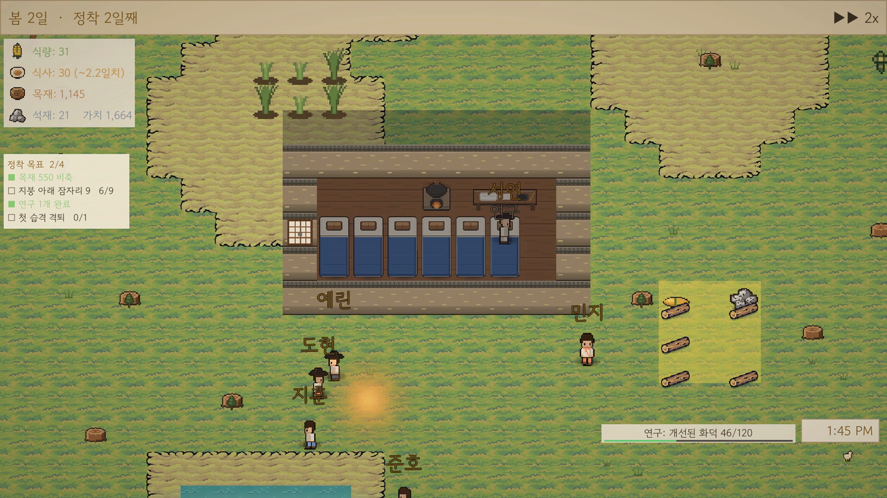
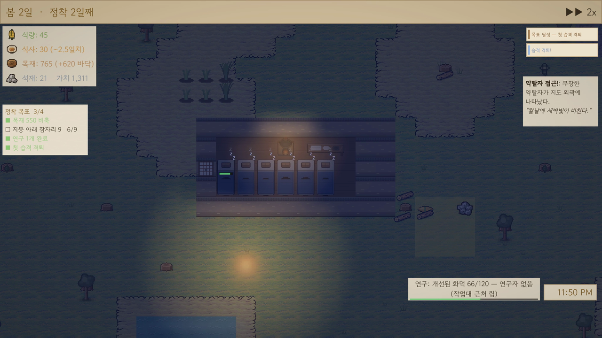

# 게임 소개 및 설명 — PawnSim

<!--internal-->
> NAN 2026 사전과제 제출물 ③.  요강 요구: *게임 제목 및 한 줄 소개 / 게임 방법
> (목표·조작·종료 조건) / 실행 방법 / 플레이 링크 / 영상 링크.*
>
> **2026-07-30 갱신.**  §3 종료 조건 해소(정착 목표 4단계 + 승리).
> 남은 것: §5 영상 링크(재촬영 후 기입).
> 이 블록은 `md2print.py` 가 인쇄본에서 제거한다 (심사자용 아님).

---
<!--/internal-->

## 제목

**PawnSim** — 어느 산골 마을의 하루하루

## 한 줄 소개

**주민에게 명령하지 않는다. 일감을 지정하면, 그들이 스스로 판단한다.**
조선 산골에 자리 잡은 마을을 간접 조작으로 키우는 시뮬레이션.

---

## 1. 목표

맨땅에 자리 잡은 주민 6명으로 마을을 세우고 유지한다.
소나무를 베고 돌을 캐 흙벽에 기와를 얹고, 논에 벼를 심어 먹고, 밤에는 이불을 덮고
자고, 며칠 뒤 찾아오는 약탈자를 견딘다.

플레이어는 **무엇을 할지만 지정한다.**  누가·언제·어떤 순서로 할지는 각 주민의
**작업 우선순위**, **숙련도**, 그리고 지금 배고픈지 졸린지 같은 **상태**가 정한다.
이 게임의 재미는 명령이 아니라 **방침을 세우고 그 결과를 지켜보는 것**에 있다.

## 2. 조작

마우스만으로 전부 된다.  (브라우저에서는 게임 화면을 한 번 클릭해야 키보드가 먹는다.  
헷갈리면 **화면 아래 버튼만 써도 전부 된다**.)

| 하려는 것 | 조작 |
|---|---|
| 주민 선택 | 좌클릭, 또는 상단 초상화 클릭 |
| 벌목·채광 지정 | 대상에 **우클릭** |
| 건축 | 하단 `건축` → 분류 → 항목 → 맵 클릭 |
| 배치 회전 | 건물을 놓기 전, 반투명한 밑그림이 마우스를 따라다닐 때 `R` |
| 구역 지정(저장·경작·지붕) | `건축` → `구역` → 드래그 |
| 작업 우선순위 | 하단 `직업` — 6인 × 9직종, 좌클릭으로 0~4 변경 |
| 하루 일정 | 하단 `일정` — 24시간 슬롯 |
| 연구 | 하단 `연구` |
| 시간 배속 | 우하단 `멈춤 / 1x / 3x / 6x` |

**게임은 일시정지로 시작한다** (의도된 설계).  배속을 누르면 흐르기 시작하며
기본 배속은 **3x** 다 — 1x 에서는 게임 속 하루가 실제 16.7분이라
짧게 둘러보는 동안에는 하루도 지나가지 않는다.  느리게 보고 싶으면 1x 를 누르면 된다.

## 3. 종료 조건

화면 좌상단에 **정착 목표** 4단계가 상시 표시된다.  네 개를 모두 달성하면 승리다.

| # | 목표 | 무엇을 해야 하나 |
|---|---|---|
| 1 | 목재 비축 | 나무를 우클릭해 벌목을 지정 |
| 2 | 지붕 아래 잠자리 | 벽으로 방을 하나 더 닫고 침대를 놓는다 (벽이 닫히면 지붕은 자동) |
| 3 | 연구 1개 완료 | 연구대에 주민을 붙임 (작업 우선순위) |
| 4 | 첫 습격 격퇴 | 습격을 막아내고 주민이 살아남음 |

1·2번의 숫자는 **시작할 때 이미 가진 것에서 얼마나 더 늘렸는지**를 센다.
그래서 화면에 뜨는 숫자가 정확하다 (예: 목재 550 = 처음 가진 양 + 더 모은 양).
시작 상황이 달라져도 목표가 저절로 채워지는 일이 없도록 이렇게 잡았다.

- **승리**: 위 4개 전부 달성 → "정착 성공".  달성 후에도 마을은 계속 돌아가므로
  원하면 그대로 이어서 키워도 된다.
- **패배**: 주민 전멸 → 게임 오버.  이후 관전 모드로 세계는 계속 돌아간다.

정착 목표의 순서는 **게임 안내가 알려주는 순서와 같다** — 두 가지가 서로 다른 것을
시켜 헷갈리는 일이 없도록 맞춰 두었다.

화면 위쪽 `가치` 는 점수가 아니다.  **마을이 부유해질수록 습격이 세진다** — 이
숫자가 그 기준이다.

<!--internal-->
> **2026-07-30 해소.**  이 항목은 "승리 조건이 없다"였고, 그래서 요강이 요구한
> "종료 조건"에 정직하게 없다고 적을지 만들지가 미결이었다.
> `ColonyObjectives` 로 정착 목표 4단계 + 승리를 넣어 해소했다.  목표는 튜토리얼이
> 가르치는 순서와 같은 축으로 잡아, 방향 제시와 종료 조건을 한 장치로 처리한다.
>
> **2026-07-31 수치 교정.**  목표를 넣은 것만으로는 부족했다 — 데모 스틸을 시간순으로
> 비교하니 4게임시간 동안 **1/4 고정**이었다.  1번은 시작 저장구역 적립분(200)만으로
> 첫 프레임에 이미 충족됐고, 2·3·4 는 각각 도달 불가였다(집에 문이 없어 지붕이 안 생김 /
> 아무도 연구를 안 함 / 앞의 것들이 안 되니 그 전에 끝남).  즉 **하나는 공짜, 셋은 불가**.
> 목재 200→400, 잠자리 3→6 으로 올리고 원인들을 고쳤다.  이제 0/4 로 열리고 카운터가
> 실제로 움직인다.  자세한 원인은 `legibility-and-progression-2026-07-31.md`.
<!--/internal-->

## 4. 실행 방법

브라우저에서 링크를 열면 끝이다.  설치·계정·유료 라이선스 불필요.

**플레이**: https://melons.github.io/MelonS-Agents/play/

- 권장: Chrome / Edge (Unity WebGL 공식 지원 대상)
- 빌드 약 20MB — 첫 로딩에 시간이 걸릴 수 있다
- 소리는 브라우저 정책상 **첫 클릭 이후** 재생된다
- 우하단 전체화면 버튼 권장

**소스**: https://github.com/MelonS/MelonS-Agents
(전체 소스 + 커밋 기록 공개.  게임 코드는 `skills/game-prototype/`)

> 저장소를 클론해 직접 빌드할 경우: 외부 아트 팩은 재배포 금지라 포함돼 있지
> 않다.  팩이 없어도 게임이 **그림을 직접 만들어 채우므로** 그대로 빌드·실행된다.
> 팩을 쓰려면 `skills/game-prototype/scripts/extract-tinyswords.py` 참조.

## 5. 영상 링크

*(YouTube 업로드 후 기입)*

<!--internal-->
> **2026-07-31 촬영 완료** — `art-out/demo/pawnsim_demo.mp4` (50.6초 · 1920×1080 · H.264).
> v1(2점 평가)은 폐기.  원인은 촬영이 아니라 찍을 사건이 없었던 것이었고, 그 게임을
> 고친 뒤 다시 찍었다.  같은 50초에 목재 200→350 · 식량 0→29 · 석재 0→3 ·
> 가치 260→644 · 시각 6:10→9:57 이 실제로 변한다.
> 남은 것은 **운영자 계정으로 YouTube 업로드** 후 이 줄에 링크 기입.
<!--/internal-->

---

## 6. 처음 5분 권장 동선

심사자가 무엇을 하는 게임인지 가장 빨리 알 수 있는 순서.

1. `게임 시작` → `3x` 배속.  좌상단 **정착 목표**가 지금 무엇을 해야 하는지 알려준다.
   시작 캠프(집·밭·화덕·연구대)가 있어 **아무 지시를 안 해도** 수확·운반·요리가
   돌아가는 것이 30초 안에 보인다.
2. 나무를 **우클릭** → 벌목 지정.  지정한 만큼만 일한다.
3. `건축` → `구조` → `목재 벽` 을 몇 칸 배치.  자재 운반 → 건설이 자동으로 돈다.
4. 하단 `직업` — 여섯 명의 우선순위가 **서로 다르다**.  각자 잘하는 일에 1이 붙어
   있다.  이 표가 이 게임에서 플레이어가 가장 많이 만지는 화면이다.
5. `6x` 로 하루를 돌린다.  시간대에 따라 화면 색이 바뀌고, 주민들이
   먹고 자고 일한다.

---

## 7. 정직한 한계

프로토타입이다.  다음은 알고 있는 결손이며 숨기지 않는다.

- 사회 상호작용은 **잡담·호감도까지만** 있다.  관계망·연애·다툼은 없다.
- 지붕은 지정하면 주민이 지어야 완성된다 — 자재는 들지 않지만 시간이 걸린다.
- 전투는 기본 활·근접 자동공격 수준이며 무기 장착 시스템은 미완이다.
- 일부 기능(주민이 크게 무너지는 단계 등)은 설계만 해두고 아직 만들지 않았다.
